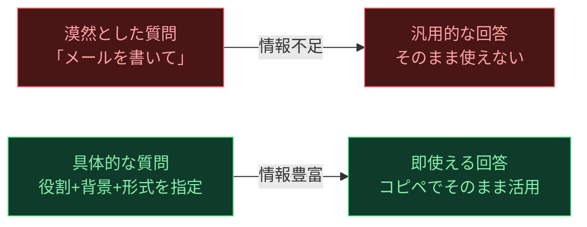
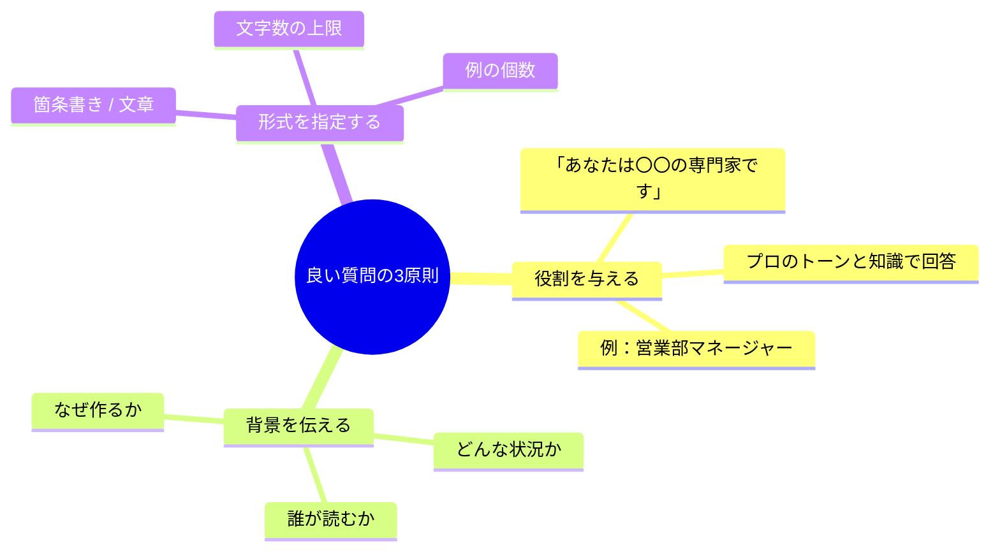
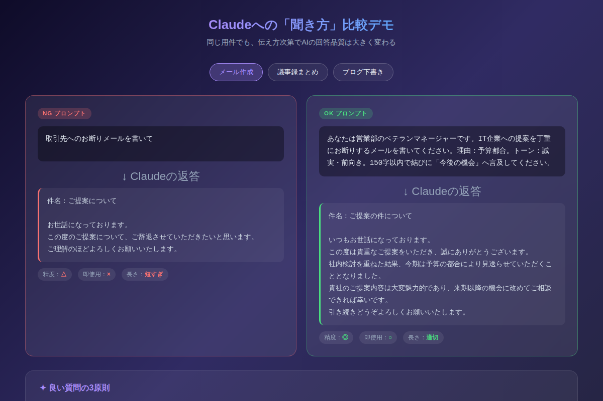

# Claudeに「正しく聞く」だけで仕事が変わる：初心者が最初に覚えるべき3つのコツ

「ChatGPTに聞いてみたけど、的外れな答えしか返ってこなかった」——そんな経験をした方こそ、ぜひこの記事を読んでほしい。AIの性能ではなく、**あなたの「聞き方」を変えるだけ**で、回答品質は劇的に変わります。

---

## なぜ「同じ質問」でも回答の質が変わるのか

Claude（クロード）をはじめとするAIは、あなたが与えた情報をもとに回答を生成します。つまり、情報量が少ない質問には「汎用的で当たり障りのない答え」が、情報量が多い質問には「あなたのニーズに的確な答え」が返ってくるのです。

これを料理に例えると、「何か作って」と言われたシェフと「夏野菜を使った、辛くない、20分で作れる家庭料理を教えて」と言われたシェフでは、後者の方が明らかに的確な提案をできますよね。

AIへの質問も全く同じです。



---

## 3つのコツ：役割・背景・形式

初心者が最初に覚えるべき「良い質問の3原則」を紹介します。



### コツ①：役割（ロール）を与える

プロンプトの冒頭に「あなたは〇〇の専門家です」と書くだけで、Claudeの回答のトーンと専門性が変わります。

> **NG例**
> 「取引先へのお断りメールを書いて」

> **OK例**
> 「あなたは営業部のベテランマネージャーです。IT企業への提案を丁重にお断りするメールを書いてください」

役割を宣言することで、ビジネスメール特有の礼節や言い回しが自然に含まれた回答が返ってきます。

### コツ②：背景・目的を伝える

「なぜ作るのか」「誰が読むのか」をひと言加えるだけで、的外れな回答を防げます。

> **NG例**
> 「AIについてブログを書いて」

> **OK例**
> 「AI未経験の会社員向けに、Claudeを使い始める入門ブログを書いてください。読者はAIに不安を持っているため、親しみやすく背中を押すトーンで」

読者像を明示することで、専門用語の量や例え方がガラリと変わります。

### コツ③：形式（アウトプット）を指定する

「箇条書き」「〇〇字以内」「例を△個含めて」など、出力の形を指定すると、後でそのまま使える回答が返ってきます。

> **NG例**
> 「議事録をまとめて」

> **OK例**
> 「以下の会議メモを①決定事項 ②TODO（担当・期限付き）③懸念事項 の箇条書き形式でまとめてください。各項目3行以内で」

形式を指定しないと、Claudeが「どんな形が良いか」を自分で判断するため、あなたが使いやすい形にならないことがあります。

---

## 実際に試してみよう

以下のデモでは「NG プロンプト」と「OK プロンプト」を3パターン比較できます。同じ用件でも回答の質がいかに変わるかを体感してください。



[→ デモを操作する](../demos/20260518_claude-intro-ask-better/index.html)

---

## コピペ用プロンプトテンプレート

すぐに使える「3原則」を組み込んだテンプレートを紹介します。

### テンプレート①：ビジネスメール作成

```
あなたは[役職・経験年数]のプロです。
以下の件についてメールを書いてください。

【宛先】[取引先/上司/顧客など]
【用件】[要件を一文で]
【トーン】[丁寧・フランク・誠実など]
【制約】[文字数・強調したい点など]
```

**使用例:**
```
あなたは10年のキャリアを持つプロジェクトマネージャーです。
以下の件についてメールを書いてください。

【宛先】取引先のシステム部長
【用件】納期を1週間延ばしてほしいというお願い
【トーン】誠実・謝罪を込めつつ前向き
【制約】200字以内。理由と代替案を必ず含める
```

---

### テンプレート②：議事録・会議メモ整理

```
以下の会議メモを議事録に整えてください。

【形式】
- 決定事項：箇条書き
- TODO：担当者と期限付き
- 懸念事項・継続検討項目

【条件】各項目3〜5行以内。専門用語はそのまま残す。

---
（ここに会議メモを貼り付ける）
```

---

### テンプレート③：ブログ・SNS投稿下書き

```
あなたは[読者層]向けメディアのライターです。
「[テーマ]」について[媒体：ブログ/X/note]の投稿文を書いてください。

【読者】[年齢層・職業・知識レベル]
【トーン】[親しみやすい/専門的/面白い]
【文字数】[上限]
【冒頭の書き出し】[指定がある場合は記載]
```

---

## まとめ：今日から変わる3つのポイント

- **役割を与える**：「あなたは〇〇の専門家です」の一文で回答の質が上がる
- **背景・目的を伝える**：なぜ・誰向けかを明示すれば的外れな回答がなくなる
- **形式を指定する**：「箇条書き」「〇字以内」「例を〇個」で即使えるアウトプットが返る
- **3つ組み合わせると効果は掛け算**：一つだけでも効くが、全部揃えると精度が劇的に向上する
- **完璧じゃなくていい**：最初は一つだけ試してみるところからでOK

---

## 次のステップ：明日すぐ試せるアクション

1. **今日使ったプロンプトを1つ取り出す**：「メール書いて」など漠然とした依頼があれば、3原則を加えて再送してみましょう
2. **テンプレート①をコピーして使う**：次にビジネスメールを書くとき、上のテンプレートをそのまま貼り付けてみてください
3. **明日は Chain-of-Thought を学ぶ**：3原則をマスターしたら、次は「Claudeに考え方のステップを教えてもらう」手法を試してみましょう（明日の記事で紹介します）

---

*この記事はClaude（Anthropic）を活用した note 記事シリーズの第1回です。毎週月〜日、初級・中級・上級の記事を公開します。*
