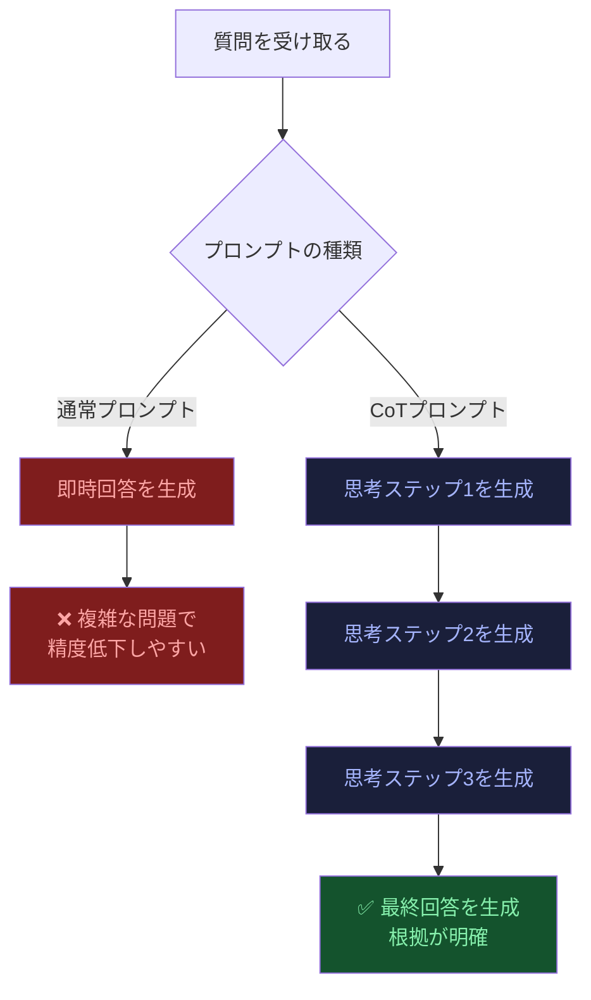
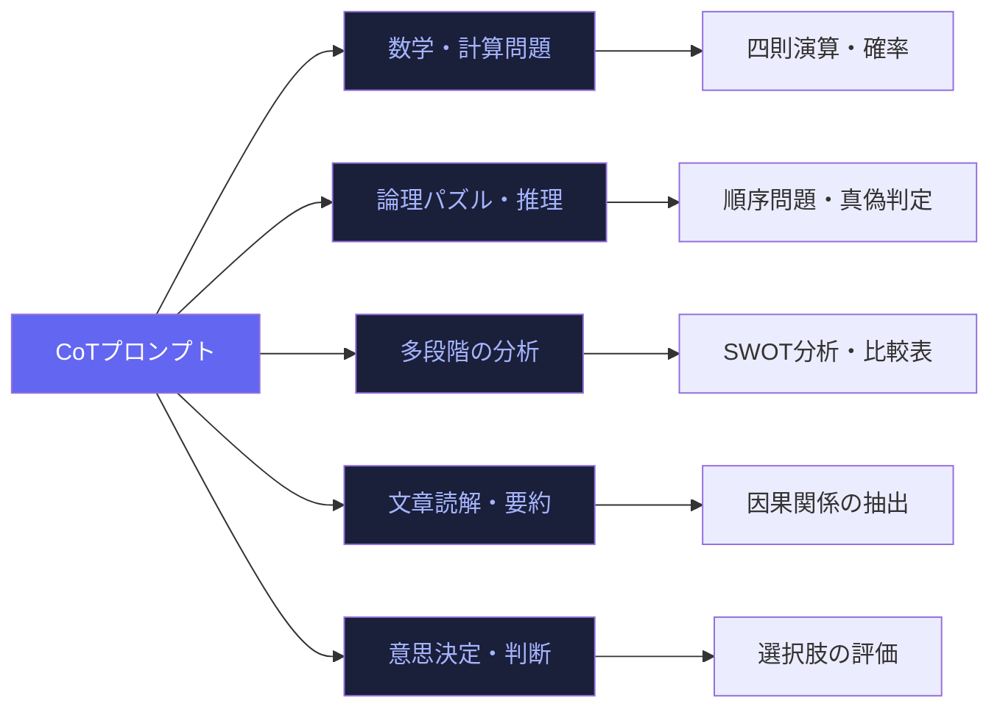
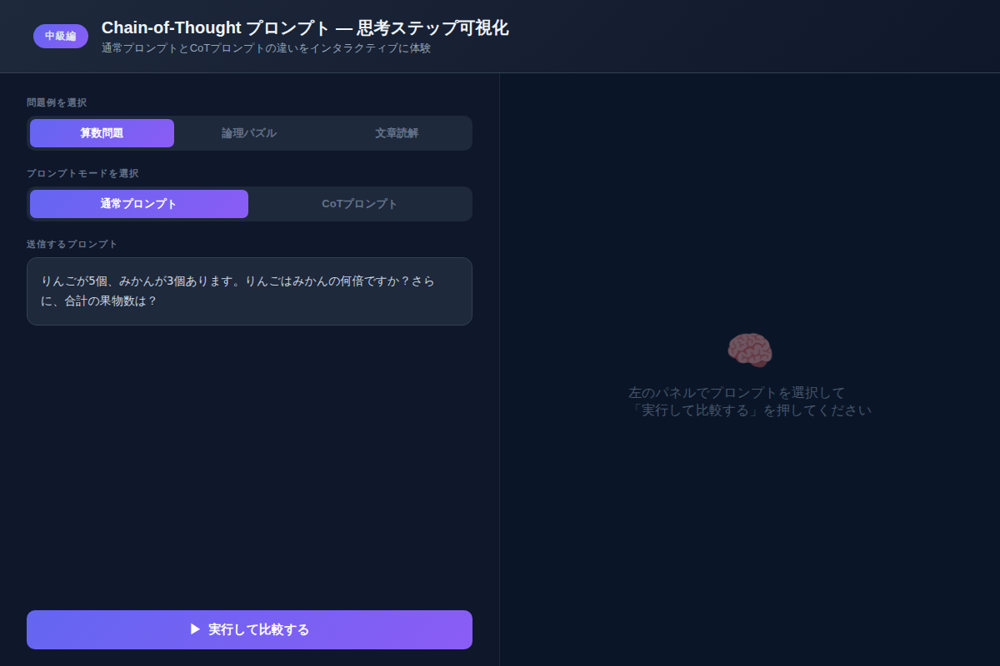

# Chain-of-Thoughtプロンプトでモデルの思考力を引き出す：ステップ分解で精度が劇的に上がる

「Claudeに聞いたら間違いを返してきた」——そんな経験はないでしょうか。実は、その原因の多くは**プロンプトの設計**にあります。ほんの一言「ステップごとに考えてください」を追加するだけで、まったく別次元の回答が返ってくる。これがChain-of-Thought（CoT）プロンプトの力です。

---

## Chain-of-Thought（CoT）とは何か

Chain-of-Thought（以下CoT）は、2022年にGoogleの研究者が発表した手法で、AIモデルに**中間推論ステップを明示させる**ことで最終回答の精度を大幅に向上させる技術です。

名前の通り「思考の連鎖（Chain）」——つまり、問題を解く過程をモデルに言語化させることがポイントです。

```
❌ 通常プロンプト:
「りんごが5個、みかんが3個。りんごはみかんの何倍？合計は？」
→ モデルが「1.67倍、合計8個」と答えても、なぜそう計算したかが不明

✅ CoTプロンプト:
「...ステップごとに考えてください：
Step 1: 倍率を計算する
Step 2: 合計を計算する
Step 3: 回答をまとめる」
→ 各ステップを踏んで計算するため、複雑な問題でも精度が上がる
```

---

## なぜCoTで精度が上がるのか：仕組みを理解する



大規模言語モデルはトークンを**順番に**生成します。CoTはこの特性を利用し、最終回答を出力する前に「考える過程のトークン」を先に生成させます。その結果：

1. **ワーキングメモリの代替**：複雑な計算や多段階の論理を「書き出す」ことで、モデルが正確に処理できる
2. **誤りの自己検出**：中間ステップを文章化することで、矛盾に気づきやすくなる
3. **根拠の可視化**：なぜその回答になったかが人間にも検証できる

---

## 3種類のCoTプロンプト手法

### 1. Zero-shot CoT（最もシンプル）

追加情報なしに、一言加えるだけの手法です。

```
コピペ用プロンプト①:
---
以下の問題を解いてください。
ステップバイステップで考えてから、最終的な答えを出してください。

【問題】
{ここに問題を記入}
---
```

「ステップバイステップで考えてから」という魔法の一文が、モデルの推論を活性化させます。研究では、この一文だけでGSM8K（数学ベンチマーク）の正解率が**17.9%から78.7%**に跳ね上がるケースも報告されています。

### 2. Few-shot CoT（例示で誘導）

解き方の例をいくつか見せてから、本題の問題を投げる手法です。

```
コピペ用プロンプト②:
---
以下の例を参考に、同じ形式でステップごとに問題を解いてください。

【例題1】
Q: バナナが4本で120円です。1本あたりいくら？
Step 1: 合計金額を把握する → 120円
Step 2: 本数で割る → 120 ÷ 4 = 30円
答え: 1本30円

【本題】
Q: {ここに問題を記入}
---
```

### 3. Tree-of-Thought CoT（複数経路探索）

複数の思考経路を並行して評価する上級手法です。複雑な意思決定や創作に特に効果的です。

```
コピペ用プロンプト③:
---
この問題について、3つの異なる視点・アプローチからそれぞれ考えてください。

視点A（楽観的）: ...
視点B（悲観的）: ...
視点C（中立）: ...

それぞれのアプローチで検討した後、最も妥当な答えを選んでください。

【問題】
{ここに問題を記入}
---
```

---

## どんな問題にCoTは効くのか



**効果が高いシーン：**
- 複数のステップを要する計算・推論
- 論理的な順序や優先順位の判断
- 「なぜ」を説明させたいとき
- 回答の根拠を確認したいビジネス用途

**効果が低いシーン：**
- 単純な事実確認（「日本の首都は？」）
- クリエイティブな自由記述（CoTが邪魔になることもある）
- 超短文の回答が求められるケース

---

## インタラクティブデモで体験する

実際に通常プロンプトとCoTプロンプトの違いを体験できるデモを用意しました。算数問題・論理パズル・文章読解の3種類で、思考ステップがリアルタイムに可視化されます。



[→ デモを操作する](../demos/20260519_chain-of-thought/index.html)

---

## 実践：ビジネスシーンでのCoT活用例

### 提案書レビューへの適用

```
コピペ用プロンプト④（ビジネス版）:
---
以下の提案書を評価してください。
ステップごとに分析してから、総合評価を出してください。

Step 1: 提案の目的と課題設定を評価する
Step 2: 解決策の実現可能性を検討する
Step 3: コストと効果の妥当性を判断する
Step 4: リスクと懸念点を列挙する
Step 5: 総合評価と改善提案をまとめる

【提案書本文】
{ここに提案書を貼り付け}
---
```

このプロンプトを使うと、Claudeが各ステップを丁寧に踏んで評価を進めるため、見落としが減り、フィードバックの質が格段に上がります。

---

## よくある失敗と対処法

| 失敗パターン | 原因 | 対処法 |
|------------|------|--------|
| ステップが多すぎて迷子になる | 問題が不明確 | 「具体的に3ステップで」と数を指定する |
| 途中で結論を出してしまう | 指示が弱い | 「各ステップを完了してから次へ」と追加 |
| ステップを省略してしまう | モデルの判断 | Few-shotで例を見せて形式を固定する |

---

## まとめ

- **CoTの本質**は「考える過程を書かせること」——最終回答前にトークンを使わせることで精度が上がる
- **Zero-shot CoT**の「ステップバイステップで」は最も手軽で、多くの問題に即効性がある
- **Few-shot CoT**は例を見せることで、出力フォーマットも統一できて一石二鳥
- **効果が高いのは**多段階推論・論理問題・分析タスク。単純な質問には不要
- **ビジネス活用**では提案書評価・問題分析・意思決定サポートに特に有効

---

## 次のステップ

明日すぐ試してほしいアクション：

1. **今日の業務メール1通を要約する際**、「3ステップで分析して」と追加してみる
2. **会議のアジェンダ作成**に「Step 1〜3の形式で考えてから箇条書き化して」を試す
3. デモを操作して、通常プロンプトとCoTの回答の違いを自分の目で確かめる

次回（水曜・上級編）は「プロンプトエンジニアリング完全ガイド：上級テクニック9選で出力品質を最大化する」を予定しています。CoTはその9選のうちの1つ。全体像をまとめて学べる内容です。
