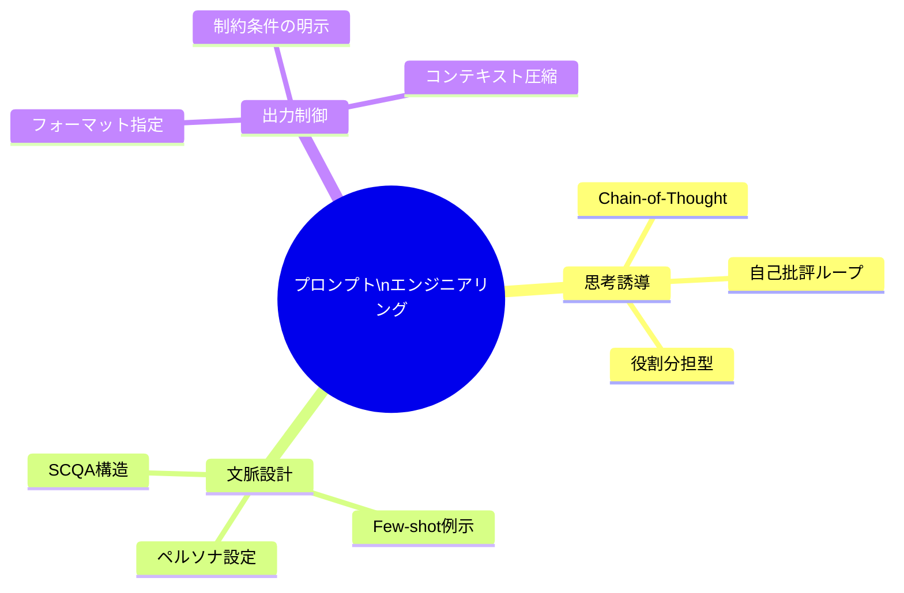
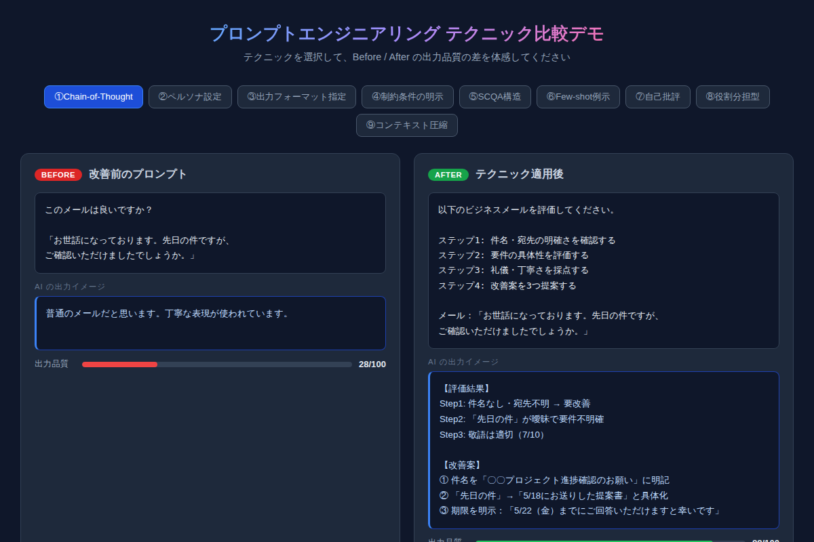
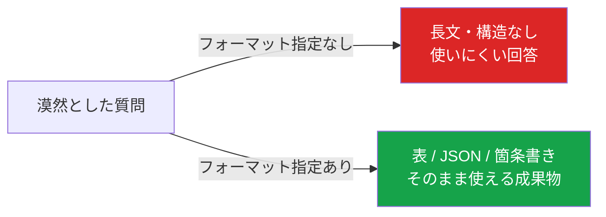
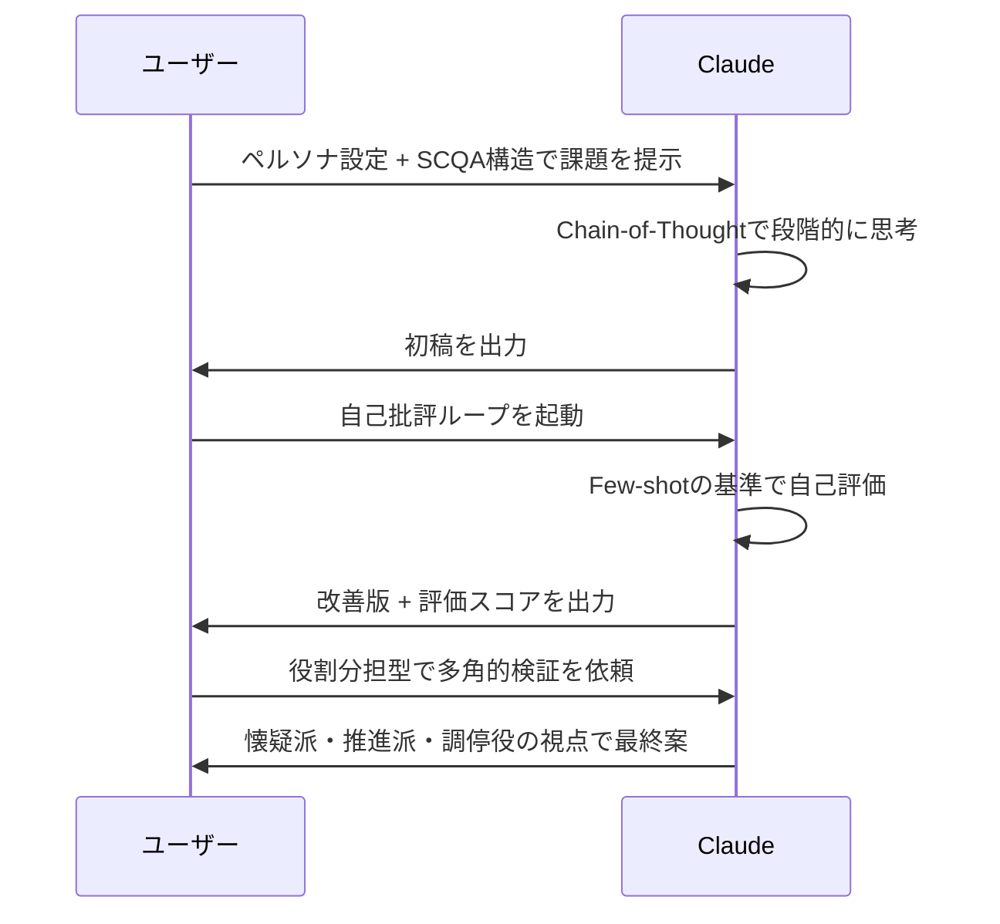

# プロンプトエンジニアリング完全ガイド：上級テクニック9選で出力品質を最大化する

「同じClaude（AI）を使っているのに、なぜあの人の出力だけクオリティが違うのか？」

その答えは、モデルの性能差ではなく**プロンプトの設計力**にあります。AIに「なんとなく聞く」のと「設計して聞く」のとでは、出力品質に3〜5倍の差が出ることも珍しくありません。本記事では、実務で即使える上級テクニック9選を、具体的なBefore/Afterとともに徹底解説します。

---

## プロンプトエンジニアリングとは何か

プロンプトエンジニアリングとは、AIへの指示文（プロンプト）を意図的に設計し、目的の出力を引き出す技術です。コーディングスキルは不要で、「言葉の設計力」が核心です。



上図のとおり、テクニックは大きく「思考誘導」「文脈設計」「出力制御」の3カテゴリに分類できます。今回はそれぞれから計9つのテクニックを紹介します。

---

## 実践デモで体感する

本記事に対応したインタラクティブデモで、各テクニックのBefore/Afterを体感できます。



[→ デモを操作する](../demos/20260520_prompt-engineering-guide/index.html)

ボタンをクリックして9つのテクニックを切り替えると、同じお題でも出力品質スコアが劇的に変わることがわかります。

---

## テクニック①：Chain-of-Thought（思考連鎖）

**概要：** AIに「段階的に考えさせる」ことで推論精度を上げる手法です。

**コピペ用プロンプト：**

```
以下の[課題]について分析してください。

ステップ1: [観点A]の視点で評価する
ステップ2: [観点B]の視点で評価する  
ステップ3: ステップ1〜2を踏まえた総合判断を出す
ステップ4: 改善案を3つ提案する

[課題]: ここに評価対象を貼り付け
```

「ステップN:」と明示するだけで、AIは論理的な段階思考を始めます。数学的推論・コードレビュー・ビジネス分析など、複雑なタスクで特に効果を発揮します。

---

## テクニック②：ペルソナ設定

**概要：** AIに「誰として答えるか」を明示することで、専門性・視点・基準が定まります。

**コピペ用プロンプト：**

```
あなたは[役職・経験年数]の[専門家]です。
[専門分野の基準・価値観]の観点から厳格に[タスク]してください。
最後に[具体的な成果物形式]も提示すること。
```

「Googleのシニアエンジニア」「元コンサルのCFO」「TOEIC900点の翻訳家」など、役職・経験・所属をセットで指定すると効果が高まります。

---

## テクニック③：出力フォーマット指定

**概要：** 「どのような形式で出力するか」を事前に指定します。



**コピペ用プロンプト：**

```
[質問・依頼]を以下のフォーマットで回答してください。

出力形式:
| 項目A | 項目B | 項目C |
|-------|-------|-------|
（X行で出力）

対象: [ターゲット・条件を明示]
```

「表」「JSON」「箇条書き（3点）」「マークダウン」など、後工程でそのまま使える形式を指定することが重要です。

---

## テクニック④：制約条件の明示

**概要：** 文字数・トーン・禁止事項・ターゲットを数値で縛ることで、要件を満たした出力が得られます。

**コピペ用プロンプト：**

```
[成果物]を[N案]作成してください。

制約条件:
- 文字数: XX〜XX文字
- トーン: [感情・文体の指定]
- 禁止ワード: [使ってはいけない表現]
- ターゲット: [対象読者・ユーザー像]
- 差別化点: [競合との違い・強み]
```

制約が多いほど「使えるアウトプット」に近づきます。特にコピーライティング・企画書・マーケティング文書で絶大な効果を発揮します。

---

## テクニック⑤：SCQA構造

**概要：** コンサルファームで広く使われるストーリーラインの型です。

| 要素 | 意味 | プロンプトへの適用 |
|------|------|-----------------|
| S（Situation） | 現状・前提 | 現在の状況・数値を記述 |
| C（Complication） | 問題・複雑化 | 障害・懸念点を明示 |
| Q（Question） | 核心的な問い | 解決したい問いを1文で |
| A（Answer） | 答え・提言 | 求めるアウトプットの方向性 |

このフレームワークをプロンプトに埋め込むと、AIは「なぜこの提案が必要か」を自動でストーリー構成してくれます。

---

## テクニック⑥：Few-shot学習（例示）

**概要：** 入出力ペアの例を2〜3個見せることで、AIが「こういう形式・基準で答えるべき」と学習します。

**コピペ用プロンプト：**

```
[タスク]を以下のルールで[分類/変換/生成]してください。

例1: 「[入力例1]」→ [期待する出力1]
例2: 「[入力例2]」→ [期待する出力2]
例3: 「[入力例3]」→ [期待する出力3]

対象:
「[実際に処理したいテキスト]」
```

例が多いほど精度は上がりますが、3例が最もコスパが良いとされています。分類・判定・スタイル変換など「基準が暗黙的なタスク」で特に強力です。

---

## テクニック⑦：自己批評ループ

**概要：** AIに自分の回答を評価させ、改善版まで一気に出力させる技術です。

**コピペ用プロンプト：**

```
[タスク]を実行してください。

その後、以下の観点で自己採点し、必ず改善版も出力すること：
- [評価軸1]（XX/10）
- [評価軸2]（XX/10）
- [評価軸3]（XX/10）

改善版では採点が低かった項目を優先的に修正すること。
```

1回の指示で「初稿 → 評価 → 改善版」まで出力されます。クリエイティブ系（文章・企画・デザイン案）で特に効果的です。

---

## テクニック⑧：役割分担型プロンプト

**概要：** 複数の立場を同時に出力させることで、思考の死角を減らす手法です。

**コピペ用プロンプト：**

```
[テーマ]について、以下の3つの立場から意見を述べてください：

🔴 [懐疑的な立場]（リスク・問題点を最大限に指摘）
🟢 [推進する立場]（メリット・可能性を最大限に強調）
🟡 [調停する立場]（両者の落としどころを探る）

各発言は[N]字以内で。最後に合意案を提示すること。
```

意思決定・リスク分析・議論の整理に最適です。「懐疑派」を入れることで批判的思考が自動的に働き、見落としが減ります。

---

## テクニック⑨：コンテキスト圧縮・構造化抽出

**概要：** 長文を渡す前に「何をどう抽出するか」のルールを先に定義します。

**コピペ用プロンプト：**

```
以下の[文書]から情報を抽出します。

抽出ルール:
- [条件A]を含む文のみを抽出
- [要素X]と[要素Y]を必ずセットで抽出
- 不明確な点には「要確認」タグをつける

出力形式:
✅ [完了]: [内容]　[担当者] [期限]
⚠️ 要確認: [内容]

[文書]:
[長文をここに貼り付け]
```

会議録・契約書・報告書など長文処理で絶大な効果を発揮します。出力形式まで定義することで、そのままドキュメントに使える成果物が得られます。

---

## 9つのテクニックを組み合わせる

より高度な活用法として、複数のテクニックを1つのプロンプトに組み合わせることができます。



組み合わせの基本パターン：
1. **分析系**：ペルソナ + CoT + 出力フォーマット
2. **創作系**：制約条件 + Few-shot + 自己批評ループ
3. **意思決定系**：SCQA + 役割分担型 + 制約条件

---

## まとめ

- **Chain-of-Thought**と**自己批評ループ**は「思考の深さ」を引き出す
- **ペルソナ設定**と**SCQA**は「文脈の精度」を上げる
- **フォーマット指定**と**制約条件**は「出力の使いやすさ」を最大化する
- **Few-shot**と**役割分担型**は「判断基準の一貫性」を担保する
- **コンテキスト圧縮**は「長文処理の精度と速度」を劇的に改善する

---

## 次のステップ：明日すぐ試せるアクション

1. **今日の仕事から1つ選ぶ**：メール返信・資料作成・コードレビューの中から1タスクを選ぶ
2. **テクニックを1つ適用する**：まずは「出力フォーマット指定」が最も即効性が高くおすすめ
3. **Before/Afterを比較する**：テクニックなしで一度出力を見てから、適用後を比較すると差が体感しやすい

プロンプトエンジニアリングは「魔法」ではなく「設計スキル」です。1つ試すたびに感覚が磨かれます。まず今日、1つだけ試してみてください。
