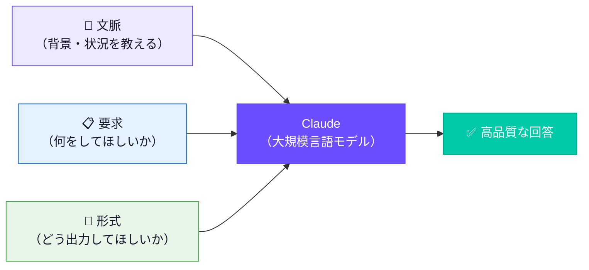
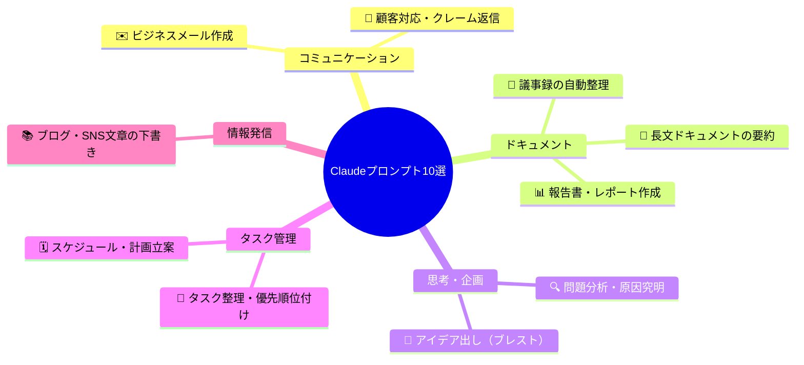
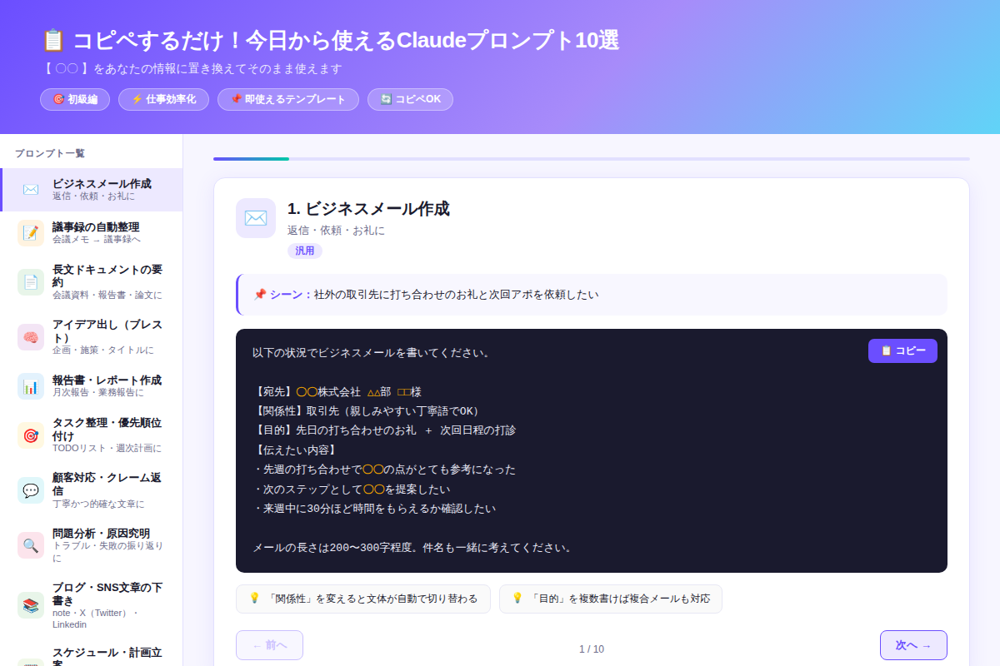

# コピペするだけ！今日から使えるClaudeプロンプト10選【仕事効率化】

「Claudeって便利らしいけど、何をどう頼めばいいかわからない」——そんな悩みを一撃で解決する、今日からそのまま使える実践プロンプトを10個まとめました。

---

## なぜ「プロンプトのコピペ」が最速の入門なのか

AIを使いこなせない人の9割が、最初の「どう聞くか」で止まっています。

実はClaudeへの指示には「型」があります。その型さえ押さえれば、英語も専門知識も不要。**【〇〇】を自分の情報に差し替えるだけ**で、今日の仕事がすぐ変わります。

まずは「なぜ精度が上がるか」を理解するために、プロンプトの構造を見てみましょう。

---

## 高精度プロンプトの3要素



**文脈**（相手・目的・状況）＋**要求**（具体的な指示）＋**形式**（文字数・構成・箇条書きなど）——この3要素が揃うだけで、Claudeの回答精度は劇的に向上します。

以下の10プロンプトはすべてこの構造で設計されています。

---

## 10のプロンプトテンプレート早見表



カテゴリは大きく5つ。あなたの今日の仕事に近いものから試してください。

---

## デモで実際に試してみよう

下のデモUIでは、10個のプロンプトをワンクリックでコピーできます。【〇〇】部分が**オレンジ色**でハイライトされているので、差し替え箇所が一目でわかります。



[→ デモを操作する](../demos/20260521_copy-paste-prompts-10/index.html)

---

## プロンプト詳細解説

### 1. ✉️ ビジネスメール作成

もっとも使用頻度が高いシーン。件名から本文まで一発生成します。

```
以下の状況でビジネスメールを書いてください。

【宛先】〇〇株式会社 △△部 □□様
【関係性】取引先（親しみやすい丁寧語でOK）
【目的】先日の打ち合わせのお礼 ＋ 次回日程の打診
【伝えたい内容】
・先週の打ち合わせで〇〇の点がとても参考になった
・次のステップとして〇〇を提案したい
・来週中に30分ほど時間をもらえるか確認したい

メールの長さは200〜300字程度。件名も一緒に考えてください。
```

> **💡 コツ：**「関係性」を「親しい同僚」「初対面の目上の方」などに変えるだけで文体が自動で切り替わります。

---

### 2. 📝 議事録の自動整理

走り書きのメモをそのまま貼るだけで、ネクストアクション付きの議事録が完成します。

```
以下の会議メモを議事録形式に整形してください。

【会議名】〇〇プロジェクト 定例MTG
【日時】〇月〇日 〇時〜〇時
【参加者】〇〇、〇〇、〇〇

【メモ（走り書き）】
〇〇について検討→〇〇さんが△△案を提案
→懸念点は納期とコスト
→来週までに見積もりを出す（担当：〇〇）
次回MTGは〇月〇日

以下のフォーマットで整理してください：
・決定事項
・ネクストアクション（担当者・期日付き）
・継続検討事項
```

> **💡 コツ：**担当者・期日が不明瞭な場合は自動で「〔要確認〕」と出力してくれます。

---

### 3. 🧠 アイデア出し（ブレスト）

「10個出して」と個数を指定するのがポイント。数を決めると手抜きなしに出力されます。

```
以下のテーマで、アイデアを10個出してください。

【テーマ】〇〇（例：社内コミュニケーション改善のための新機能）
【対象ユーザー】〇〇（例：リモートワーク中の20〜30代）
【制約条件】〇〇（例：開発コスト小・3ヶ月で実装可能）

アイデアごとに以下を記載：
- アイデア名（10字以内）
- 一言説明（30字以内）
- 期待効果

最後に特に面白いと思うアイデアTop3とその理由を教えてください。
```

> **💡 コツ：**最後の「Top3+理由」を求めることで、ただのリストではなく考察つきの企画書になります。

---

### 4. 🎯 タスク整理・優先順位付け

エイゼンハワーマトリクス（緊急×重要）で自動分類。頭が混乱しているときこそ有効です。

```
以下のタスク一覧を整理し、今日やるべき順番に並べ直してください。

【今日の締め切り/イベント】〇〇
【利用可能な時間】〇時間
【タスク一覧（思いついたまま）】
・〇〇
・〇〇
・〇〇

出力形式：
1. 緊急×重要（今すぐやる）
2. 重要だが緊急でない（今日中）
3. 緊急だが重要でない（後回し可）
4. どちらでもない（今日はやらない）

各タスクの目安時間も教えてください。
```

---

### 5. 📄 長文ドキュメントの要約

仕様書・報告書・記事をキャッチアップするときに。「読む目的」を書くことで要約の切り口が変わります。

```
以下のドキュメントを要約してください。

【ドキュメント種別】〇〇（例：業務報告書/提案資料/仕様書）
【読む目的】〇〇（例：意思決定のポイントを把握したい）
【要約の形式】
1. 3行サマリー（誰でも分かるように）
2. 重要ポイント（箇条書き5点以内）
3. 要注意・要確認事項

【本文】
〇〇〇〇〇〇（ここに文章を貼る）
```

---

### 6. 📊 報告書・レポート作成

数字やデータを渡すだけで、根拠のある報告文が生成されます。

```
以下の情報から、ビジネス報告書の本文を書いてください。

【報告タイプ】〇〇（例：月次営業報告）
【対象期間】〇年〇月
【実績データ】
・〇〇：△△（目標比□□%）
・〇〇：△△（前月比□□%）

【特記事項】〇〇
【課題・懸念点】〇〇

構成：
① 概況（2〜3行）② 数値サマリー（表形式）
③ 成功要因・課題分析  ④ 来月の対策・アクションプラン
```

---

### 7. 💬 顧客対応・クレーム返信

「制約」（言えない情報）を明示するのが肝です。これにより不用意な謝罪や約束を防げます。

```
以下の状況に合わせた顧客返信文を作成してください。

【問い合わせ内容】
〇〇〇〇（顧客の言葉をそのまま貼る）

【状況】
・弊社の対応：〇〇
・弊社の方針：〇〇
・制約：〇〇（例：具体的な原因はまだ調査中）

返信文の条件：
- 誠実かつ迅速な対応姿勢を示す
- 謝罪は過剰にならず、解決策に重点を置く
- 300字以内・メール形式（件名付き）
```

---

### 8. 🔍 問題分析・原因究明

「感情的な表現は避けて」という一言が、冷静な論理分析を引き出す魔法の一文です。

```
以下の問題について、原因と対策を分析してください。

【発生した問題】〇〇（例：プロジェクトが1ヶ月遅延した）
【状況の詳細】
・いつ：〇〇  ・誰が関係：〇〇  ・何が起きたか：〇〇

分析フレームワーク：
① なぜなぜ分析（5回のWhy）
② 真因の特定
③ 再発防止策（短期・長期）

客観的・論理的に分析してください。感情的な表現は避けて。
```

---

### 9. 📚 ブログ・SNS文章の下書き

箇条書きのメモを渡すだけで記事の骨格が完成。「フック必須」が冒頭引力の決め手です。

```
以下のネタをもとに、〇〇向けの文章を書いてください。

【媒体】〇〇（例：note記事/X投稿/LinkedIn）
【伝えたいこと（箇条書きでOK）】
・〇〇を経験した
・そこから〇〇を学んだ
・読者に〇〇してほしい

【トーン】〇〇（例：親しみやすく実用的に）
【文字数】〇〇字程度

最初の1〜2行で読者を引き込む「フック」を必ず入れてください。
ハッシュタグの提案も3つ添えてください。
```

---

### 10. 🗓️ スケジュール・計画立案

「現在地」を正直に書くほど現実的な計画が出てきます。「継続しやすい」と書くのも忘れずに。

```
以下の目標に向けた実行計画を作ってください。

【ゴール】〇〇（例：3ヶ月後に〇〇資格に合格する）
【現在地】〇〇（例：基礎知識ゼロ、1日1時間確保可能）
【制約・条件】
・毎日使える時間：〇時間
・締め切り：〇月〇日

出力形式：
① フェーズ分割（準備→学習→仕上げ）
② 週次マイルストーン
③ 1日のタスク例

現実的で継続しやすい計画にしてください。
```

---

## 精度を10倍上げる「差し替え3原則」

プロンプトをより効果的にするための3つのルールです。

| 原則 | NG例 | OK例 |
|------|------|------|
| **具体的な数字を入れる** | 「短めに」 | 「200〜300字で」 |
| **相手・関係性を明示する** | 「メールを書いて」 | 「初対面の部長宛てに」 |
| **出力形式を指定する** | 「まとめて」 | 「箇条書き5点・見出し付きで」 |

この3つを意識するだけで、プロンプトを書き直すことなく精度が跳ね上がります。

---

## まとめ

- 🎯 **コピペ → 差し替えの2ステップ**で今日からすぐ使える
- 📐 **文脈・要求・形式の3要素**が高精度回答の必須条件
- 📊 **出力形式の指定**（字数・構成・箇条書き）が最大の差になる
- 💬 **「制約条件」の記載**でハルシネーション（誤情報）を防げる
- ⚡ **まず1つだけ試す**——全部やろうとしないのが継続のコツ

---

## 次のステップ：今日の仕事に1つ使ってみよう

**おすすめの始め方（5分でできる）：**

1. 今日のタスクリストをメモ帳に箇条書きにする
2. プロンプト「6. タスク整理・優先順位付け」に貼り付ける
3. Claudeに送信して、今日の作業順序を決めてもらう

これだけです。AIは使い続けるほど「どう頼むか」の感覚が身につきます。まず1回、今日の業務で試してみてください。

明日（金曜日）は中級編として「**Few-shot学習でClaudeを育てる：3つの例文で回答精度が大幅アップ**」を公開予定です。今日のプロンプトに例文を足すだけで、さらに精度を上げる方法を解説します。
