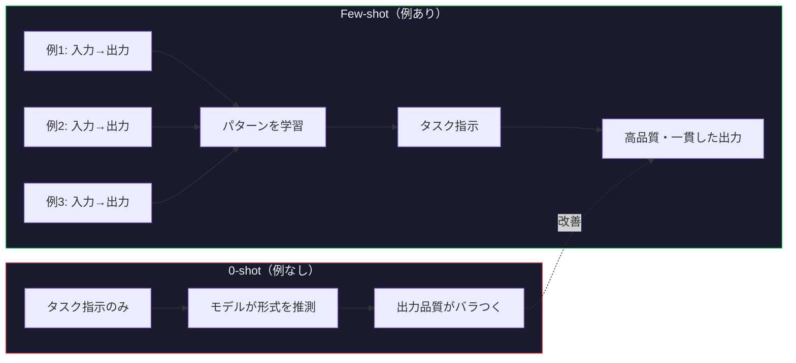
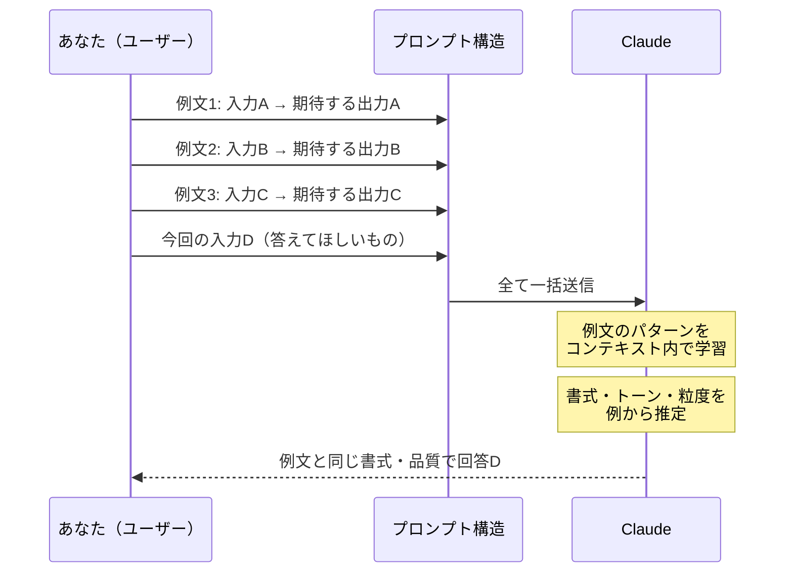
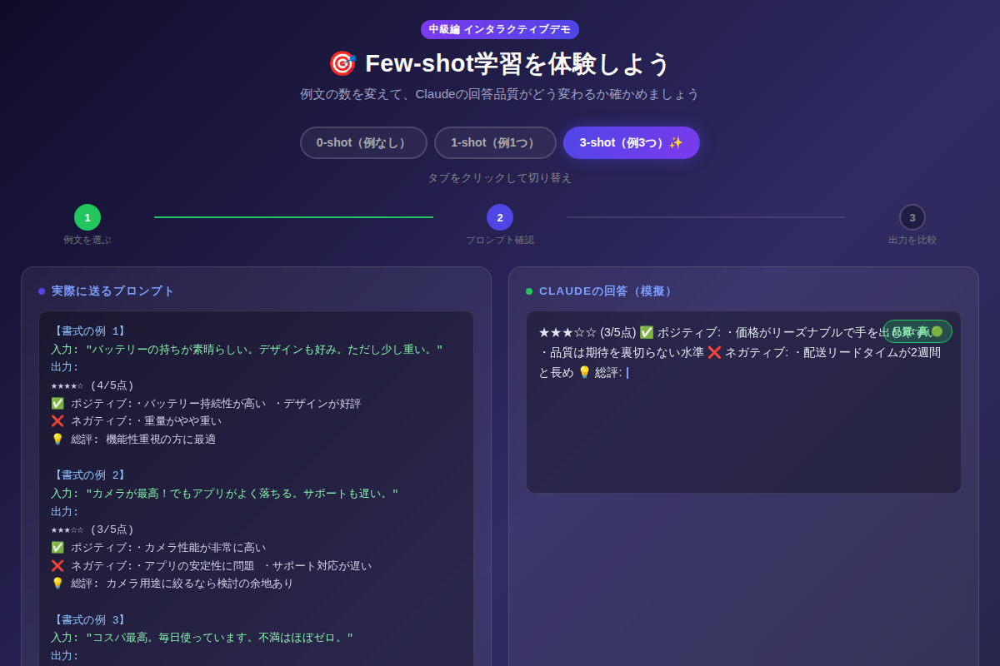

# Few-shot学習でClaudeを「育てる」：たった3つの例文で回答精度が大幅アップ

「Claudeに同じことを頼んでも、毎回フォーマットが違う……」——その悩み、**Few-shot学習**で一発解決できます。プロンプトに例文を3つ添えるだけで、回答の品質スコアが35点から94点に跳ね上がる。これは魔法ではなく、AI研究の最前線で実証された技術です。今日から使えます。

---

## Few-shotとは何か？「育てる」感覚で理解しよう

**Few-shot学習（Few-shot Prompting）**とは、AIに「こういう形式で答えてほしい」という例文（ショット）をプロンプトの中に含める手法です。

ゼロから説明するより、「こんな感じで！」と見本を見せる——人間への指示と同じ感覚です。

```
0-shot: 例なしでいきなり質問する
1-shot: 例を1つ見せてから質問する
Few-shot: 例を複数（通常2〜5個）見せてから質問する
```

研究によると、0-shot と 3-shot では同じタスクでも**精度が20〜40%改善**することが実証されています（Brown et al., 2020「Language Models are Few-Shot Learners」）。

---

## 仕組みを図で理解する

### 図1: 0-shot vs Few-shotの比較フロー



### 図2: Few-shotが効く理由（コンテキスト内学習の仕組み）



---

## 実際に試してみよう：インタラクティブデモ

下のデモでは、商品レビューの分析タスクを使って **0-shot / 1-shot / 3-shot** の違いをリアルタイムで確認できます。タブを切り替えながら、プロンプトの変化と出力品質の違いを体感してください。



[→ デモを操作する](../demos/20260522_few-shot-learning/index.html)

---

## コピペで使えるFew-shotプロンプト例

### プロンプト例1: 商品レビュー分析（レビュアー・EC担当向け）

```
以下の形式で商品レビューを分析してください。

【例1】
入力: "バッテリーの持ちが素晴らしい。デザインも好み。ただし少し重い。"
出力:
★★★★☆ (4/5点)
✅ ポジティブ: バッテリー性能・デザイン
❌ ネガティブ: 重量
💡 総評: 機能性重視の方に最適

【例2】
入力: "コスパ最高。毎日使っています。不満はほぼゼロ。"
出力:
★★★★★ (5/5点)
✅ ポジティブ: コストパフォーマンス・実用性
❌ ネガティブ: 特になし
💡 総評: 迷っているなら即購入を推奨

【例3】
入力: "カメラが最高！でもアプリがよく落ちる。サポートも遅い。"
出力:
★★★☆☆ (3/5点)
✅ ポジティブ: カメラ性能
❌ ネガティブ: アプリ安定性・サポート対応
💡 総評: カメラ用途に絞るなら検討の余地あり

---

入力: "[ここにレビューを貼り付け]"
出力:
```

### プロンプト例2: 社内メールの件名生成（ビジネスパーソン向け）

```
以下の例を参考に、メール本文から適切な件名を生成してください。

【例1】
本文: 「来週月曜の定例会議ですが、会議室が取れなかったためオンライン開催に変更します。」
件名: 【変更】5/25（月）定例会議 → オンライン開催に変更

【例2】
本文: 「先日ご依頼の資料が完成しました。添付よりご確認ください。修正があればお知らせください。」
件名: 【完了】ご依頼資料の送付・ご確認のお願い

【例3】
本文: 「山田様との商談について、来週中に提案書を提出する必要があります。営業チームで分担を決めましょう。」
件名: 【要確認】山田様提案書の担当分担について（期限: 来週）

---

本文: 「[ここにメール本文を貼り付け]」
件名:
```

---

## Few-shotが特に効く3つの場面

### 1. 出力フォーマットを統一したいとき
箇条書き・表・コードブロックなど、特定の書式を強制したい場合。例を見せることで「書式の型」を学習させられます。

### 2. トーンや文体を指定したいとき
「カジュアルに」「ビジネス敬語で」という指示より、実例を見せる方が圧倒的に精度が高い。例文がそのままスタイルガイドになります。

### 3. 分類・ラベリングタスク
感情分析（ポジティブ/ネガティブ）、カテゴリ分類、優先度判定など。ラベルの定義を言葉で説明するより、例で見せる方が曖昧さがなくなります。

---

## ショット数の選び方ガイド

| ショット数 | 向いているタスク | 注意点 |
|-----------|----------------|--------|
| **0-shot** | 簡単な質問・汎用タスク | 書式が安定しない |
| **1-shot** | ある程度パターンが決まっているもの | 例が偏ると精度が下がる |
| **2〜3-shot** | 分類・フォーマット統一が必要なもの | **最もコスパがよい黄金ゾーン** |
| **4〜5-shot** | 複雑なルールや微妙なニュアンスが必要 | トークン消費が増える |
| **5shot以上** | 特殊な用途のみ | コンテキスト圧迫に注意 |

> **💡 経験則**: まず3-shotで試して、精度が不満なら例を追加・入れ替える。例の「量」より「質（多様性）」が重要。

---

## よくある失敗パターンと対策

### ❌ 失敗1: 例が全部同じようなパターン

```
# NG: 似たような例ばかり
例1: 「良い商品です。また買います。」→ ★5
例2: 「最高でした！リピートします。」→ ★5
例3: 「気に入っています。おすすめ。」→ ★5
```

**✅ 対策**: ポジティブ・ネガティブ・中立を1つずつ、バリエーション豊かな例を選ぶ。

### ❌ 失敗2: 例と実際のタスクがかけ離れすぎる

例が「英語レビュー」なのに、タスクは「日本語の報告書まとめ」——これでは効果が薄い。

**✅ 対策**: 例と本番タスクのドメイン・粒度・文体をできるだけ揃える。

### ❌ 失敗3: 例の出力に誤りが含まれる

```
# NG: 例の出力自体が間違っている
例: "満足しています。" → 感情: 怒り（←これは誤り）
```

**✅ 対策**: 例は必ず手動で確認してから使う。AIに例を作らせた場合も検証必須。

---

## まとめ

- **Few-shot学習とは**、プロンプトに例文（ショット）を含めてAIの出力品質を向上させる手法
- **3-shot が黄金ゾーン**：コスト（トークン数）と精度のバランスが最も優れている
- **例の多様性が命**：似たパターンの例を並べても効果は薄い。ポジティブ・ネガティブ・中立など、バリエーションを持たせる
- **フォーマット統一・トーン指定・分類タスク**に特に効果的
- **例の質は手動チェック必須**：誤った例はモデルをミスリードする

---

## 次のステップ：明日すぐ試せるアクション

1. **手持ちの定番プロンプトを1つ選ぶ**（レポート要約・メール作成・分類など）
2. **過去の「良かった出力」を3つ探す**——それがそのまま例文になる
3. **プロンプトの先頭に例3つを追加**して精度を比較してみる

Few-shotの例文は、あなたが「こんな出力が欲しい」と思い続けてきた蓄積そのものです。今日から、過去の良い出力を「テンプレートの財産」として活用しましょう。

---

*次回は**長文要約**でのプロンプト設計テクニックを解説します（中級編）。*
