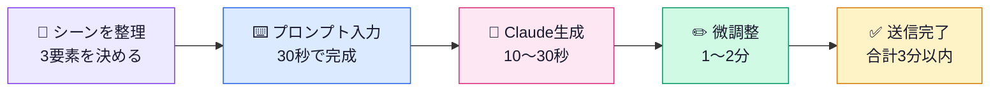
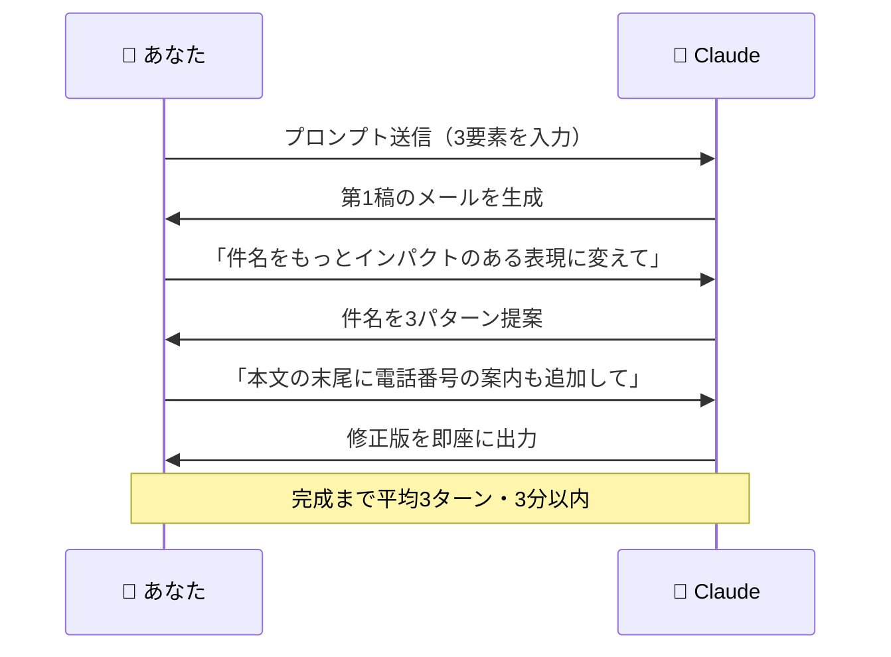
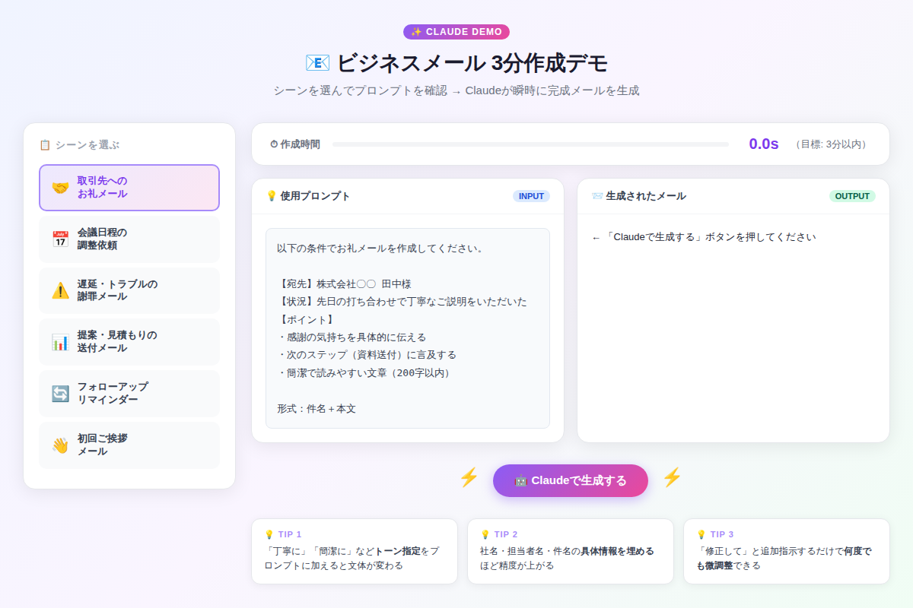

# Claudeでビジネスメールを3分で書く方法：シーン別プロンプト10選

「また同じような文章を1時間かけて書いた…」そんな日常から解放されてみませんか？Claudeに"シーン・相手・ポイント"の3要素を伝えるだけで、プロ品質のビジネスメールが3分以内に完成します。今日から使えるプロンプト10選を、実例付きでお届けします。

---

## なぜメール作成にClaudeが最適なのか

ビジネスメールの作成には、毎日想像以上の時間が費やされています。マイクロソフトの調査によると、ビジネスパーソンは1日平均28%の時間をメール対応に費やしているとされています。

しかしClaudeを使うと、この状況が劇的に変わります。



**3要素を揃えるだけ**で、文章が苦手な人でも即戦力レベルのメールが書けるのが最大の強みです。

---

## 「魔法の3要素」テンプレート

すべてのプロンプトの基礎となる黄金フォーマットがこちらです。

```
【宛先】誰に送るか（役職・関係性）
【状況】何があったか（1〜2行で）
【ポイント】伝えたいことの優先順位

形式：件名＋本文（〇〇字以内）
トーン：丁寧・簡潔・温かみがある　など
```

この3要素を意識するだけで、出力の精度が飛躍的に上がります。

---

## シーン別プロンプト10選

### 1. お礼メール（打ち合わせ後）

```
以下の条件でお礼メールを作成してください。

【宛先】株式会社〇〇 田中様（初対面の取引先）
【状況】先日の打ち合わせで丁寧なご説明をいただいた
【ポイント】
・感謝の気持ちを具体的に
・次のステップ（資料送付）に言及
・200字以内で簡潔に

形式：件名＋本文
```

**生成例（一部）:**
> 件名：先日の打ち合わせのお礼  
> 先日は貴重なお時間をいただき、誠にありがとうございました。ご丁寧なご説明のおかげで…

---

### 2. 会議日程の調整依頼

```
会議日程調整メールを作成してください。

【宛先】プロジェクトチーム全員
【状況】月次定例の日程を候補3択で調整したい
【候補日】6月3日(火)・6月5日(木)・6月7日(土)
【時間帯】午後2〜4時
【締切】5月28日(木)回答希望
【形式】箇条書きで見やすく
```

---

### 3. 謝罪メール（納期遅延・トラブル）

```
トラブル謝罪メールを作成してください。

【宛先】株式会社〇〇 佐藤部長（重要顧客）
【状況】システム障害で納品が2日遅延した
【対応】原因究明済み・再発防止策を実施
【トーン】誠実・真摯。言い訳をしない
【要素】お詫び→原因→対応策→今後の約束
```

> 💡 **ポイント:** 謝罪メールは「言い訳をしない」と明示するだけで、Claudeが言い訳のない誠実な文体を選んでくれます。

---

### 4. 提案・見積もりの送付

```
提案書送付メールを作成してください。

【宛先】鈴木様（商談相手）
【状況】先日の商談を受けて提案書を送付
【添付】提案書PDF・見積書Excel（2点）
【ポイント】提案の要点を2〜3行で説明、次のアクションを提案
```

---

### 5. フォローアップ（返信待ち）

```
フォローアップメールを作成してください。

【状況】1週間前に送った提案書への返答がない
【宛先】高橋様（顧客）
【トーン】しつこく感じさせず自然にリマインド
【工夫】「YesかNoかだけでOK」と返答しやすくする
```

---

### 6. 初回ご挨拶メール（担当者変更）

```
初回ご挨拶メールを作成してください。

【状況】部署異動で新しい担当者になった
【宛先】既存の取引先担当者
【内容】前任からの引き継ぎ・自己紹介・今後のサポート意欲・近日伺いたい旨
```

---

### 7. 断り・辞退メール（丁寧に）

```
お断りメールを作成してください。

【状況】いただいた案件を今回は受けられない
【宛先】〇〇様（知人の紹介案件）
【トーン】関係を壊さない。感謝を先に伝える
【ポイント】「今後もご縁を」という温かさを残す
```

---

### 8. 催促メール（入金・書類未着）

```
催促メールを作成してください。

【状況】請求書を送って2週間経過、入金がない
【宛先】△△株式会社 経理担当者様
【トーン】角を立てず、事実確認のスタンスで
【追加】「もし不明点があればご連絡ください」と逃げ道を作る
```

---

### 9. 社内向け報告メール

```
社内向け報告メールを作成してください。

【宛先】部長（上司）
【状況】先週の営業活動の週次報告
【数字】訪問件数5社・新規商談2件・受注1件
【課題】1社で価格競合が起きている
【フォーマット】箇条書き中心・読みやすく
```

---

### 10. お知らせ・告知メール

```
お知らせメールを作成してください。

【宛先】既存顧客リスト全員
【内容】夏季休業期間の案内（8月12日〜16日）
【ポイント】急ぎの連絡先も案内する
【トーン】フレンドリーだが丁寧
【文字数】150字程度でコンパクトに
```

---

## 対話フロー：Claudeとのやりとりイメージ



このように、最初の生成から「修正指示」を追加することで、自分の言葉・スタイルに近づけていけます。

---

## インタラクティブデモを試してみよう

実際のプロンプトと生成結果を6つのシーンで比較できます。



[→ デモを操作する](../demos/20260525_business-email-3min/index.html)

シーンを選んで「Claudeで生成する」ボタンを押すと、各メールの生成過程と完成形が確認できます。

---

## 精度をさらに高める上級テクニック

### ① トーン指定を細かく
- `「丁寧だが硬すぎない、親しみやすいビジネス文体で」`
- `「箇条書きを多用し、忙しい人がパッと読めるように」`
- `「英語と日本語の両方で書いて（外資系向け）」`

### ② 具体的な数字・固有名詞を入れる
曖昧な情報より具体的な情報を入れると精度が上がります。

| 曖昧な指示 | 具体的な指示 |
|-----------|------------|
| 「先日の件で」 | 「5月20日の打ち合わせで」 |
| 「お礼を伝えて」 | 「新製品の詳細説明に感謝を伝えて」 |
| 「短く」 | 「150字以内で」 |

### ③ 複数バリエーションを一気に生成

```
上記の条件で3パターンのメールを生成してください。
・パターンA：フォーマル（取引先向け）
・パターンB：カジュアル（知人ビジネス向け）
・パターンC：超簡潔（要点のみ・3行）
```

---

## まとめ：今日から実践できること

- ✅ **「3要素フォーマット」を習慣化** → 宛先・状況・ポイントを揃えるだけで出力精度が大幅向上
- ✅ **トーン指定を必ず加える** → 同じ状況でもフォーマル/カジュアルで全く違う文章が生まれる
- ✅ **第1稿を0点だと思わない** → Claudeの生成は「叩き台」。修正指示で自分らしい文体に育てる
- ✅ **よく使うプロンプトはメモ帳に保存** → 月曜朝のルーティンに組み込むだけで週5時間以上の削減に
- ✅ **バリエーション生成で迷いをなくす** → 複数案を一気に生成し、最良のものを選ぶ判断に時間を使う

---

## 次のステップ：明日すぐ試せるアクション

**今夜やること（5分）：**
今日書いたメールの1通を選んで、上記のプロンプトフォーマットに当てはめて入力してみましょう。自分が書いた文章とClaudeの生成文を比較することで、「どこを改善すべきか」が一目で分かります。

**明日からやること：**
メールを書き始める前に必ず「3要素メモ」を30秒で書く習慣をつけましょう。宛先・状況・ポイントをメモしてからClaudeに渡すだけで、毎日のメール作成時間が平均60%削減できます。

> 💬 **次回予告:** 明日は「Claudeで長文を瞬時に構造化要約する技術」を解説します。議事録・論文・レポートを一瞬でサマリーに変換する中級テクニックをお届けします。

---

*この記事で紹介したプロンプトはすべてコピペで使用できます。ご自身のシーンに合わせてカスタマイズしてお使いください。*
