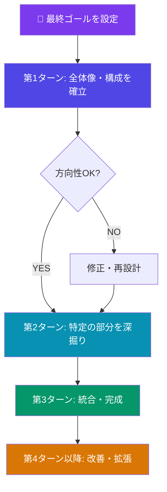
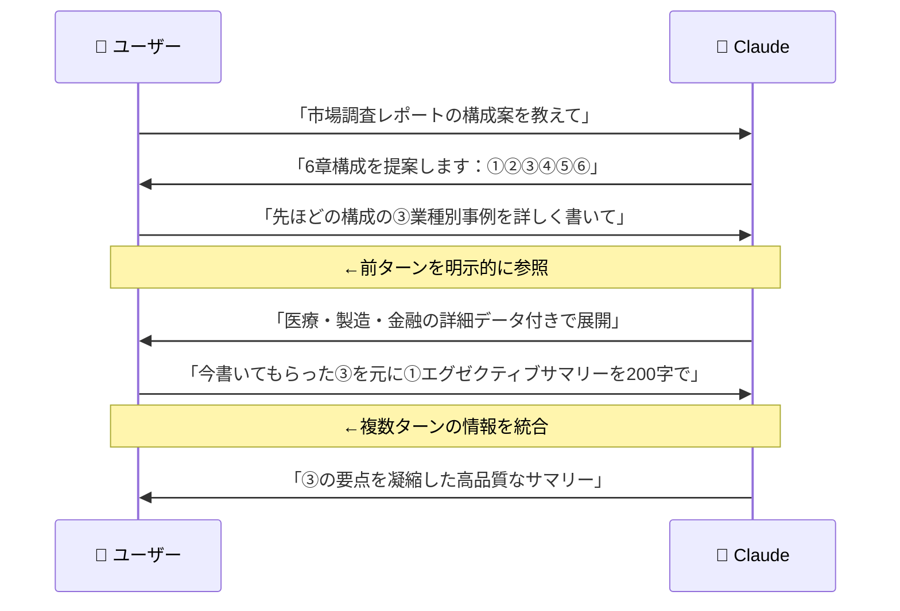
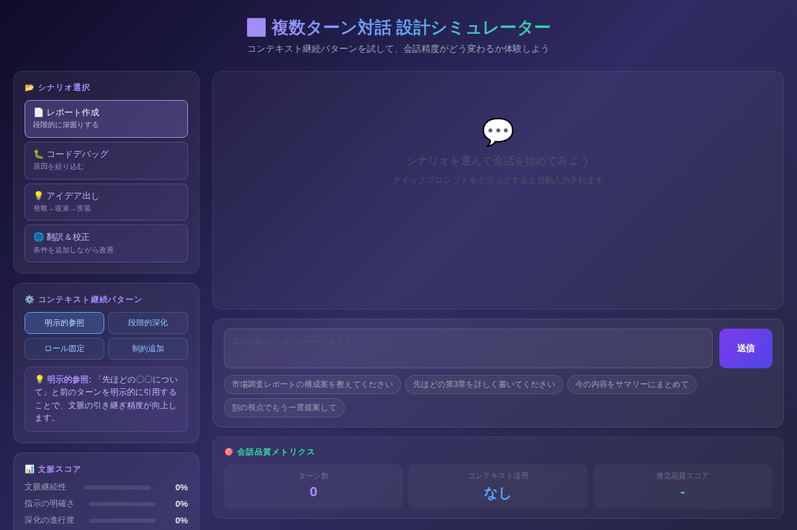

# Claudeとの複数ターン対話を極める：文脈を活かした会話設計で回答精度を3倍にする方法

「Claudeに聞いたけど、何度もやり取りしていると途中から的外れな答えが返ってくる……」

そう感じたことはないでしょうか？実は、複数回のやり取りで精度が落ちるのは**会話の設計が原因**であることがほとんどです。Claudeは最大200Kトークンものコンテキストを保持できる優れたモデルですが、そのポテンシャルを引き出すには「文脈を活かす対話設計」が不可欠です。

本記事では、複数ターンの対話をデザインする4つのパターンと、各パターンを使いこなすための実践プロンプトを解説します。これを読み終えたあと、あなたのClaudeとのやり取りは劇的に変わるはずです。

---

## なぜ複数ターン対話が重要なのか

単発の質問でも十分有用なClaudeですが、**複雑な仕事を完成させる**には複数のやり取りが必要です。

たとえば：
- レポートを書くとき → 構成 → 各章の執筆 → 全体の整合性チェックという段階がある
- コードをデバッグするとき → エラーの理解 → 原因特定 → 修正 → 拡張という流れがある
- アイデアを形にするとき → 発散 → 絞り込み → 実装計画という収束プロセスがある

一発で完璧な答えを出そうとするより、**段階を踏んで深掘りする対話設計**のほうが最終的な成果物の質が圧倒的に高くなります。



---

## 4つのコンテキスト継続パターン

複数ターン対話を成功させる鍵は、**前のターンの文脈を次のターンにどうつなぐか**です。ここでは4つの設計パターンを紹介します。

### パターン1：明示的参照（Explicit Reference）

前のターンの内容を**「〇〇について」「先ほどの〜」**と明示的に引用する方法。最もシンプルで確実なパターンです。



**コピペ用プロンプト①（明示的参照の基本形）**

```
先ほど提案してもらった[〇〇]を踏まえて、[具体的な追加リクエスト]をお願いします。
特に[強調したいポイント]の部分を重点的に扱ってください。
```

---

### パターン2：段階的深化（Progressive Deepening）

最初は広く全体を見て、ターンを重ねるごとに**徐々に対象を絞り込む**手法。「発散→収束」の思考プロセスを対話でトレースします。

| ターン | 目的 | 質問の粒度 |
|--------|------|----------|
| 1 | 全体像の把握 | 広い（10項目を並べる） |
| 2 | 有望な案に絞る | 中程度（3案を深堀り） |
| 3 | 最終案を磨く | 細かい（1案を完成形へ） |

**コピペ用プロンプト②（段階的深化のテンプレート）**

```
[テーマ]について、まずは幅広く10個のアイデアを出してください。
この段階では実現可能性より多様性を優先してください。

（2ターン目）
先ほどの10案の中から「[選んだ案]」と「[選んだ案]」が気に入りました。
この2つについて、それぞれのメリット・デメリット・具体的な実装方法を詳しく教えてください。

（3ターン目）
「[最終選択]」で進めます。
先ほどの分析を踏まえて、実際に使える[成果物の形式]を作成してください。
```

---

### パターン3：ロール固定（Role Anchoring）

対話の最初にClaudeの役割を宣言し、**全ターンで同じキャラクター・専門家として一貫した回答**を引き出す方法。

**コピペ用プロンプト③（ロール固定の例）**

```
今から、あなたは私が書くコードのシニアレビュアーとして振る舞ってください。
レビュー観点は以下の3点です：
1. 可読性（変数名・コメント）
2. パフォーマンス（計算量・メモリ）
3. セキュリティリスク

この役割は会話が終わるまで維持してください。
まず、あなたのレビュー方針を簡単に教えてください。
```

役割を固定することで、ターンを重ねるにつれて「専門家との深い議論」ができるようになります。特に**技術的な問題解決や文章の校正作業**で威力を発揮します。

---

### パターン4：制約追加（Constraint Stacking）

ターンごとに**新しい制約を積み上げていく**手法。最初は自由に出力させ、後から条件を追加することで、アウトプットの形式をコントロールします。

```
（1ターン目）ブログ記事の冒頭文を書いてください
  ↓
（2ターン目）先ほどの文章を200字以内に圧縮してください
  ↓
（3ターン目）同じ内容を、20代向けのカジュアルなトーンに書き直してください
  ↓
（4ターン目）今の文章にSEOキーワード「AI活用」「業務効率化」を自然に含めてください
```

各ターンが前のターンの出力を足場にして積み上がっていくため、**最終的な完成度が非常に高い**アウトプットになります。

---

## デモで実際に体験しよう

4つのパターンを使った実際の対話シミュレーターを用意しました。



[→ デモを操作する](../demos/20260526_multiple-turn-dialogue/index.html)

デモでは「レポート作成」「コードデバッグ」「アイデア出し」「翻訳＆校正」の4シナリオで、各パターンがどのように機能するかを体験できます。クイックプロンプトをクリックするだけで、複数ターン対話の流れを追体験できます。

---

## よくある失敗パターンと対処法

複数ターン対話でつまずきやすいポイントも確認しておきましょう。

**❌ 失敗1: コンテキストが長くなりすぎてClaudeが迷子になる**

長い対話の後半で「途中で言ったことを忘れた？」と感じるときは、コンテキストが散漫になっているサインです。

✅ 対処法: 定期的に「ここまでの整理」を依頼する
```
ここまでの議論を3点で要約して、現時点での結論と次のアクションを確認させてください。
```

**❌ 失敗2: 毎回ゼロから説明して冗長になる**

前のターンで決めたことを毎回最初から説明し直していませんか？

✅ 対処法: 「前提は変わらず」と一言添えるだけでOK
```
前提条件は変わらず、今度は[新しいリクエスト]だけお願いします。
```

**❌ 失敗3: あいまいな「もっとよくして」**

「もっといい感じにして」「もう少し丁寧に」といった曖昧な修正依頼は、期待と異なる方向に修正されることがあります。

✅ 対処法: 変更点を具体的に指定する
```
先ほどの文章の[具体的な箇所]を[具体的な変更内容]に修正してください。
他の部分は変更しないでください。
```

---

## まとめ：今日から使える複数ターン設計の要点

- 🔗 **前のターンを明示的に参照する**ことで文脈の引き継ぎ精度が大幅に向上する
- 📐 **段階的に深化させる設計**が最終的な成果物の品質を最大化する
- 🎭 **役割を最初に固定**すると、全ターンで一貫したトーンと専門性が担保される
- ⚙️ **制約を後から追加**することで、アウトプットの形式をコントロールできる
- 🔄 **長い対話では途中整理**を挟むことで迷子を防ぐ

---

## 次のステップ：明日すぐ試せるアクション

1. **職場や日常の「複数ステップが必要な作業」を1つ選ぶ**（例：週次報告書、企画書、コードレビュー）
2. **本記事の「段階的深化テンプレート」をコピーして、最初のターンだけ送ってみる**
3. **Claudeの返答を読んで、2ターン目で「先ほどの〇〇について、さらに〜」と続ける**

たった3ターンの練習で、これまでとまったく違う体験ができるはずです。ぜひ今日の仕事で試してみてください。

---

*次回は「ペルソナ設定でClaudeを自分専用のコンサルタントに育てる方法」を解説します。お楽しみに。*
