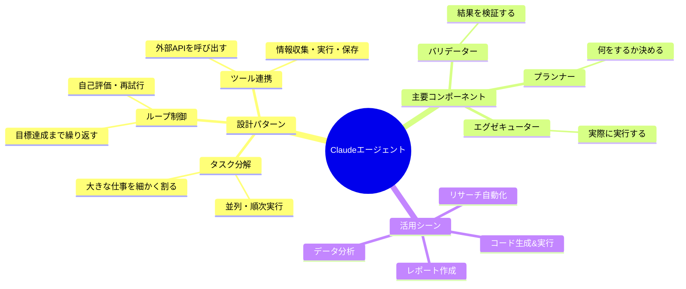
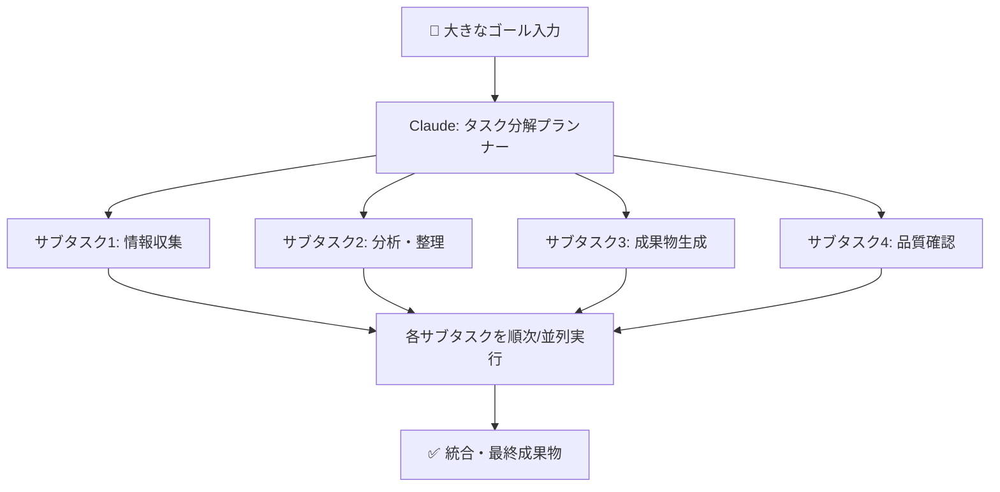
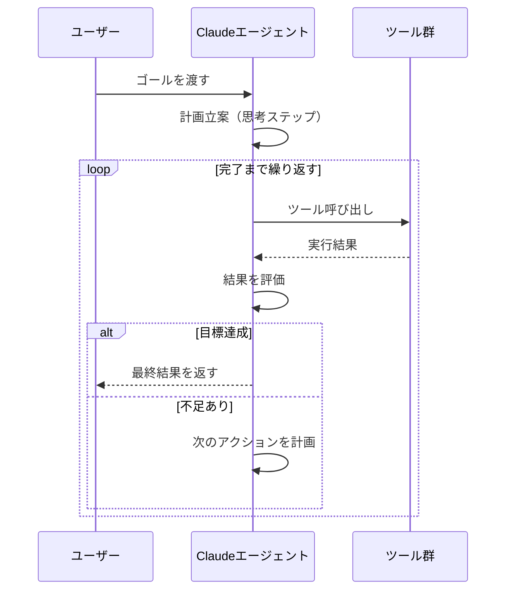
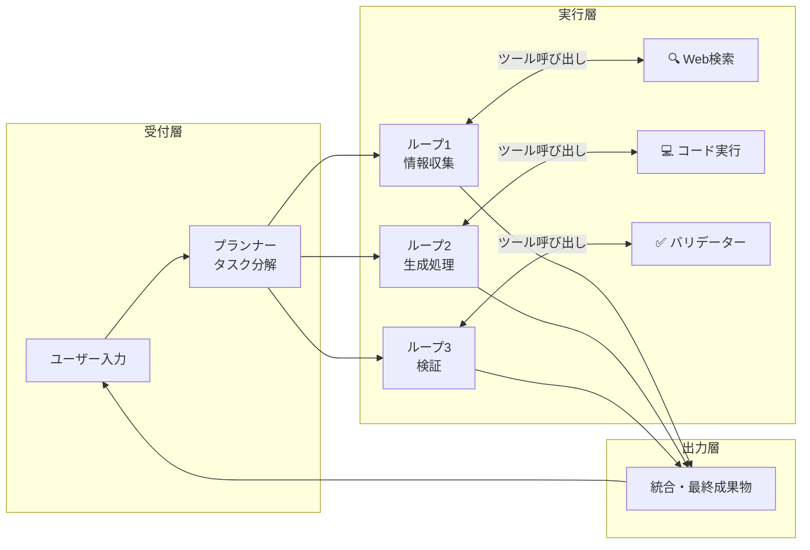
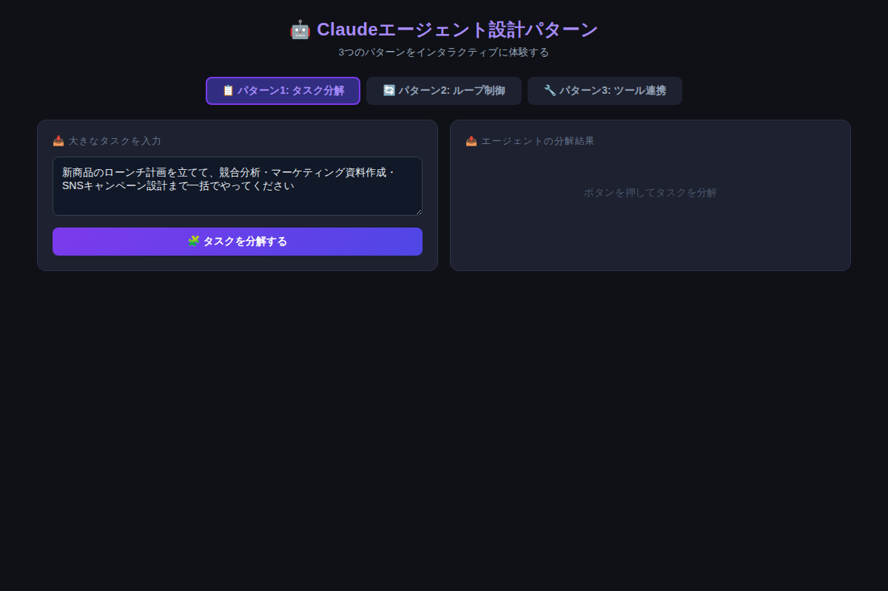

# Claudeエージェントを設計する3つのパターン：タスク分解・ループ制御・ツール連携の実践

「AIに仕事を任せたい」——そう思ったとき、単発のプロンプトでは限界があります。本当に複雑な作業をこなすには、**エージェント設計**という発想の転換が必要です。この記事を読み終えると、3つのパターンで多くの業務を自動化できるようになります。

---

## AIエージェントとは何か？

従来のClaude活用は「質問→回答」の1往復が基本でした。しかし現実の仕事はそれほど単純ではありません。競合分析、コード生成、データ集計……これらは複数のステップが連続し、途中で判断が必要で、外部ツールとの連携も求められます。

**AIエージェント**とは、目標を与えれば自律的にステップを設計・実行・評価してタスクを完遂するシステムです。Claude 3.5以降、ツール呼び出し（Function Calling）とマルチターン対話の精度が飛躍的に向上し、本格的なエージェント設計が現実的になりました。



---

## パターン1：タスク分解（Task Decomposition）

### 概要

大きなゴールを、Claude自身が実行可能な小さなサブタスクに分解するパターンです。人間がプロジェクト管理でWBS（作業分解構造）を作るのと同じ発想です。

### なぜ有効か

Claudeに「新商品のローンチ計画を全部やって」と一気に頼むと、出力が曖昧になりがちです。しかし「まず競合分析、次にポジショニング、その次にコピー作成…」と分解すると、各ステップで深い思考が生まれ、出力品質が格段に向上します。



### コピペ用プロンプト例①：汎用タスク分解

```
あなたはプロジェクトマネージャーです。以下のゴールを達成するために、
具体的な実行可能なサブタスクに分解してください。

【ゴール】
{ここに大きなタスクを書く}

要件：
- 各サブタスクは30分以内で完了できる粒度にする
- 依存関係（A完了後にBを実行）を明記する
- 並列実行可能なタスクは[並列]と示す
- 各タスクの成功基準を1行で示す

出力形式：
1. [タスク名] - [成功基準] - [依存関係]
```

### 実践例

```
【ゴール】競合他社3社の分析レポートを作成する

分解結果：
1. [競合A調査] - 製品・価格・特徴を3点以上記録 - [なし] [並列]
2. [競合B調査] - 製品・価格・特徴を3点以上記録 - [なし] [並列]
3. [競合C調査] - 製品・価格・特徴を3点以上記録 - [なし] [並列]
4. [比較表作成] - 3社×5項目の表が完成 - [1,2,3完了後]
5. [差別化分析] - 自社優位性を3点特定 - [4完了後]
6. [レポート統合] - 2,000字以上のレポート完成 - [5完了後]
```

---

## パターン2：ループ制御（ReAct Loop）

### 概要

「目標設定 → アクション実行 → 結果評価 → 完了か判断 → 未完なら再実行」というサイクルを繰り返すパターンです。**ReAct（Reasoning + Acting）**とも呼ばれ、自律エージェントの核心部分です。

### なぜ有効か

一回の試みで完璧な結果が得られないとき（検索で欲しい情報が見つからない、コードがエラーを出すなど）、人間と同様に「もう一度試す」判断ができます。これにより、単発プロンプトでは不可能だったタスクが自動完結します。



### コピペ用プロンプト例②：ReActループ指示

```
あなたは自律エージェントです。以下の目標を達成するまで、
思考と行動のループを繰り返してください。

【目標】
{ここに達成したいことを書く}

【成功基準】
{何が揃ったら完了か}

ループのルール：
- 各ステップで「思考：〇〇」「行動：〇〇」「結果：〇〇」「評価：〇〇」の形式で記録する
- 最大5ループまで試みる
- 3ループ連続で同じ結果なら別のアプローチに切り替える
- 完了したら「✅ 完了：{まとめ}」と出力する

利用可能なツール：{web_search / code_exec / file_read}
```

### 最大ループ数を設定する重要性

ループ制御で絶対に忘れてはいけないのが**終了条件**です。無限ループは計算コストを浪費します。実装時は必ず：

- **最大試行回数**（例：`max_iterations: 10`）
- **タイムアウト**（例：`timeout: 60s`）
- **信頼スコアしきい値**（例：`confidence >= 0.85 で完了`）

の3点を設定しましょう。

---

## パターン3：ツール連携（Tool Integration）

### 概要

Claudeが外部ツール（検索API、コード実行環境、ファイルシステム、データベース）を呼び出し、リアルタイムの情報や計算結果を取り込むパターンです。

### なぜ有効か

Claudeの知識は学習データに依存しますが、ツール連携によって「今この瞬間のWebデータ」「実際に動かしたコードの結果」「社内DBの最新値」を活用できます。これが、エージェントを「考えるだけのAI」から「行動できるAI」に変えます。

### コピペ用プロンプト例③：ツール呼び出し定義テンプレート

```json
{
  "tools": [
    {
      "name": "web_search",
      "description": "インターネットで最新情報を検索する",
      "input_schema": {
        "type": "object",
        "properties": {
          "query": {
            "type": "string",
            "description": "検索クエリ（日本語可）"
          },
          "num_results": {
            "type": "integer",
            "description": "取得件数（デフォルト5）",
            "default": 5
          }
        },
        "required": ["query"]
      }
    },
    {
      "name": "code_exec",
      "description": "Pythonコードを実行して結果を返す",
      "input_schema": {
        "type": "object",
        "properties": {
          "code": {
            "type": "string",
            "description": "実行するPythonコード"
          }
        },
        "required": ["code"]
      }
    }
  ]
}
```

### ツール設計の黄金則

| 原則 | 説明 |
|------|------|
| **最小権限** | エージェントに必要最小限のツールだけ渡す |
| **冪等性** | 同じ入力なら同じ結果になるツールを優先 |
| **エラーハンドリング** | ツール失敗時の代替動作を定義する |
| **ログ記録** | 全ツール呼び出しをトレースできるようにする |

---

## 3パターンを組み合わせた実践アーキテクチャ

実際のプロダクション環境では、3パターンを組み合わせることで真の威力を発揮します。



---

## インタラクティブデモで体験する

この記事で解説した3つのパターンを、実際に動かして確認できるデモを用意しました。



[→ デモを操作する](../demos/20260527_claude-agent-design-3patterns/index.html)

- **パターン1タブ**：タスクを入力すると自動でサブタスクに分解されます
- **パターン2タブ**：ReActループの思考プロセスをリアルタイムで可視化
- **パターン3タブ**：3つのシナリオでツール呼び出しの流れを体験

---

## 実装時のよくある落とし穴

### 1. コンテキストウィンドウの枯渇

ループを繰り返すと、過去のやり取りが蓄積してコンテキストが溢れます。**定期的に要約を挟む**か、**スライディングウィンドウ**で古い履歴を削除する設計が必要です。

### 2. ハルシネーションによる誤ったツール呼び出し

Claudeが存在しないAPIエンドポイントや誤ったパラメータでツールを呼び出すことがあります。**ツールの定義を詳細に書く**こと、**バリデーション層を挟む**ことで大幅に改善できます。

### 3. コスト爆発

無制限のループはAPIコストを爆発させます。`max_tokens`と`max_iterations`は必ず設定し、ステージングで十分テストしてからプロダクションに投入してください。

---

## まとめ

- 🧩 **タスク分解**：大きなゴールをWBSのように分割することで、各ステップの精度を向上させる
- 🔄 **ループ制御**：目標達成まで自律的に試行を繰り返すReActパターンで複雑なタスクに対応
- 🔧 **ツール連携**：外部API・コード実行・DBと接続し、リアルタイムデータを活用できる
- ⚠️ **設計時の必須事項**：最大ループ数・タイムアウト・最小権限の3つを必ず設定する
- 🏗️ **実力はコンビネーション**：3パターンを組み合わせることで、人間が手動では対応できないスケールの作業を自動化できる

---

## 次のステップ：明日すぐ試せるアクション

1. **タスク分解プロンプト**（例①）をコピーして、今日の業務の一つに適用してみる
2. Claudeのドキュメント「[Tool Use](https://docs.anthropic.com/en/docs/build-with-claude/tool-use)」を読んでツール定義の書き方を習得する
3. デモのソースコードを参考に、自分のユースケース向けのシンプルなループエージェントを実装してみる

エージェント設計は最初こそ学習コストがありますが、一度マスターすれば「今まで一日かかっていた作業が15分で完了する」体験が何度でも繰り返せます。まずは小さなタスクから始めてみましょう。
