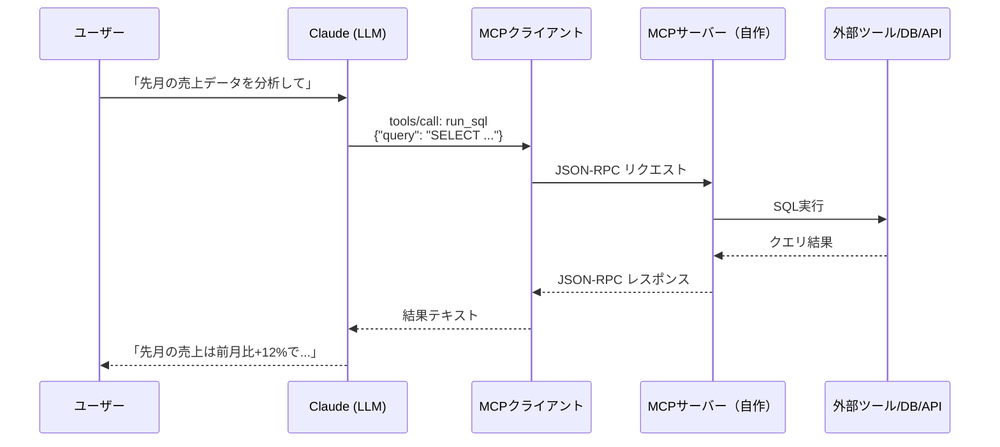
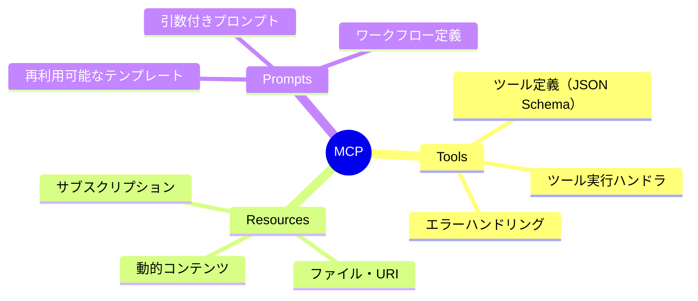
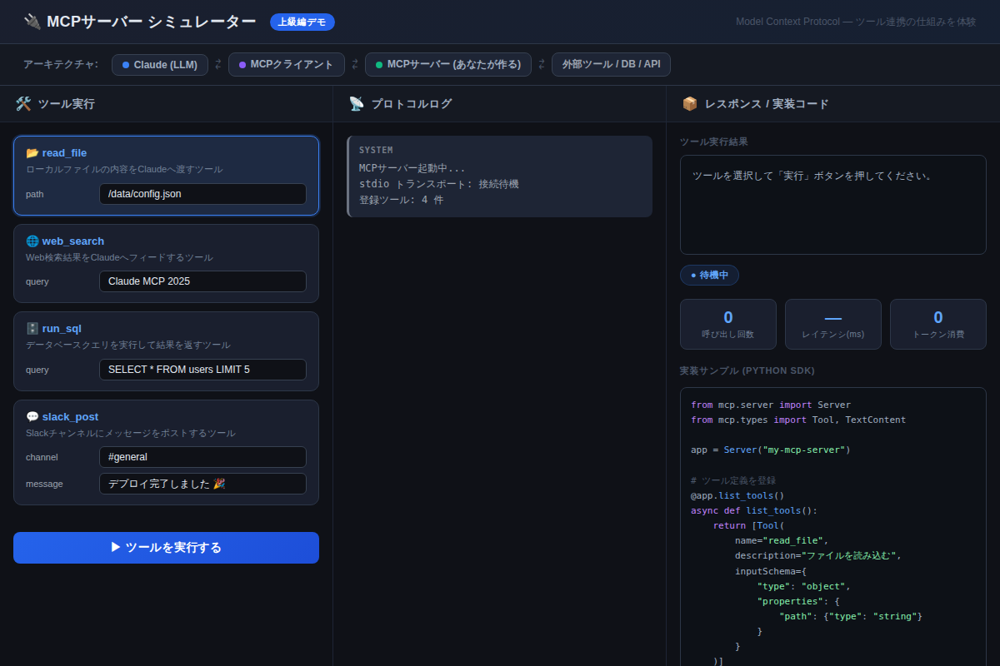

# MCPサーバーを30分で自作する：Claudeの能力を無限に拡張する実装ガイド【上級編】

「Claudeにファイルを読ませたい」「データベースと繋ぎたい」「Slackと連携させたい」——そんな願いを**コード50行以内**で叶える技術が、Model Context Protocol（MCP）だ。2024年11月にAnthropicが公開したこのオープン規格を使えば、Claudeはあなただけの専用ツールを自在に呼び出すエージェントへと進化する。

---

## MCPとは何か：Claudeに「手」を与える仕組み

Claudeは優秀な思考エンジンだが、デフォルトでは「言葉を扱う」しかできない。ファイルシステムへのアクセス、データベースへのクエリ、外部APIの呼び出し——これらはすべて「手」が必要な作業だ。

MCPはその「手」を提供するプロトコルである。



重要なのは、**MCPサーバーはあなたが実装する**という点だ。Claudeはツールの定義さえ知っていれば、適切なタイミングで自律的にそれを呼び出す。

---

## MCPの3つのコアコンセプト



本記事では最も頻繁に使う **Tools**（ツール）に集中する。ツールとは「Claudeが呼び出せる関数」であり、JSON Schemaで引数を定義し、Pythonまたは TypeScript で実装する。

---

## 環境構築：5分で準備完了

Python SDKを使った最小構成から始めよう。

```bash
pip install mcp
```

これだけだ。依存関係は最小限に保たれている。

---

## ステップ1：最小MCPサーバーを動かす

まず動く最小コードを見てほしい。

```python
# server.py
from mcp.server import Server
from mcp.server.stdio import stdio_server
from mcp.types import Tool, TextContent
import asyncio

app = Server("my-first-mcp-server")

@app.list_tools()
async def list_tools():
    return [
        Tool(
            name="greet",
            description="名前を受け取って挨拶文を返す",
            inputSchema={
                "type": "object",
                "properties": {
                    "name": {"type": "string", "description": "挨拶する相手の名前"}
                },
                "required": ["name"]
            }
        )
    ]

@app.call_tool()
async def call_tool(name: str, arguments: dict):
    if name == "greet":
        return [TextContent(
            type="text",
            text=f"こんにちは、{arguments['name']}さん！MCPが動いています 🎉"
        )]

if __name__ == "__main__":
    asyncio.run(stdio_server(app))
```

**コピペ用プロンプト①（Claude Desktopへの設定確認）**
```
以下のMCPサーバー設定をclaude_desktop_config.jsonに追加する方法を教えてください：
サーバー名: my-first-mcp-server
コマンド: python /path/to/server.py
```

---

## ステップ2：実用的なファイル読み込みツール

```python
# file_server.py
from mcp.server import Server
from mcp.server.stdio import stdio_server
from mcp.types import Tool, TextContent
import asyncio, pathlib

app = Server("file-reader")

ALLOWED_DIR = pathlib.Path("/home/user/documents")  # アクセス許可ディレクトリ

@app.list_tools()
async def list_tools():
    return [
        Tool(
            name="read_file",
            description="テキストファイルを読み込む（許可ディレクトリのみ）",
            inputSchema={
                "type": "object",
                "properties": {
                    "path": {"type": "string", "description": "読み込むファイルのパス"}
                },
                "required": ["path"]
            }
        ),
        Tool(
            name="list_files",
            description="ディレクトリ内のファイル一覧を返す",
            inputSchema={
                "type": "object",
                "properties": {
                    "directory": {"type": "string", "description": "一覧を取得するディレクトリ"}
                },
                "required": ["directory"]
            }
        )
    ]

@app.call_tool()
async def call_tool(name: str, arguments: dict):
    if name == "read_file":
        target = pathlib.Path(arguments["path"]).resolve()
        # セキュリティ：許可ディレクトリ外へのアクセスを防ぐ
        if not target.is_relative_to(ALLOWED_DIR):
            raise ValueError(f"アクセス拒否: {target}")
        return [TextContent(type="text", text=target.read_text(encoding="utf-8"))]

    if name == "list_files":
        d = pathlib.Path(arguments["directory"]).resolve()
        if not d.is_relative_to(ALLOWED_DIR):
            raise ValueError(f"アクセス拒否: {d}")
        files = [f.name for f in d.iterdir() if f.is_file()]
        return [TextContent(type="text", text="\n".join(files))]
```

ポイントは `is_relative_to()` によるパストラバーサル攻撃への対策だ。MCPサーバーはローカルで動くため、**セキュリティは実装者の責任**になる。

---

## ステップ3：SQLiteデータベース連携

```python
# db_server.py
from mcp.server import Server
from mcp.server.stdio import stdio_server
from mcp.types import Tool, TextContent
import asyncio, sqlite3, json

app = Server("sqlite-reader")
DB_PATH = "./app.db"

@app.list_tools()
async def list_tools():
    return [Tool(
        name="query_db",
        description="SQLiteデータベースにSELECTクエリを実行する",
        inputSchema={
            "type": "object",
            "properties": {
                "sql": {"type": "string", "description": "実行するSELECT文"}
            },
            "required": ["sql"]
        }
    )]

@app.call_tool()
async def call_tool(name: str, arguments: dict):
    if name == "query_db":
        sql = arguments["sql"].strip()
        if not sql.upper().startswith("SELECT"):
            raise ValueError("SELECTのみ許可")
        
        conn = sqlite3.connect(DB_PATH)
        conn.row_factory = sqlite3.Row
        rows = conn.execute(sql).fetchall()
        result = json.dumps([dict(r) for r in rows], ensure_ascii=False, indent=2)
        return [TextContent(type="text", text=result)]

if __name__ == "__main__":
    asyncio.run(stdio_server(app))
```

**コピペ用プロンプト②（Claudeへの指示）**
```
query_dbツールを使って、usersテーブルから
直近30日以内に登録した新規ユーザーを抽出し、
登録日・名前・メールアドレスの一覧を作成してください。
```

---

## Claude Desktop への登録方法

作ったサーバーをClaude Desktopで使うには、設定ファイル（`claude_desktop_config.json`）に追記するだけだ。

```json
{
  "mcpServers": {
    "file-reader": {
      "command": "python",
      "args": ["/path/to/file_server.py"]
    },
    "sqlite-reader": {
      "command": "python",
      "args": ["/path/to/db_server.py"],
      "env": {
        "DB_PATH": "/path/to/app.db"
      }
    }
  }
}
```

再起動すれば、Claude Desktopのツールメニューにサーバーが表示される。

---

## インタラクティブデモ：MCPプロトコルを体験する

実際のJSON-RPCメッセージの流れをブラウザ上でシミュレートできるデモを用意した。



[→ デモを操作する](../demos/20260528_mcp-server-build-guide/index.html)

`read_file`・`web_search`・`run_sql`・`slack_post` の4つのツールを試し、ClaudeとMCPサーバーの間でどのようなJSON-RPCメッセージが交換されるかを確認できる。右パネルには各ツールの実装コードサンプルも表示される。

---

## 実装時の重要チェックリスト

| チェック項目 | 内容 |
|------------|------|
| 入力バリデーション | パストラバーサル・SQLインジェクション対策 |
| エラーハンドリング | 例外を`ValueError`で返す（Claude がエラーを認識できる） |
| ログ出力 | `stderr` に出力（`stdout` はプロトコル用） |
| 権限の最小化 | 必要最低限のディレクトリ・テーブルのみ公開 |
| タイムアウト | 長時間処理は`asyncio.wait_for()`でラップ |

---

## まとめ

- **MCPはClaudeに「手」を与えるオープン規格**で、Python/TypeScript SDKで30分以内に動作する
- **ツール定義（JSON Schema）+ 実行ハンドラ**の2つを実装するだけで完成する
- **セキュリティは実装者の責任**——パストラバーサル対策・SQLインジェクション対策・権限最小化を必ず行う
- **Claude Desktopへの登録は設定ファイル1行**で完了し、再起動後すぐに使える
- **コミュニティ製サーバーが300件以上公開中**なので、まずは既存サーバーを試してから自作へ進むのが効率的

---

## 次のステップ：明日すぐ試せるアクション

1. `pip install mcp` を実行して、本記事の「最小MCPサーバー」コードをそのまま動かしてみる
2. 自分がよく使うローカルディレクトリを `ALLOWED_DIR` に設定して `file_server.py` を起動する
3. Claude Desktop の設定ファイルに登録し、「このプロジェクトのREADME.mdを要約して」と話しかけてみる

30分後、Claudeはあなたのローカルファイルを読める存在に変わっているはずだ。

---

*関連記事: [Chain-of-Thoughtプロンプトでモデルの思考力を引き出す](./20260519_chain-of-thought.md)*
