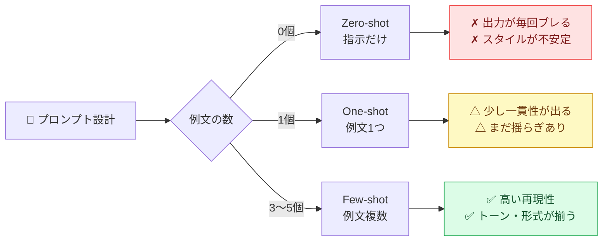
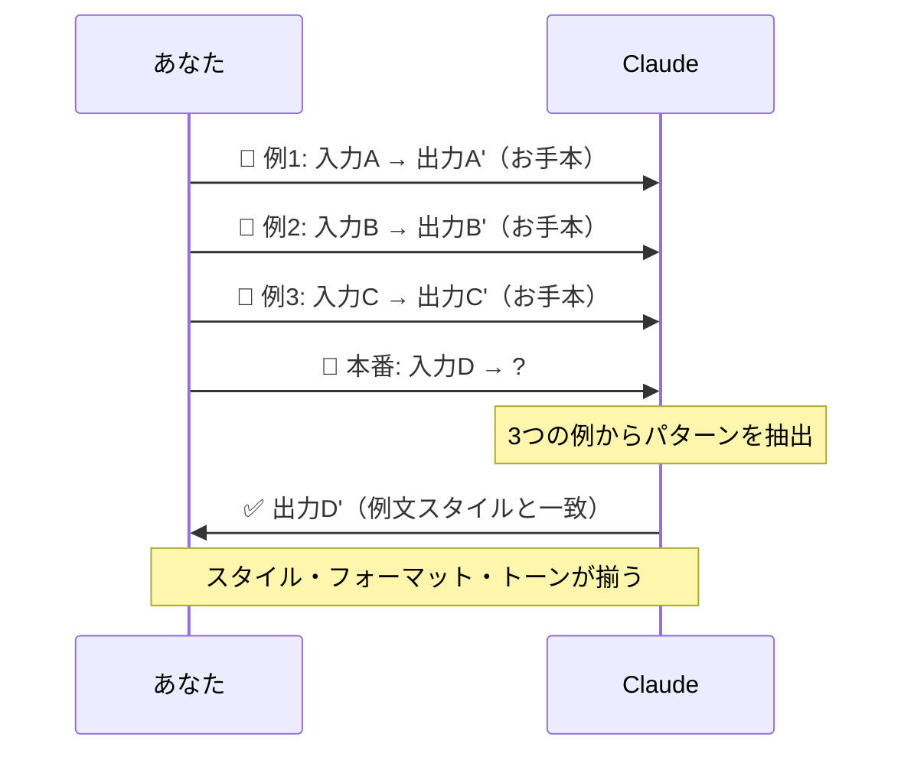
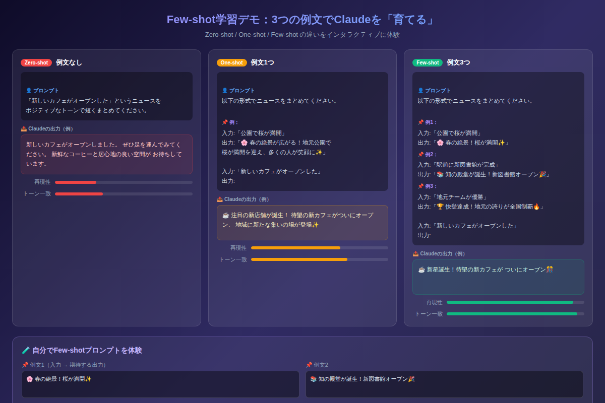

# Few-shot学習でClaudeを「育てる」：たった3つの例文で回答精度が大幅アップ

「毎回プロンプトを丁寧に書いているのに、Claudeの回答がバラバラ」──そう感じたことはありませんか？実は、回答の一貫性を高める最強の武器が「Few-shot学習」です。たった3つの例文を添えるだけで、Claudeは瞬時にあなたの「期待するスタイル」を学習し、精度が劇的に向上します。

---

## Few-shot学習とは何か

**Few-shot学習**とは、プロンプトの中に「こんな入力にはこんな出力を」という例文を数件示すテクニックです。AIに「お手本」を渡してから本題を問う、という流れです。

「言葉で説明する」のではなく「見せて学ばせる」──これがFew-shot学習の本質です。

### Zero-shot・One-shot・Few-shotの違い



---

## なぜFew-shotは効くのか

Claudeは大量のテキストデータで学習しており、「パターンの続きを予測する」ことが得意です。例文を示すと「あ、このパターンで回答すればいいんだな」と即座に理解します。

指示だけで「ポジティブな文体で」と伝えるよりも、実際にポジティブな例を3つ見せた方が、Claudeにとってはるかに明確です。

### Few-shotの対話フロー



---

## 実践：Few-shotプロンプトの書き方

### ステップ1: 例文を3〜5つ用意する

出力してほしい**形式・トーン・長さ**を揃えた例文を準備します。バラバラなスタイルの例は逆効果なので注意してください。

### ステップ2: 「例X:」ラベルで区切る

Claudeが例文と本番の入力を混同しないよう、明確にラベルを付けます。

### ステップ3: 本番の入力を最後に置く

「本番の入力 → ?」という形で終わらせることで、Claudeが「これが解くべき問題だ」と認識します。

---

## コピペ用プロンプト例

### 例1: SNS投稿の文体を統一する

```
以下の形式でニュースをSNS向けに短くまとめてください。

【例1】
入力: 「公園で桜が満開」
出力: 「🌸 春の絶景！桜が満開✨ 今すぐ近くの公園へ」

【例2】
入力: 「地元チームが全国優勝」
出力: 「🏆 快挙達成！地元の誇りが全国制覇🔥 感動をありがとう」

【例3】
入力: 「新しい図書館が完成」
出力: 「📚 知の殿堂が誕生！新図書館ついにオープン🎉 ぜひ行こう」

---
入力: 「地域の子ども食堂に100万円の寄付が集まった」
出力:
```

### 例2: レビュー文の構成を固定する

```
以下のフォーマットで商品レビューをまとめてください。

【例1】
商品: ワイヤレスイヤホン
レビュー: 「音質が良く、長時間つけても疲れない。バッテリーが1日持つのも嬉しい。
強いて言えば、もう少し安いと嬉しい。総合して買って正解でした。」
まとめ:「✅ 良い点: 音質・装着感・バッテリー持ち / ❌ 惜しい点: 価格」

【例2】
商品: コーヒーメーカー
レビュー: 「操作が簡単で毎朝重宝している。抽出スピードが速い。
ただ、洗いにくい部品があるのが気になる。」
まとめ:「✅ 良い点: 操作性・スピード / ❌ 惜しい点: 手入れのしにくさ」

---
商品: スマートウォッチ
レビュー: 「デザインがおしゃれで仕事中も違和感なし。通知管理が便利。
充電が毎日必要なのはちょっと面倒。」
まとめ:
```

---

## デモで体験する

上記の理論を実際に試せるインタラクティブデモを用意しました。Zero-shot・One-shot・Few-shotの出力品質の差を視覚的に確認できます。



[→ デモを操作する](../demos/20260529_few-shot-learning/index.html)

デモでは、自分でお手本例文を入力し、Few-shotプロンプトの構造がどう変わるかをリアルタイムで確認できます。

---

## 精度を上げる3つのコツ

**1. 最後の例文に最もこだわる（recency bias）**
Claudeは直前の例文が最も記憶に残りやすい性質を持ちます。最も伝えたいスタイルの例は必ず最後に配置してください。

**2. 例文の長さ・形式を揃える**
例文Aは2行、例文Bは10行、では「長さ」という変数が加わりぶれます。お手本は形式を統一することが重要です。

**3. ネガティブ例も入れる（Contrast Few-shot）**
「こうは書かない」という反面教師の例を1つ混ぜることで、Claudeの方向性がさらに絞られます。

---

## まとめ

- **Few-shot学習**とは、例文を数件示してClaudeに出力スタイルを学習させるテクニック
- **Zero-shot（例文なし）→ Few-shot（3〜5例）**でトーン・形式の再現性が劇的に向上する
- 例文は**形式・長さ・トーンを揃えて**3〜5件が最適（多すぎるとコスパ低下）
- **最後の例文**が最も影響が大きい（recency biasを活用する）
- コピペ用プロンプト2つをそのまま使えば、今日から即効果が出る

---

## 次のステップ：明日すぐ試せるアクション

1. **今日の会議**でFew-shotプロンプトを1つ試す──SNS投稿まとめや議事録要約に使ってみてください
2. **自分専用のFew-shot辞書**を作る──よく使うフォーマットの例文を3つストックしておくと毎回の手間が省けます
3. **明日は「長文要約」テクニック**──Few-shotを使った長文の構造化要約を学びましょう（中級編・次回更新予定）
