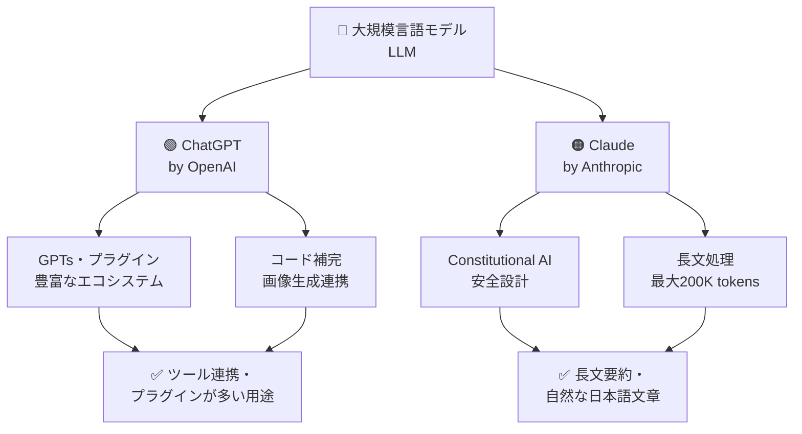
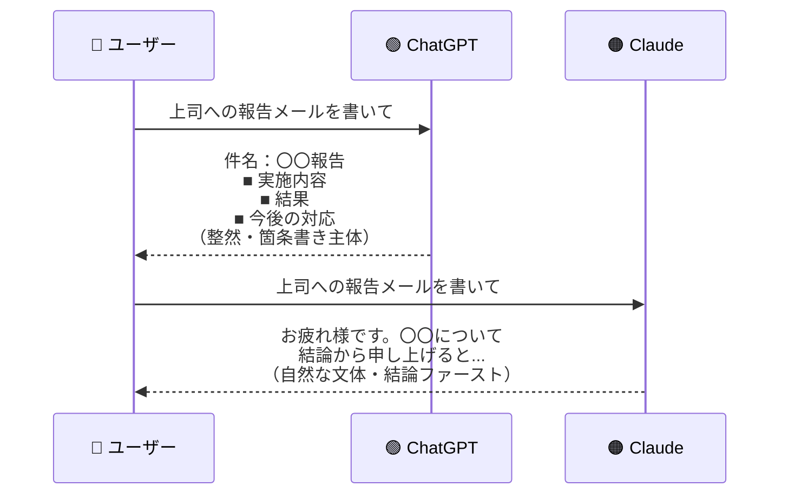
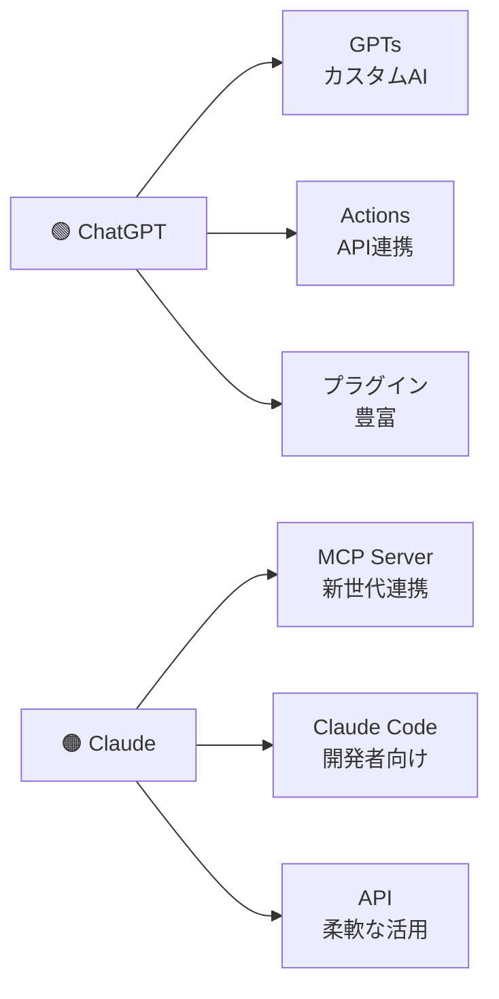
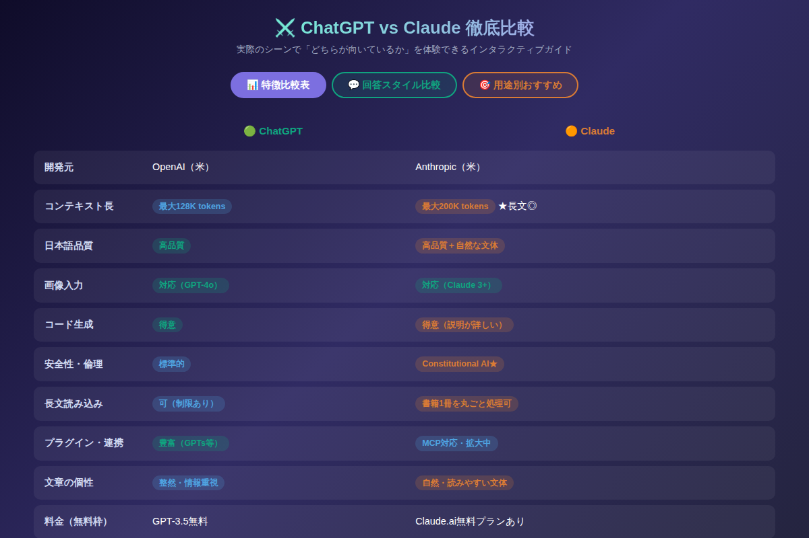

# ChatGPTとClaudeはここが違う！初心者が知るべき5つの特徴と使い分けガイド

「ChatGPTとClaudeって何が違うの？どっちを使えばいいの？」——これは2026年のAI入門者が最初にぶつかる壁です。両者とも「すごいAI」であることは確かですが、**得意なことが微妙に異なり、使い方を間違えると「何かイマイチだな」という体験につながります。** この記事では5つの違いを具体的に比較し、あなたの用途に合った選択ができるようになるガイドをお届けします。

---

## そもそも2つはどう違う？ざっくり整理

まず全体像を掴みましょう。



どちらも「テキストを生成するAI」という点では同じです。ただ、**開発元の理念・設計思想・得意な領域が異なります。** どちらかが「上」ではなく、「向いている用途が違う」という理解が正解です。

---

## 違い1：コンテキストウィンドウ（一度に読める量）

最も実用的な違いの一つがこれです。

| モデル | 最大コンテキスト |
|--------|------------|
| ChatGPT（GPT-4o） | 最大128K tokens（約10万文字相当） |
| Claude 3.7 Sonnet | 最大200K tokens（約15万文字相当） |

「tokens」という単位はざっくり「単語の数」と思ってください。**200K tokensとは、文庫本1冊丸ごとを貼り付けて質問できる**、ということです。

**Claudeが有利なシーン：**
- 長い契約書・報告書を丸ごと読み込ませて要約させたい
- 論文や仕様書を全部渡して「矛盾点を探して」と頼みたい
- 長時間の会議録（テキスト化済み）を分析したい

**コピペ用プロンプト例①：長文要約（Claude向け）**
```
以下の文書全体を読み込んでください。その上で：
1. 全体の要点を3行で
2. 特に重要な数値・日付・固有名詞を箇条書きで
3. 矛盾または曖昧な記述があれば指摘してください

[文書全文をここに貼る]
```

---

## 違い2：日本語の文体・自然さ

これは体感的に最も分かりやすい違いです。



ChatGPTは**構造化された情報を整理して出す**のが得意です。報告書や技術文書のような「箇条書きで整理されたアウトプット」が欲しい時に力を発揮します。

一方Claudeは、**読んでいて自然なリズムの文章**を生成する傾向があります。ブログ・SNS投稿・ビジネスメールの「最終稿」として使いやすい文章が出やすいです。

**コピペ用プロンプト例②：自然なビジネスメール（Claude向け）**
```
以下の状況に合わせて、読み手に自然に伝わるビジネスメールを書いてください。

状況：[状況を書く。例：商談の結果を上司に報告する]
重要ポイント：[相手に必ず伝えたいこと]
トーン：[丁寧・フレンドリー・簡潔、などを指定]
```

---

## 違い3：安全性・倫理設計（Constitutional AI）

Claudeの最大の独自性がここにあります。Anthropicは「Constitutional AI（憲法AI）」という設計思想のもとでClaudeを開発しました。

簡単に言うと、**AIが「どう振る舞うべきか」を原則のセット（≒憲法）として学習させている**手法です。

実際の使用感としては：
- 有害な回答をより慎重に避ける傾向がある
- 倫理的に微妙な質問に対して「バランスの取れた回答」を返しやすい
- 「私には〇〇の能力はありません」という正直な自己開示が多い

**どちらが向いているか：**
- 教育目的・子どもが使う環境 → **Claude推奨**
- 創作・フィクション系の試み → ChatGPTの方が制限が少ない場合も

---

## 違い4：ツール連携・エコシステム

「外部サービスと繋いで使いたい」という用途では、現時点でChatGPTが優位です。



ChatGPTはGPTs・Actionsというエコシステムが成熟しており、多くの外部サービスが「ChatGPT連携」をサポートしています。

Claudeは**MCPサーバー（Model Context Protocol）**という新しいアーキテクチャで急速に拡張中です。GitHub・Slack・データベースと接続できる仕組みで、開発者には特に注目されています（詳しくは来週水曜の記事で解説予定です）。

---

## 違い5：回答スタイル・対話のアプローチ

これが最も「使い始めてから気づく」違いです。

**ChatGPTの回答スタイル**：「質問に答える」を優先。すぐに答えを返してくれる。処理が速い印象。

**Claudeの回答スタイル**：「質問を理解してから答える」を重視。「前提を確認させてください」「〇〇と〇〇の2パターン、どちらが合いますか？」と聞き返してくることが多い。

これは「どちらが正しい」ではなく、**目的によって使い分けるべき特性**です。

| やりたいこと | 向いているAI |
|----------|------------|
| すぐに答えが欲しい | ChatGPT |
| 深く掘り下げて考えたい | Claude |
| コードを素早く直したい | ChatGPT |
| 設計や方針を相談したい | Claude |
| プラグインを使いたい | ChatGPT |
| 長い文書を分析したい | Claude |

---

## インタラクティブデモで確認してみよう

この記事の内容を実際に体験できるデモを用意しました。「特徴比較表」「回答スタイル比較」「用途別おすすめ」の3つのパネルで確認できます。



[→ デモを操作する](../demos/20260601_chatgpt-vs-claude/index.html)

---

## まとめ：5つの違いを一言で

- **コンテキスト長** → Claudeが200K tokensで有利。長文処理はClaudeへ
- **日本語文体** → Claudeがより自然な文章。ブログ・メールの最終稿にはClaude
- **安全性設計** → ClaudeのConstitutional AIが独自。教育・倫理的配慮が必要な場面はClaude
- **ツール連携** → ChatGPTのエコシステムが成熟。連携サービスが多い用途はChatGPT
- **対話スタイル** → すぐに答えを求めるならChatGPT、深く考えるならClaude

「どちらが上か」という問いに答えはありません。**「今日やりたいこと」に合わせて使い分ける**——これがAI活用の第一歩です。

---

## 次のステップ：今日から試せること

1. **同じプロンプトを両方に投げてみる** — 「先週の業務を振り返り、来週の優先度を整理して」を両方に送り、回答の違いを体感する
2. **長文テスト** — 自分がよく扱う長いドキュメント（会議録・仕様書など）をClaudeに丸ごと貼り付けて要約させてみる
3. **メール作成** — 明日書く必要があるビジネスメールをClaudeに相談してみる（上のプロンプト例②をコピペしてOK）

次回（明日、火曜）は中級編として「Claudeをロールプレイで使い倒す：専門家・批評家・メンターを自在に呼び出す方法」をお届けします。
