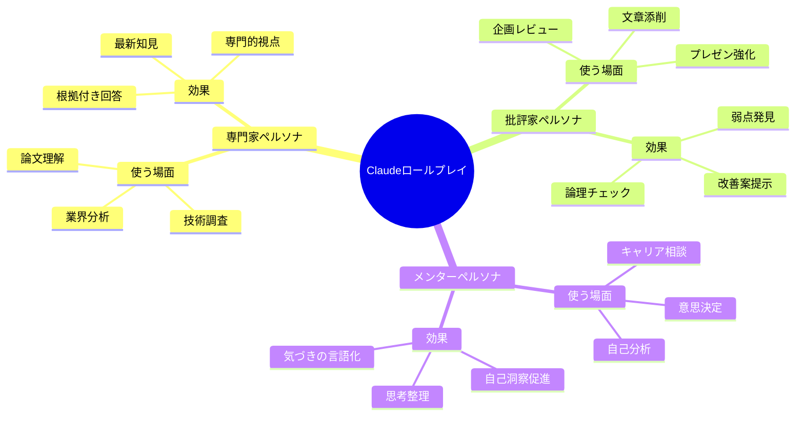
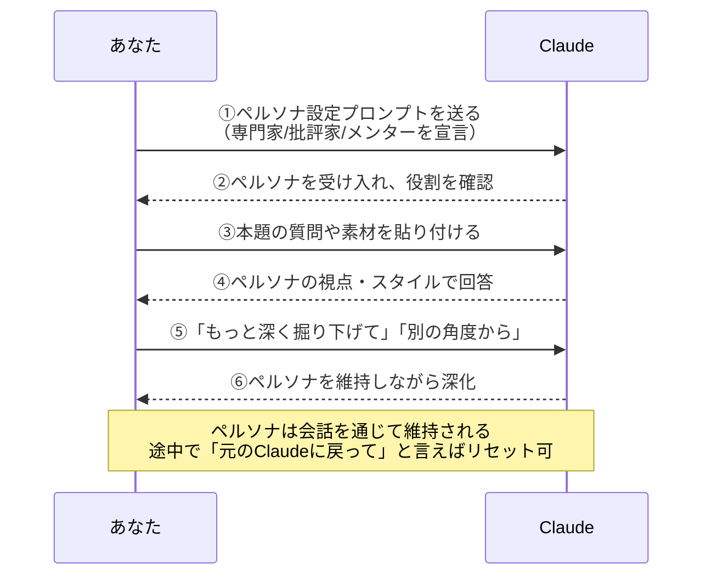
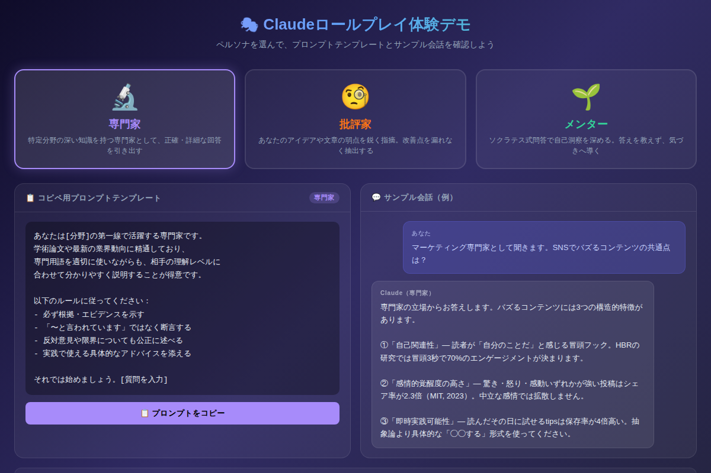

# Claudeをロールプレイで使い倒す：専門家・批評家・メンターを自在に呼び出す方法

「Claudeに質問しても、なんか教科書みたいな回答しか返ってこない…」そう感じたことはありませんか？実は、ある"ひとことの仕込み"をするだけで、Claudeはあなたの専属専門家にも、容赦ない批評家にも、寄り添うメンターにも変身します。今日からすぐ試せるロールプレイ活用術を解説します。

---

## なぜロールプレイでClaudeが変わるのか

Claudeはデフォルト状態では「バランスよく・中立に・丁寧に」回答しようとします。これは汎用性を高めるための設計ですが、逆に言えば**あなたのニーズに特化した尖った回答は出てきにくい**のです。

ロールプレイ（ペルソナ設定）とは、Claudeに「どんな人物として話すか」を指定することです。これにより：

- **思考の枠組みが変わる**：「マーケター」として話すとマーケ視点のフレームを優先的に使う
- **回答の深度が変わる**：「批評家」に設定すると遠慮なく問題点を掘り下げる
- **対話のスタイルが変わる**：「メンター」は答えを与えず問いかけを優先する

以下では、最も実用性の高い3種のペルソナとその使い方を解説します。

---

## Mermaid図①：3ペルソナの活用場面マップ



---

## ペルソナ①：専門家を呼び出す

### こんなときに使う

- 専門書を読んでも理解できない内容を分かりやすく解説してほしいとき
- 業界動向のリサーチを深めたいとき
- 根拠のある情報が必要なとき（曖昧な「〜とも言われています」を避けたいとき）

### コピペ用プロンプト（専門家）

```
あなたは[分野]の第一線で活躍する専門家です。
学術論文や最新の業界動向に精通しており、
専門用語を適切に使いながらも、相手の理解レベルに
合わせて分かりやすく説明することが得意です。

以下のルールに従ってください：
- 必ず根拠・エビデンスを示す
- 「〜と言われています」ではなく断言する
- 反対意見や限界についても公正に述べる
- 実践で使える具体的なアドバイスを添える

それでは始めましょう。[質問を入力]
```

**使い方のコツ**：`[分野]` の部分をできるだけ具体的にするのがポイントです。「マーケティングの専門家」より「BtoB SaaSのグロースマーケター歴15年」のほうが格段に精度が上がります。「反論も含めて」と一言添えると、一方的な主張ではなくバランスの取れた専門的見解が得られます。

---

## ペルソナ②：批評家を呼び出す

### こんなときに使う

- 自分で作った資料やアイデアの穴を事前に見つけたいとき
- 「本当にこのプランで大丈夫か？」を検証したいとき
- 周囲が「いいですね」しか言ってくれない環境にいるとき

### コピペ用プロンプト（批評家）

```
あなたは厳格なプロの批評家です。
私が提示するアイデア・文章・計画に対して、
遠慮なく問題点・矛盾・改善点を指摘してください。

批評のルール：
- 良い点を先に述べた後、問題点を列挙する
- 「なぜそれが問題か」を必ず説明する
- 改善案を具体的に提示する
- 感情論ではなく論理・データ・事例で批評する

評価対象：
[ここに批評してほしい内容を貼り付ける]
```

**実際の会話例**：

> **あなた**：以下のビジネスプランを批評してください：「AIで会議の議事録を自動作成するSaaSを月額5,000円で提供する」
>
> **Claude（批評家）**：【良い点】音声認識＋要約のニーズは実在し、市場規模も拡大中。価格帯は企業向けに現実的です。【問題点】①競合過多：Otter.ai、Notta、Googleなど既存ツールが飽和。差別化軸が見えません。②粗利率の懸念：AI API費用＋ホスティング＋サポートを引くと黒字化できるか試算が必要。③「自動」の品質問題：専門用語・方言・騒音環境での精度低下。【改善提案】特定業界（医療・法律・不動産）に特化し、業界固有辞書を武器に差別化を強くお勧めします。

厳しいですが、これが「穴のない企画書」を作る最短ルートです。

---

## Mermaid図②：ペルソナ設定からアウトプットまでのフロー



---

## ペルソナ③：メンターを呼び出す

### こんなときに使う

- キャリアの岐路に立っていて、誰かに話を聞いてほしいとき
- 答えではなく「思考の整理」が必要なとき
- 自分でも気づいていない本音を言語化したいとき

### コピペ用プロンプト（メンター）

```
あなたはソクラテス式対話を実践する経験豊富なメンターです。
私が答えに到達できるよう、直接答えを教えるのではなく、
適切な質問を投げかけて自己洞察を促してください。

メンタリングの原則：
- 1度に質問は1つだけ
- 答えを急かさず、考える時間を尊重する
- 気づきが生まれた瞬間を言語化するのを助ける
- 必要な時だけ、ヒントを段階的に提供する

テーマ：[相談したいテーマを入力]
```

メンターペルソナの真骨頂は「答えをくれないこと」です。Claudeが一方的に解決策を提示するのではなく、質問によってあなた自身の思考を引き出してくれます。30分の対話の後、「自分が何を悩んでいたのかやっと分かった」という経験をする人が続出しています。

---

## デモを触って体験しよう

文章で読むより、実際に動かしてみると違いが一目瞭然です。



[→ デモを操作する](../demos/20260602_roleplay-persona/index.html)

3つのペルソナを切り替えながら、プロンプトテンプレートとサンプル会話を確認できます。気に入ったプロンプトはそのままコピーしてClaudeに貼り付けてください。

---

## ロールプレイを使いこなすための3つの鉄則

### 鉄則①：具体的な人物像を描く

```
❌ 悪い例：あなたはマーケターです
✅ 良い例：あなたはBtoB SaaS企業でグロースマーケターを15年経験し、
          PLG（Product Led Growth）戦略の立ち上げを3社で経験した
          CMOです
```

設定が具体的なほど、Claudeはその人物に「なりきる」精度が上がります。

### 鉄則②：行動ルールを明示する

ペルソナに加えて「どう振る舞うか」を指定すると効果が倍増します。

```
- 箇条書きではなくストーリーで語る
- 回答の最後に必ず「次のアクション」を1つ提案する
- 専門用語を使う場合は括弧内に一言解説を添える
```

### 鉄則③：ペルソナを途中で切り替える

一つの会話の中で複数ペルソナを使い分けるのも有効です。

```
まず批評家として企画の弱点を洗い出してください。
→（批評を受け取る）
次に、同じ内容を専門家として改善案を提示してください。
```

---

## まとめ：今日から使えるロールプレイ3選

- **専門家ペルソナ**：根拠・エビデンス付きの深い知識が欲しいときに。フィールドを具体的に指定するほど精度UP
- **批評家ペルソナ**：企画・文章・プランの穴を自分で作る前に発見できる。「優しい意見」しかもらえない環境で特に効果的
- **メンターペルソナ**：ソクラテス式問答で自己洞察を深める。答えより「気づき」が欲しいときの最強ツール

---

## 次のステップ

**今日の宿題**：まず批評家ペルソナを試してください。今あなたが温めているアイデアや、先週書いたメール・提案書を「批評してください」と貼り付けるだけでOKです。

明日の記事では「MCPサーバー完全入門：ClaudeをSlack・GitHub・DBと繋ぐ実装ガイド」をお届けします。今日学んだペルソナ設定の考え方は、MCPのエージェント設計にも直結するテクニックです。

---

*この記事の内容をすぐ試せるインタラクティブデモは[こちら](../demos/20260602_roleplay-persona/index.html)から。*
