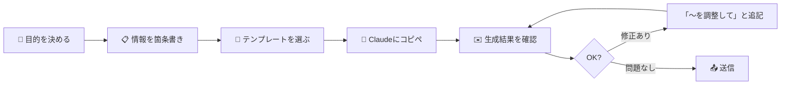
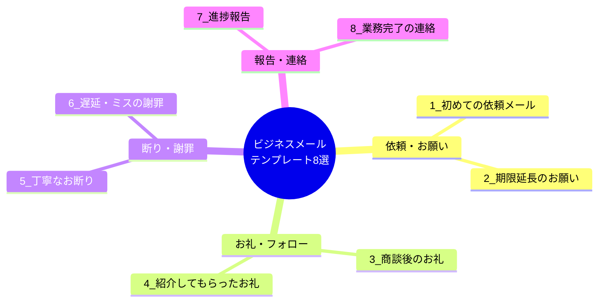
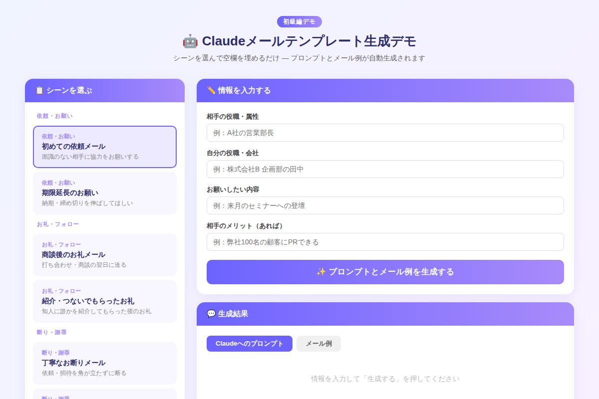

# Claudeでビジネスメールを3分で仕上げる：コピペ用テンプレート8選

「このメール、どう書けばいいんだろう…」と5分以上悩んだ経験はありませんか？Claudeに正しいプロンプトを渡すだけで、丁寧かつ的確なビジネスメールが3分以内に仕上がります。今日からすぐ使える8パターンのテンプレートを完全公開します。

---

## なぜメール作成にClaudeが向いているのか

ビジネスメールは「型」があります。お礼、依頼、謝罪、報告——どのシーンも構造は決まっていて、必要な情報を適切な敬語で組み立てるのがポイントです。

Claudeはこの「型の当てはめ」が極めて得意です。状況を箇条書きで渡すだけで、敬語のレベルや文体を自動調整しながら自然な文章を生成してくれます。

### メール作成の基本フロー



このフローに慣れると、メール作成にかかる時間を大幅に短縮できます。慣れてくると「状況を整理する30秒」＋「Claudeへの入力1分」＋「確認30秒」で合計2分以内に収まるようになります。

---

## 8つのシーン別テンプレート

### シーン分類の全体像



それぞれのテンプレートを見ていきましょう。

---

### テンプレート①：初めての依頼メール

面識のない相手に協力をお願いするときのプロンプトです。

```
以下の条件でビジネスメールを書いてください。

【送り先】A社の営業部長
【送り主】株式会社B 企画部の田中
【依頼内容】来月のセミナーへの登壇
【相手のメリット】弊社100名の顧客にPRできる

条件：
- 件名も含めて作成する
- 敬語は丁寧だが堅すぎない
- 300字以内でスッキリまとめる
- 初対面なので最初に簡単な自己紹介を入れる
```

**ポイント：** 「相手のメリット」を明記するだけで、依頼の成功率が上がります。Claudeは自然にそのメリットを文章に盛り込んでくれます。

---

### テンプレート②：期限延長のお願い

締め切りを伸ばしてほしいとき、言い訳にならず誠実に伝えるのが難しいシーンです。

```
以下の状況で、期限延長をお願いするビジネスメールを作成してください。

【宛先】鈴木様（プロジェクトマネージャー）
【対象業務】提案書の提出
【現在の締め切り】6月10日
【希望する新期限】6月15日
【理由】要件の追加調査が必要になったため

条件：
- 件名も含めて作成する
- 誠実に謝罪しつつ、理由をきちんと説明する
- 相手への配慮を示す一文を入れる
- 250字以内
```

**ポイント：** 「理由」を具体的に書くほど、Claudeが説得力のある文章を生成します。「忙しかったため」より「○○の追加調査が必要になったため」の方が格段に良いメールになります。

---

### テンプレート③：商談後のお礼メール

打ち合わせ翌日に送る、関係構築の要となるメールです。

```
商談後のお礼メールを作成してください。

【宛先】山田様
【打ち合わせ内容】新サービスの導入提案
【印象に残った点・合意事項】コスト削減効果に強い関心を持っていただけた
【次のアクション】来週中に見積もりをお送りする

条件：
- 件名も含めて作成する
- 感謝の気持ちを自然に表現する
- 次のアクションを明記して前向きな印象で締める
- 200〜250字程度
```

**ポイント：** 「次のアクション」を含めることで、ただのお礼メールが「案件を前に進める」メールに変わります。

---

### テンプレート④：紹介してもらったお礼

知人に誰かを紹介してもらった後は、紹介者へのフォローが大切です。

```
紹介していただいたことへのお礼メールを作成してください。

【宛先】中村様
【紹介された相手】株式会社Xの伊藤様
【その後の状況】早速打ち合わせの日程が決まった

条件：
- 件名も含めて作成する
- 感謝の気持ちを具体的に表現する
- 紹介のおかげで良いことが起きていることを伝える
- 180字以内
```

---

### テンプレート⑤：丁寧なお断りメール

依頼や招待を断るとき、相手との関係を壊さず角を立てずに伝えるのがポイントです。

```
丁寧にお断りするビジネスメールを作成してください。

【宛先】佐藤様
【断る依頼】来月の講演登壇
【理由】先約が入っているため

条件：
- 件名も含めて作成する
- 感謝を先に述べてから断る
- 理由を簡潔に伝え、今後の関係維持を大切にした締め
- 200字以内でスマートにまとめる
```

**ポイント：** 「感謝→断り→今後の関係」の3段構成がClaudeの得意パターンです。条件に「感謝を先に述べる」と明示しておくと安定します。

---

### テンプレート⑥：遅延・ミスの謝罪メール

謝罪メールで最も難しいのは「言い訳がましくならないこと」です。

```
謝罪メールを作成してください。

【宛先】高橋様
【問題の内容】請求書の送付が2日遅れた
【原因】担当者の確認ミスにより
【再発防止策】チェックリストを整備しダブルチェック体制を導入

条件：
- 件名も含めて作成する
- まず謝罪、次に原因、最後に再発防止策の順で構成
- 言い訳がましくならないよう注意
- 300字以内
```

**ポイント：** 「再発防止策」を具体的に書くと、Claudeが誠意ある謝罪文を構成してくれます。抽象的な「気をつけます」より信頼感が増します。

---

### テンプレート⑦：進捗報告メール

プロジェクトの現状を上司や顧客に伝える、頻度の高いメールです。

```
以下の情報をもとに、進捗報告メールを作成してください。

【宛先】部長
【プロジェクト名】新CRM導入プロジェクト
【現在の進捗】要件定義が完了し、設計フェーズに入った（全体の40%）
【課題・懸念点】外部ベンダーの回答が遅れている
【次のマイルストーン】6月15日までに設計書の初版を提出

条件：
- 件名も含めて作成する
- 箇条書きを活用して読みやすくする
- ポジティブな締め言葉で終わる
- 300字以内
```

---

### テンプレート⑧：業務完了の連絡メール

「できました」をきちんと伝えることで、依頼者の安心感が大きく変わります。

```
業務完了の報告メールを作成してください。

【宛先】田中さん
【完了した業務】見積もり資料の作成
【成果物・添付物】見積書（PDF）を添付
【補足・注意事項】金額は概算です。詳細は打ち合わせ時に調整可能

条件：
- 件名も含めて作成する
- 簡潔でわかりやすく
- 追加対応が必要な場合はいつでも連絡してほしい旨を入れる
- 200字以内
```

---

## デモで試してみよう

実際に8つのテンプレートを動かせるインタラクティブデモを用意しました。シーンを選んで空欄を埋めるだけで、Claudeへのプロンプトとメール例が即座に生成されます。



[→ デモを操作する](../demos/20260604_business-email-templates/index.html)

---

## メール品質を上げる3つの追加テクニック

テンプレートをベースに、さらにクオリティを上げる方法です。

### 1. トーン調整の指示を加える

生成後に「もっとカジュアルに」「もっとフォーマルに」と追加指示するだけで文体が変わります。

```
上記のメールを、もう少しカジュアルなトーンに調整してください。
相手は社内の同僚なので、敬語は保ちつつも親しみやすい表現にしてください。
```

### 2. 長さの微調整

```
上記のメールを150字以内に短くしてください。
要点だけを残して、礼儀は保ったままにしてください。
```

### 3. 複数案を出してもらう

迷ったときは複数案を生成させて選ぶのが効率的です。

```
上記の依頼メールを、表現のトーンが異なる3パターン作成してください。
- パターンA：フォーマル（初対面・目上の方向け）
- パターンB：ビジネスカジュアル（数回やり取りした相手向け）
- パターンC：親しみやすい（社内の先輩・同僚向け）
```

---

## まとめ

- **8シーン分類**で迷わずテンプレートを選べる（依頼・お礼・断り・報告）
- プロンプトに**状況の具体的な情報**を入れるほどメールの精度が上がる
- 「条件」欄で**文字数・敬語レベル・構成順序**を指定すると意図通りに仕上がる
- 生成後も**「もっとカジュアルに」「150字に短く」**などの追加指示で微調整できる
- コピペして使い続けるうちに**自分だけのプロンプト集**が育っていく

---

## 次のステップ

今日すぐ試せるアクション：

1. **今日書く予定のメール1通**をこのテンプレートで試してみる
2. うまくいったプロンプトを**メモ帳やNotionに保存**して自分のプロンプト集を作り始める
3. 明日は「Claudeで長い文章を要約・整理する方法」（中級編）を読んで、メール以外の文書作成にも応用してみましょう

---

*使用したデモのHTMLファイルはリポジトリ内の `demos/20260604_business-email-templates/index.html` にあります。ローカルで開いてもそのまま動作します。*
