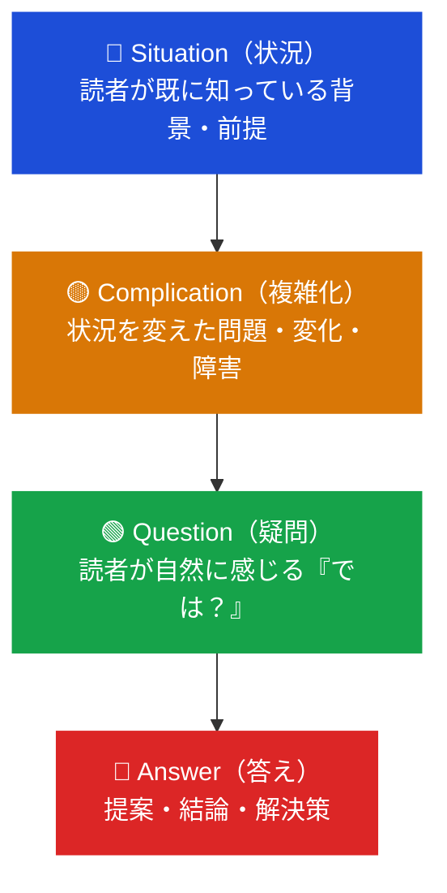
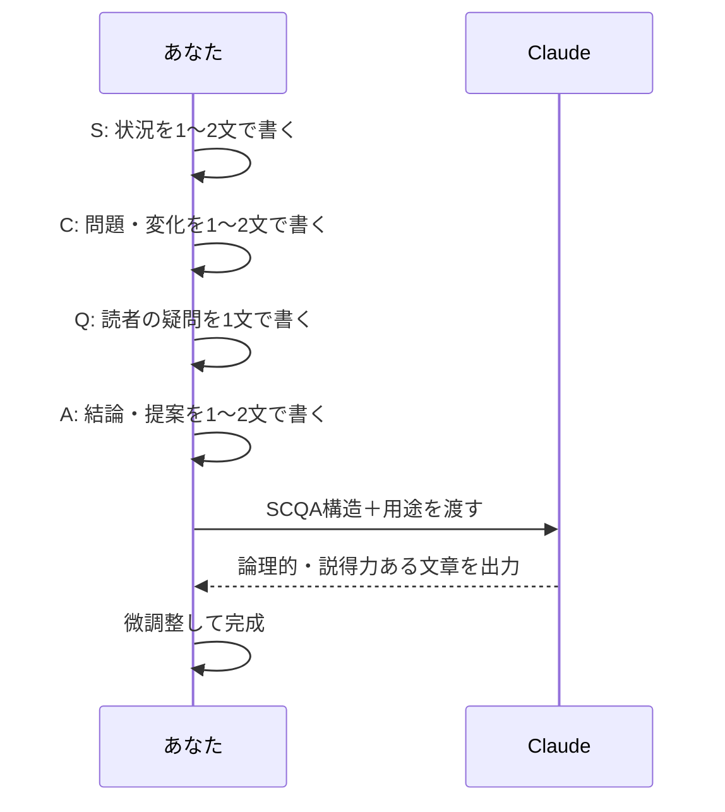
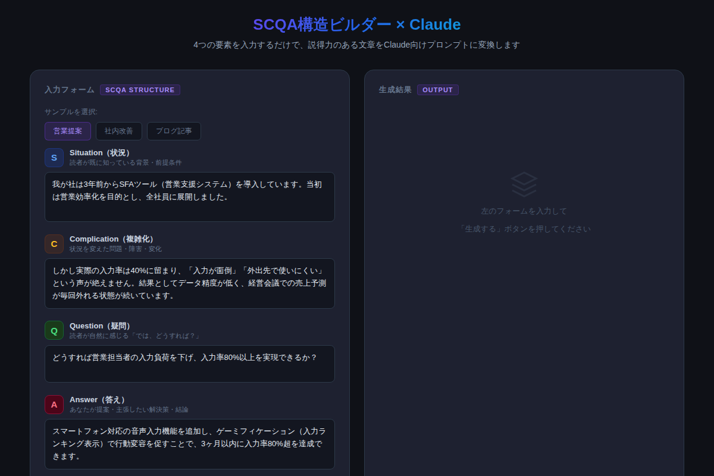

# SCQA構造×Claudeで説得力が3倍になる文章を書く方法

「Claudeに書いてもらったのに、なんか薄い…」と感じたことはないですか？その原因は、AIではなく**あなたが渡す「材料」の問題**です。正しい設計図を渡せば、Claudeは驚くほど説得力のある文章を生み出します。

---

## なぜAIライティングは「薄く」なるのか

ChatGPTやClaudeが普及したことで、多くのビジネスパーソンが「とりあえずAIに書かせてみる」時代になりました。しかし、こんな経験はないでしょうか。

- 「Claudeが書いた提案書、なんとなく説得力がない」
- 「ブログをAIに任せたら、誰でも書けそうな内容になった」
- 「メールに個性が出ず、自分の意図が伝わらない気がする」

これはAIの能力不足ではありません。AIは**「何を書くか」が曖昧なまま渡されると、それらしい文章を埋めるだけ**になります。構造のない材料では、どんなAIも説得力ある文章は生み出せない。

解決策は、**SCQA構造**にあります。

---

## SCQA構造とは？コンサル発祥の「思考の骨格」

SCQA構造は、元マッキンゼーのコンサルタント・バーバラ・ミントが著書『考える技術・書く技術』で提唱したフレームワークです。4つの要素で構成されます。



| 要素 | 英語 | 役割 |
|------|------|------|
| S | Situation | 読者との「共通認識」を作る |
| C | Complication | 「問題意識」を共有する |
| Q | Question | 読者の「頭の中の疑問」を代弁する |
| A | Answer | 結論・提案を先に示す |

この順序には心理的な根拠があります。人間は「知っていること」→「変化・問題」→「疑問」→「解決」という流れで情報を受け取るとき、最も論理的に理解しやすい。読者の頭の動きに合わせた構成だから、説得力が生まれるのです。

---

## ClaudeとSCQAを組み合わせる方法

SCQA×Claudeの使い方はシンプルです。**自分でSCQAの4要素を書き、Claudeに「文章化だけ」依頼する**。AIに「何を書くか」を考えさせるのではなく、「どう書くか」だけを任せるイメージです。



### コピペ用プロンプト例①：営業提案書

```
以下のSCQA構造をもとに、営業提案書として説得力のある文章を作成してください。

【Situation（状況）】
我が社は3年前からSFAツールを導入しています。当初は営業効率化を目的とし、全社員に展開しました。

【Complication（複雑化）】
しかし実際の入力率は40%に留まり、「入力が面倒」「外出先で使いにくい」という声が絶えません。結果としてデータ精度が低く、経営会議での売上予測が毎回外れる状態が続いています。

【Question（読者が感じる疑問）】
どうすれば営業担当者の入力負荷を下げ、入力率80%以上を実現できるか？

【Answer（提案・結論）】
スマートフォン対応の音声入力機能を追加し、ゲーミフィケーションで行動変容を促すことで、3ヶ月以内に入力率80%超を達成できます。

【要件】
- 読者が「なるほど、そうすべきだ」と納得できる論理構成にする
- 冒頭は課題感から入り、答えを先に提示する
- 具体的な数字を活かしてください
- ビジネス文書として簡潔・明快な文体で
```

### コピペ用プロンプト例②：note・ブログ記事

```
以下のSCQA構造をもとに、note記事の冒頭3段落（リード文）を作成してください。

【Situation】
ChatGPTが登場して以来、多くのビジネスパーソンがAIライティングを試みています。

【Complication】
しかし「なんとなく書いてもらったが、薄い文章になる」「自分の意図が伝わらない」という悩みが絶えません。AIに任せるほど、文章がのっぺりして個性が消えるという逆説が生まれています。

【Question】
AIを使って、むしろ自分の文章を強化するにはどうすればよいか？

【Answer】
SCQA構造で「何を書くか」を先に設計し、Claudeに「文章化だけ」依頼することで、論理的かつ個性のある文章が3分で完成します。

【要件】
- 冒頭は読者の悩みへの共感から始める
- 親しみやすい口語調で
- 最後は「続きを読みたい」と思わせる引きで締める
```

---

## Before/After で見る効果の違い

実際にSCQA未使用とSCQA適用後を比較してみましょう。

**Before（構造なし）:**
> SFAを3年前に導入しました。入力率が低いです。音声入力機能を追加することを提案します。ゲーミフィケーションも効果的だと思います。ぜひご検討ください。

**After（SCQA適用後）:**
> 3年前に導入したSFAツールですが、入力率は40%に低迷し、売上予測の精度低下という経営課題に直結しています。この状況を3ヶ月以内に解決するため、音声入力機能とゲーミフィケーションの導入をご提案します。同様の施策で他社では入力率80%超を達成しており、本施策により予測精度±10%以内が見込まれます。

読者の「なるほど」という納得感がまるで違います。情報量は同じでも、論理の流れが整うだけで説得力が飛躍的に上がることがわかります。

---

## デモ：SCQAビルダーで試してみよう

インタラクティブなデモで、4つの要素を入力すると即座にClaudeプロンプトが生成されます。



[→ デモを操作する](../demos/20260605_scqa-writing/index.html)

営業提案・社内改善提案・ブログ記事など複数の用途に対応し、生成されたプロンプトをそのままClaudeに貼り付けるだけで使えます。

---

## SCQA設計の4つのコツ

### 1. S（状況）は短く・共通認識だけに絞る

状況パートは「読者がすでに知っていること」だけを書きます。ここで新情報を出そうとすると、読者の頭が「え、そうなの？」と止まってしまい流れが崩れます。1〜2文が理想です。

### 2. C（複雑化）で感情を動かす

複雑化こそがSCQAの心臓部です。読者が「それは問題だ」「どうにかしなければ」と感じる具体的な数字・損失・リスクを入れましょう。「なんとなく課題がある」では弱すぎます。

### 3. Q（疑問）は読者の声で書く

疑問は「読者が心の中で呟く言葉」そのままを使います。「では、本課題に対する最適解はいかなるものか？」より「どうすれば解決できるか？」の方が自然で共感されます。

### 4. A（答え）は冒頭で断言する

日本語のビジネス文書は「理由を述べてから結論」という順序が多いですが、SCQAでは**結論を先に**。「答えは〇〇です。理由は3つあります」という形で始めると、読者が最後まで読んでくれます。

---

## まとめ

- **SCQA構造**はS（状況）→C（複雑化）→Q（疑問）→A（答え）の4要素で説得力を設計するフレームワーク
- Claudeに渡す前にSCQAで「材料」を整えることで、AIが論理的・説得力ある文章を出力できるようになる
- 営業提案書・ブログ・メール・報告書など、あらゆる文章用途に適用可能
- Claudeへの指示は「文章化のみ」に絞ることで、あなたの主張・個性を残せる
- まず1つのメール・提案書でSCQAを試すと、違いが即実感できる

---

## 次のステップ

**今日中に試せること：**

1. 明日送る予定のビジネスメールをSCQAで設計し、プロンプト例②をClaudeに投げてみる
2. デモツールでサンプルデータを切り替えながら、各用途の出力パターンを体験する
3. 自分の仕事で「説得が難しい場面」を1つ思い浮かべ、SCQA 4要素をメモ帳に書いてみる

SCQA構造は習得に時間がかかりません。一度使えば、「なんとなく書く」という習慣が消えます。ぜひ今日から実践してみてください。
