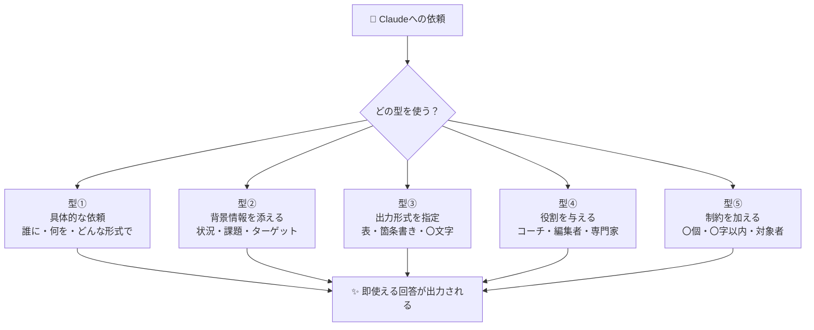
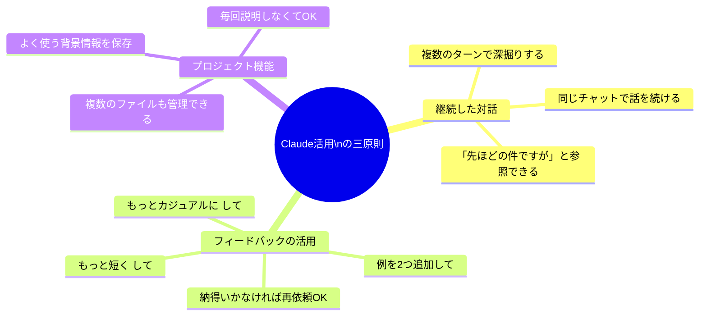
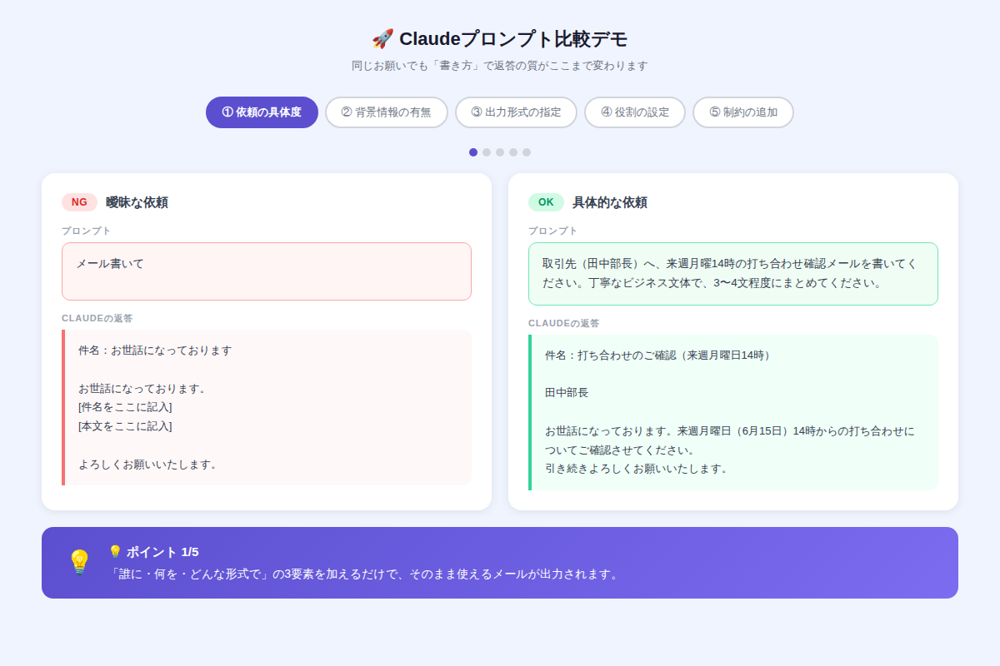

# Claudeを初めて使う人へ：今日すぐ始められる5つのステップと必須設定

**「AIって難しそう」と思っていたあなたへ。Claudeは今日、5分で使い始められます。**

AIツールは「玄人のもの」というイメージがありませんか？実は、Claudeは専門知識ゼロでも今日から仕事や日常に取り込めます。この記事では、アカウント作成からはじめて「おお、これは使える！」と感じる最初の体験まで、5つのステップで完全ガイドします。

---

## なぜClaude？ 2分でわかる特徴

2026年現在、AIアシスタントはいくつも存在しますが、Claudeが初心者におすすめな理由は3つあります。

1. **長い文章に強い** — 報告書・契約書・長メールをまるごと処理できる
2. **日本語が自然** — 翻訳調でなく、読み手に伝わる文体で出力される
3. **安全性重視の設計** — 不確かな情報を断定せず「わかりません」と言える誠実さ

では、さっそく始めましょう。

---

## ✅ Step 1：アカウントを作成する（3分）

1. [claude.ai](https://claude.ai) にアクセス
2. 「Sign up」からメールアドレスまたはGoogleアカウントで登録
3. 無料プランでも十分な使用量が確保されています

**ポイント：** 最初は無料プランで十分です。使いながら「もっと使いたい」と感じたらProプランへ。

---

## ✅ Step 2：最初のプロンプトを送る

アカウント作成後、すぐにチャット画面が開きます。最初に試すなら、このプロンプトがおすすめです。

```
今日の昼ごはんを決めたいです。
条件：調理時間15分以内、材料は冷蔵庫にある卵・豆腐・ほうれん草のみ、和食希望。
レシピを1つ提案して、手順を箇条書きで教えてください。
```

「具体的なお願い」「条件の明示」「出力形式の指定」の3点を含んだプロンプトで、すぐに使える回答が返ってきます。

---

## ✅ Step 3：5つの「使い方の型」を覚える

Claudeを120%使いこなすには、次の「5つの型」を覚えるだけで十分です。



この5つの型を組み合わせるだけで、「NG回答」が「OK回答」に変わります。どう変わるかは後述のデモで体験できます。

---

## ✅ Step 4：今日から使える3つのシーン

### シーン① ビジネスメールの作成

```
【状況】先週の打ち合わせの御礼メールを書きたい
【宛先】ABC商事・山田課長
【内容】①先日の議論への感謝 ②来週中に提案書を送る旨 ③引き続きのお付き合いをお願い
【文体】丁寧なビジネス文体・4〜5文程度
```

> **→ そのまま使えるメール文が30秒で完成します**

---

### シーン② 情報の整理・要約

長い会議メモや記事を貼り付けて、このプロンプトを使うだけ：

```
以下のテキストを読んで、
①重要なポイントを3つ箇条書きで
②決定事項を1文で
③次にすべきアクションを列挙して
まとめてください。

[ここにテキストを貼り付ける]
```

---

### シーン③ アイデア出し

```
【テーマ】部署の歓迎会の企画
【人数】8人（20〜40代）
【予算】一人3,000円
【制約】平日19時以降、新宿エリア
ユニークなアイデアを5つ提案してください。各アイデアに「なぜ盛り上がるか」の理由も添えてください。
```

---

## ✅ Step 5：知っておきたい3つの設定・コツ



**特に覚えておきたいのが「フィードバック」です。**  
最初の回答が気に入らなくても、「もっと短く」「もう少し具体的に」と追加指示するだけで改善されます。これが、ChatGPTなど他のAIとの会話と同じで、「やり取りを重ねるほど精度が上がる」という感覚です。

---

## 🎮 デモで体験：NG vs OKプロンプト比較

5つの「型」が実際にどう回答の質を変えるか、インタラクティブに確認できます。



[→ デモを操作する](../demos/20260608_claude-first-steps/index.html)

NG例とOK例を切り替えながら、「背景情報を加えると」「役割を設定すると」どれほど回答が変わるか体感してください。

---

## 📋 コピペ用プロンプト集

### プロンプト①：初日のお試し用（汎用型）

```
私は[職業/役割]です。
今、[具体的な状況や課題]で困っています。
[何をしてほしいか]を、[形式: 箇条書き/表/〇文字以内]で教えてください。
専門用語は避け、初心者にもわかりやすく説明してください。
```

**使い方：**`[]`の中を自分の状況に書き換えるだけで使えます。

---

### プロンプト②：仕事の文章を改善する

```
以下の文章を改善してください。
【改善の方向性】
- もっと読みやすく（長い文は分割）
- 論理の流れを明確に
- 結論を冒頭に移動（PREP形式）

【元の文章】
[ここに文章を貼り付ける]

改善前・改善後を並べて表示してください。
```

---

### プロンプト③：会議・ブレストのファシリテーター

```
あなたは経験豊富なファシリテーターです。
テーマ「[テーマ]」についてブレインストーミングを手伝ってください。
・まず私が思いつくアイデアを言います（箇条書きで送ります）
・私のアイデアを踏まえて、さらに発展させた案を5つ追加してください
・最後に「見落としがちな視点」を2つ指摘してください
```

---

## まとめ：今日から変わる5つのポイント

- **具体的に伝えるほど、使える回答が返ってくる** — 「メール書いて」より「〇〇宛に〇〇の件でメールを書いて」
- **背景・条件・形式の3点セット**がプロンプトの基本型
- **役割設定（「あなたは〇〇です」）**で専門家レベルの視点を引き出せる
- **一発で完璧を求めない** — 「もっと〇〇に」と追加指示で磨ける
- **チャットの流れを活かす** — 同じ会話内で続けるとコンテキストが積み上がる

---

## 🚀 次のステップ：明日やること

1. **今日：** 上記のコピペ用プロンプト①を使って、自分の仕事に合わせた最初のプロンプトを試す
2. **明日：** 日常業務の中で「これClaude使えるかも」と思った場面でチャレンジ
3. **今週中：** プロジェクト機能で「自分の仕事の背景情報」を保存し、毎回説明を省く

「とりあえず試してみる」が最速の上達法です。最初は失敗してOK——「もっと〇〇に」と言い直すだけで、Claudeはすぐに軌道修正してくれます。

---

*この記事で紹介した5つの型を毎日1つ試すだけで、1週間後には「Claudeなしの仕事が考えられない」状態になっているはずです。*
