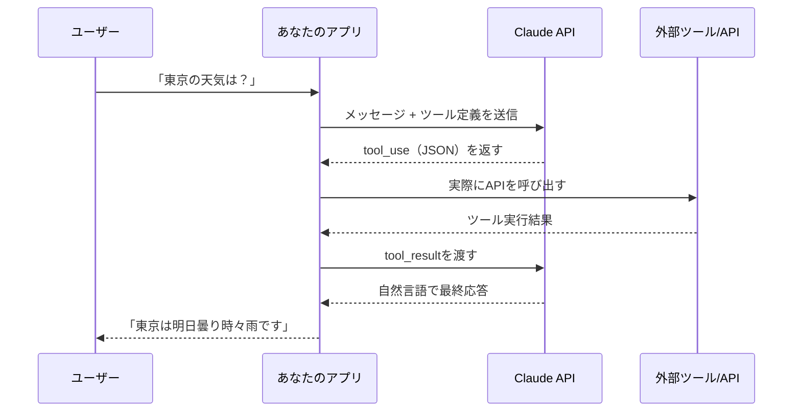
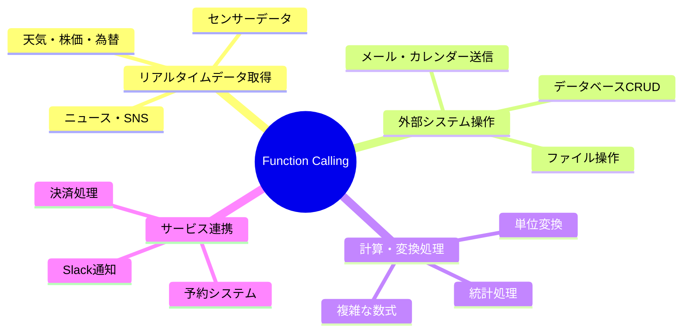
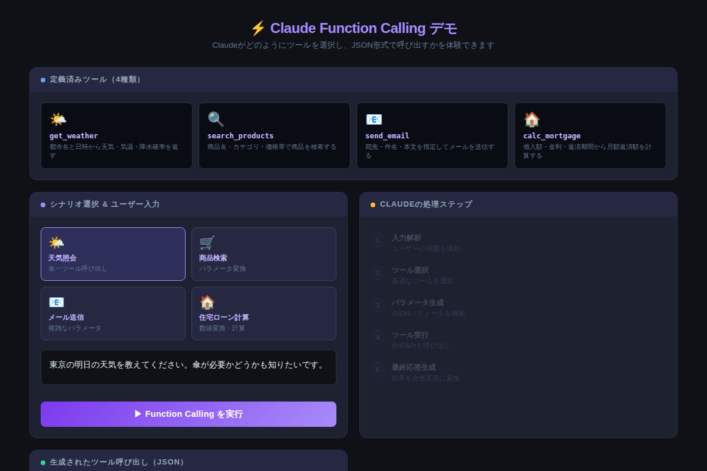

# ClaudeのFunction Calling完全ガイド：ツール定義からJSONレスポンス解析まで実装例つき解説

「Claudeに天気を聞いたら、いつも決まって"リアルタイム情報は持っていません"と言われる——」そう感じたことはありませんか？Function Callingを使えば、その壁を突き破れます。ClaudeがあなたのAPIを自分で呼び出し、リアルタイムの情報を取得して答えてくれる。これが実現できた瞬間、「AIアシスタント」が「自律エージェント」に変わります。

---

## Function Callingとは何か

**Function Calling（ツール使用）**とは、ClaudeがAPIリクエストの中で「外部のツール・関数を呼び出してほしい」という指示をJSON形式で返す仕組みです。

Claudeが直接データベースにアクセスするわけではありません。フローはこうです：



ポイントは**「ClaudeはJSON指示を出すだけ、実行するのはあなたのコード」**という点です。これによりClaudeはセキュリティ上安全に、任意の外部システムと連携できます。

---

## なぜFunction Callingが重要なのか

Claude単体でできることには限界があります。知識のカットオフ、リアルタイムデータへのアクセス不可、データベース操作——これらはすべてFunction Callingで解決できます。



---

## 実装の全手順

### Step 1：ツール定義を書く

ツール定義はJSONスキーマで記述します。Claudeはこのスキーマをもとにパラメータを生成するため、**descriptionの精度が精度を左右します**。

```python
import anthropic

client = anthropic.Anthropic()

# ツール定義
tools = [
    {
        "name": "get_weather",
        "description": "指定した都市・日付の天気情報を取得する。気温・天気・降水確率を返す。",
        "input_schema": {
            "type": "object",
            "properties": {
                "location": {
                    "type": "string",
                    "description": "都市名（例：東京、大阪、New York）"
                },
                "date": {
                    "type": "string",
                    "description": "日付（YYYY-MM-DD形式）。省略時は今日"
                },
                "unit": {
                    "type": "string",
                    "enum": ["celsius", "fahrenheit"],
                    "description": "温度単位。デフォルトはcelsius"
                }
            },
            "required": ["location"]
        }
    }
]
```

`description` フィールドは人間向けではなく **Claude向け** です。「いつ・なぜこのツールを使うべきか」を明確に書くほど、Claudeの判断精度が上がります。

---

### Step 2：APIにツール定義を渡してリクエストする

```python
response = client.messages.create(
    model="claude-opus-4-8",
    max_tokens=1024,
    tools=tools,
    messages=[
        {"role": "user", "content": "東京の明日の天気を教えてください"}
    ]
)

print(response.stop_reason)   # "tool_use" であれば呼び出し指示あり
print(response.content)
```

---

### Step 3：Claudeのレスポンスを解析する

`stop_reason` が `"tool_use"` のとき、`content` の中に `type: "tool_use"` ブロックが含まれています。

```python
# tool_useブロックを取り出す
tool_use_block = None
for block in response.content:
    if block.type == "tool_use":
        tool_use_block = block
        break

if tool_use_block:
    tool_name = tool_use_block.name        # "get_weather"
    tool_input = tool_use_block.input      # {"location": "東京", "date": "2026-06-10"}
    tool_use_id = tool_use_block.id        # "toolu_01AbCd..."
    
    print(f"ツール名: {tool_name}")
    print(f"パラメータ: {tool_input}")
```

Claudeが生成するJSONの例：

```json
{
  "type": "tool_use",
  "id": "toolu_01AbCd",
  "name": "get_weather",
  "input": {
    "location": "東京",
    "date": "2026-06-10",
    "unit": "celsius"
  }
}
```

---

### Step 4：実際にツールを実行し、結果をClaudeに返す

```python
import datetime

def get_weather(location: str, date: str = None, unit: str = "celsius") -> dict:
    # 実際はここで気象APIを叩く
    # このサンプルはモック
    return {
        "location": location,
        "date": date or str(datetime.date.today()),
        "weather": "曇り時々雨",
        "temperature": {"max": 22, "min": 18},
        "precipitation_probability": 65
    }

# ツールを実行
tool_result = get_weather(**tool_input)

# Claudeに結果を渡して最終応答を得る
final_response = client.messages.create(
    model="claude-opus-4-8",
    max_tokens=1024,
    tools=tools,
    messages=[
        {"role": "user", "content": "東京の明日の天気を教えてください"},
        {"role": "assistant", "content": response.content},  # Claudeの前回レスポンス
        {
            "role": "user",
            "content": [
                {
                    "type": "tool_result",
                    "tool_use_id": tool_use_id,
                    "content": str(tool_result)
                }
            ]
        }
    ]
)

print(final_response.content[0].text)
# → 「東京の明日（6/10）の天気は曇り時々雨です。降水確率65%なので傘をお持ちください。」
```

---

## インタラクティブデモで体験する

4種類のシナリオ（天気・商品検索・メール送信・住宅ローン計算）でFunction Callingの動作を確認できます。Claudeがどのツールを選び、どんなJSONを生成するかをリアルタイムで観察してください。



[→ デモを操作する](../demos/20260609_function-calling/index.html)

---

## コピペで使えるプロンプト例

### プロンプト例①：複数ツールを同時に定義する

```python
tools = [
    {
        "name": "get_weather",
        "description": "天気情報を取得する",
        "input_schema": { ... }
    },
    {
        "name": "search_restaurants",
        "description": "レストランを検索する。天気が良い日は屋外席のある店舗を優先する",
        "input_schema": { ... }
    }
]

# Claudeが文脈から最適なツールを自動選択する
response = client.messages.create(
    model="claude-opus-4-8",
    max_tokens=1024,
    tools=tools,
    messages=[{"role": "user", "content": "今日の渋谷でランチのおすすめを教えて"}]
)
```

複数ツールを定義すると、Claudeはユーザーの意図から最適なものを**自律的に選択**します。「天気が良ければ屋外席を優先する」といったロジックもdescriptionで指定できます。

---

### プロンプト例②：tool_choiceで強制指定する

```python
# 必ずget_weatherを使わせたい場合
response = client.messages.create(
    model="claude-opus-4-8",
    max_tokens=1024,
    tools=tools,
    tool_choice={"type": "tool", "name": "get_weather"},  # 強制指定
    messages=[{"role": "user", "content": "外出すべきか教えて"}]
)

# ツールを一切使わせたい場合
tool_choice={"type": "none"}

# Claudeに任せる場合（デフォルト）
tool_choice={"type": "auto"}
```

`tool_choice` オプションで挙動を制御できます。バッチ処理など「必ずツールを呼び出す」ことが前提のシステムでは `type: "tool"` が有効です。

---

## よくあるミスと対処法

| ミス | 症状 | 対処 |
|------|------|------|
| descriptionが曖昧 | 別のツールが選ばれる | 「いつ使うか」を具体的に書く |
| required を設定し忘れ | パラメータが省略される | 必須項目は必ず `required` に追加 |
| tool_resultの紐付けミス | Claudeが混乱する | `tool_use_id` を正確に使い回す |
| エラー時に何も返さない | 会話が詰まる | エラー内容もtool_resultとして返す |

エラー処理の例：

```python
try:
    result = get_weather(**tool_input)
    content = str(result)
except Exception as e:
    content = f"エラーが発生しました: {str(e)}。別の方法で回答してください。"

# エラー内容もtool_resultとして渡す
{"type": "tool_result", "tool_use_id": tool_use_id, "content": content}
```

---

## まとめ

- **Function Callingの仕組み**：ClaudeはJSONで「ツール呼び出し指示」を返すだけ。実行するのはあなたのコード
- **ツール定義のコツ**：`description` はClaude向けに「いつ・なぜ使うか」を明確に書く
- **4ステップの流れ**：定義→リクエスト→JSON解析→実行して結果を返す
- **tool_choiceで制御**：`auto`（自動）/ `tool`（強制）/ `none`（禁止）の3モード
- **エラーも必ず返す**：例外が起きても `tool_result` でエラー内容をClaudeに伝える

---

## 次のステップ

明日すぐ試せるアクション：

1. **Anthropic SDKをインストール**：`pip install anthropic` を実行
2. **天気ツールをモックで実装**：本記事の Step 1〜4 をそのまま貼り付けて動かす
3. **自分のAPIと繋ぐ**：社内DB・Slack・スプレッドシートのAPIに差し替えてみる

Function Callingをマスターすると、Claudeは「会話するだけのAI」から「実際に仕事をこなすエージェント」に進化します。次回は**複数のFunction Callingを連鎖させるマルチステップエージェント**の設計手法を解説します。
