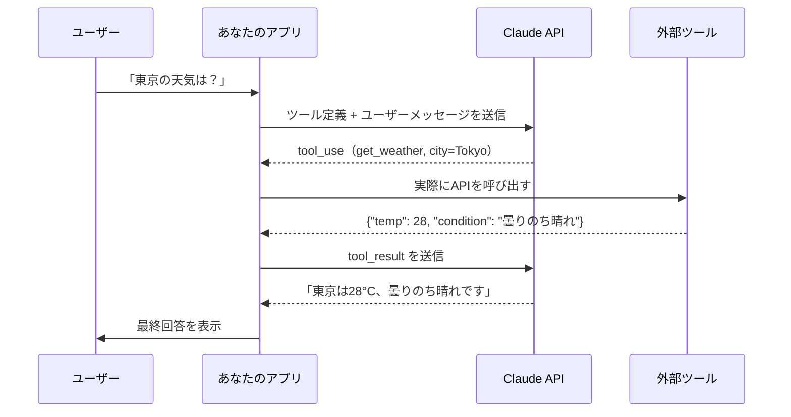
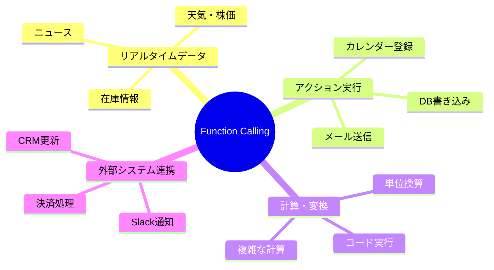

# ClaudeのFunction Calling完全ガイド：外部ツールをAIに使わせる実装パターン5選

「Claudeって賢いけど、リアルタイム情報は取れないし、メールも送れないよね」——そう思っていたなら、Function Callingを知らないだけかもしれません。この機能を使うと、ClaudeはWeather APIを叩いて天気を調べ、DBを検索して商品を探し、カレンダーに予定を登録できます。今日は5つの実装パターンで、AIを「指示するだけの道具」から「自律的に動く実働エージェント」へとアップグレードする方法を解説します。

---

## Function Callingとは何か

Function Calling（Claudeの公式ドキュメントでは「Tool Use」と呼ばれます）は、Claude APIのリクエストに「ツール定義」を渡すことで、Claudeが必要に応じてそのツールを呼び出せるようにする仕組みです。

重要なのは、**Claudeが自分でAPIを実行するわけではない**という点です。Claudeは「このツールをこのパラメーターで呼んでほしい」という指示を返し、実際の実行はあなたのコードが担当します。結果を受け取ったClaudeが、最終的な回答を生成します。



このアーキテクチャにより、Claudeはインターネットアクセスや実行環境を持たなくても、あなたが用意した「目と手」を通じて世界と接続できます。

---

## なぜFunction Callingが重要なのか

従来のChatbot的な使い方では、Claude（やGPT）は「テキストを入出力する処理機」でした。Function Callingはこの限界を根本から変えます。



**できるようになること：**
- 「今日の株価を見て、ポートフォリオのリバランスを提案して」
- 「来週の空き時間を調べて、クライアントに候補日を送って」
- 「売上データをDBから取得して、前月比のレポートを作って」

---

## 実装パターン5選

### パターン1：情報取得API（天気・ニュース・株価）

最もシンプルな使い方です。外部APIからデータを取得し、Claudeが自然言語で解釈・説明します。

```python
import anthropic
import json
import requests

client = anthropic.Anthropic()

# ツール定義
tools = [
    {
        "name": "get_weather",
        "description": "指定した都市の現在の天気情報を取得する",
        "input_schema": {
            "type": "object",
            "properties": {
                "city": {
                    "type": "string",
                    "description": "都市名（英語表記）例: Tokyo, Osaka"
                },
                "unit": {
                    "type": "string",
                    "enum": ["celsius", "fahrenheit"],
                    "description": "温度の単位",
                    "default": "celsius"
                }
            },
            "required": ["city"]
        }
    }
]

def get_weather(city: str, unit: str = "celsius") -> dict:
    # 実際はOpenWeather等のAPIを呼び出す
    # ここではモックデータを返す
    return {"city": city, "temp": 28, "condition": "曇りのち晴れ", "humidity": 72}

def run_with_tools(user_message: str) -> str:
    messages = [{"role": "user", "content": user_message}]

    while True:
        response = client.messages.create(
            model="claude-sonnet-4-6",
            max_tokens=1024,
            tools=tools,
            messages=messages
        )

        # ツール呼び出しがなければ終了
        if response.stop_reason != "tool_use":
            return response.content[0].text

        # ツール呼び出しを処理
        tool_results = []
        for block in response.content:
            if block.type == "tool_use":
                result = get_weather(**block.input)
                tool_results.append({
                    "type": "tool_result",
                    "tool_use_id": block.id,
                    "content": json.dumps(result, ensure_ascii=False)
                })

        # 結果をClaudeに戻す
        messages.append({"role": "assistant", "content": response.content})
        messages.append({"role": "user", "content": tool_results})

answer = run_with_tools("東京の今日の天気を教えて")
print(answer)
```

**コピペ用プロンプト例①（Claude API + 天気）:**
```
あなたは天気情報アシスタントです。
get_weather ツールを使って正確な情報を取得し、
服装のアドバイスを添えて回答してください。
```

---

### パターン2：データベース検索

構造化データへのアクセスを自然言語で実現します。「在庫あり」「3万円以下」といった条件をClaudeが自動的にクエリパラメーターに変換します。

```python
tools = [
    {
        "name": "search_products",
        "description": "製品データベースを検索する",
        "input_schema": {
            "type": "object",
            "properties": {
                "category": {"type": "string"},
                "max_price": {"type": "number"},
                "min_rating": {"type": "number"},
                "in_stock": {"type": "boolean"}
            }
        }
    }
]
```

**ポイント:** `description` フィールドに「何をすべきか」を明確に書くことで、Claudeは適切なパラメーターを推論して渡してくれます。曖昧な説明は誤ったパラメーターの原因になります。

---

### パターン3：カレンダー・スケジュール操作

読み取り（`get_availability`）と書き込み（`create_event`）を組み合わせることで、自律的なスケジューリングエージェントが作れます。

```python
tools = [
    {
        "name": "get_availability",
        "description": "指定した日付範囲の空き時間を取得する",
        "input_schema": {
            "type": "object",
            "properties": {
                "start_date": {"type": "string", "description": "YYYY-MM-DD形式"},
                "end_date": {"type": "string"},
                "duration_minutes": {"type": "integer", "description": "必要な会議時間（分）"}
            },
            "required": ["start_date", "end_date", "duration_minutes"]
        }
    },
    {
        "name": "create_event",
        "description": "カレンダーにイベントを作成する",
        "input_schema": {
            "type": "object",
            "properties": {
                "title": {"type": "string"},
                "start_datetime": {"type": "string", "description": "ISO 8601形式"},
                "duration_minutes": {"type": "integer"},
                "attendees": {"type": "array", "items": {"type": "string"}}
            },
            "required": ["title", "start_datetime", "duration_minutes"]
        }
    }
]
```

**コピペ用プロンプト例②（スケジューリングエージェント）:**
```
あなたは私のスケジューリングアシスタントです。
来週中に60分の打ち合わせを設定したいです。
get_availability で空き時間を確認してから、
適切な時間帯を3つ提案し、確認を取ってから create_event で登録してください。
```

---

### パターン4：コード実行サンドボックス

Claudeが「自分で考えて書いたコードを自分で実行する」パターンです。数値計算、データ変換、グラフ生成に使えます。

```python
import subprocess

def run_python(code: str, timeout: int = 10) -> dict:
    try:
        result = subprocess.run(
            ["python3", "-c", code],
            capture_output=True, text=True, timeout=timeout,
            # セキュリティ: 本番では適切なサンドボックスを使うこと
        )
        return {"stdout": result.stdout, "stderr": result.stderr, "status": "success"}
    except subprocess.TimeoutExpired:
        return {"status": "timeout", "stdout": "", "stderr": "Timeout"}
```

**注意:** 本番環境では必ずDockerやWASMなどの安全なサンドボックスを使ってください。生のsubprocessはセキュリティリスクがあります。

---

### パターン5：並列ツール呼び出し

Claude 3以降、**複数のツールを同時に呼び出す**ことができます。「東京・大阪・福岡の天気を比較して」と聞いた場合、Claudeは3つの`get_weather`を並列で呼び出します。

```python
# Claudeからの返答が複数のtool_useブロックを含む場合の処理
import asyncio

async def handle_parallel_tools(tool_calls: list) -> list:
    tasks = []
    for call in tool_calls:
        if call.name == "get_weather":
            tasks.append(asyncio.create_task(
                async_get_weather(call.input["city"])
            ))

    results = await asyncio.gather(*tasks)
    return [
        {"type": "tool_result", "tool_use_id": call.id, "content": json.dumps(r)}
        for call, r in zip(tool_calls, results)
    ]
```

並列呼び出しにより、従来の「1つ呼んで→待って→次を呼ぶ」に比べて大幅な速度改善が可能です。

---

## インタラクティブデモで動きを体験

実際のFunction Callingフローを手を動かして体験できます。


[→ デモを操作する](../demos/20260610_function-calling-guide/index.html)

天気取得・DB検索・カレンダー・コード実行・メール送信の5パターンを選択し、「シミュレーション実行」ボタンを押すと、ユーザー→Claude→ツール→結果→最終回答の流れがステップごとに可視化されます。

---

## 実装時の5つのベストプラクティス

### 1. ツールの説明は「いつ使うか」まで書く
```python
# NG: 何をするかだけ
"description": "天気情報を取得する"

# OK: いつ使うかも明示
"description": "ユーザーが特定の都市や地域の現在の天気・気温・湿度を知りたい場合に使用する。過去の天気や予報には使わないこと"
```

### 2. `required` と `optional` を適切に分ける
必須パラメーターだけを `required` に入れ、オプションはデフォルト値を持たせます。Claudeが不要なパラメーターを推論しようとして誤った値を入れるリスクを減らせます。

### 3. エラーも `tool_result` で返す
ツールが失敗した場合も `"is_error": true` と共にエラー内容を返すと、Claudeが文脈に合った対処をしてくれます。

### 4. ツール数は10個以内に絞る
ツールが多すぎると、Claudeが適切なツールを選べなくなります。機能ごとにツールを分離しすぎず、関連する操作は1つのツールにまとめましょう。

### 5. `tool_choice` で動作を制御する
```python
# 必ずツールを使わせたい場合
tool_choice={"type": "any"}

# 特定のツールを強制したい場合
tool_choice={"type": "tool", "name": "get_weather"}

# ツールを使うかClaudeに任せる（デフォルト）
tool_choice={"type": "auto"}
```

---

## まとめ

- **Function Callingは「Claude × 外部API」の接着剤**。Claudeが判断し、あなたのコードが実行し、結果をClaudeが解釈する三段構造
- **5つの実装パターン**：情報取得 / DB検索 / スケジュール操作 / コード実行 / 並列呼び出し。まず最もシンプルな「情報取得」から始めよう
- **ツール定義のクオリティが精度を左右する**。`description` に「いつ・何のために使うか」を書くだけで、Claudeの判断精度が大きく上がる
- **並列呼び出し**で複数ツールを同時実行でき、レスポンス速度を劇的に改善できる
- **セキュリティは自分で担保**。Claudeはツールを「提案」するだけで「実行」しない。権限チェック・サンドボックスはアプリ側の責任

---

## 次のステップ

**明日すぐ試せるアクション：**

1. [Claude API公式ドキュメント「Tool Use」](https://docs.anthropic.com/ja/docs/tool-use)を読み、ツール定義のJSONスキーマに慣れる
2. まず天気APIかモックデータで「1ツール・1往復」の最小実装を動かす
3. 動いたら並列呼び出し（複数ツール）に挑戦し、`asyncio.gather` で速度を計測する
4. 余裕があれば `tool_choice: {"type": "any"}` で「必ずツールを使うモード」を試し、動作の違いを確認する

Function Callingを使いこなせると、Claudeは「賢い会話相手」から「実際に仕事をこなすエージェント」に変わります。ぜひ最初の一歩を踏み出してみてください。
