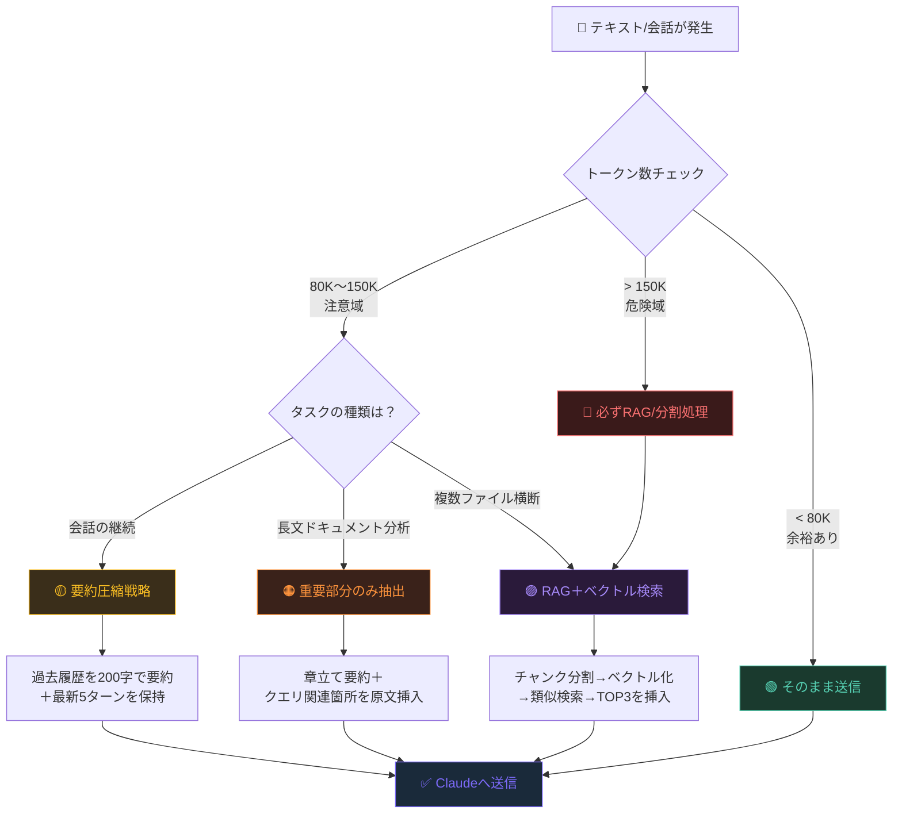
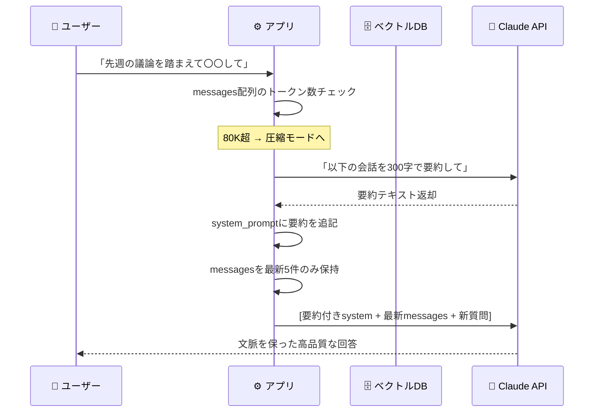
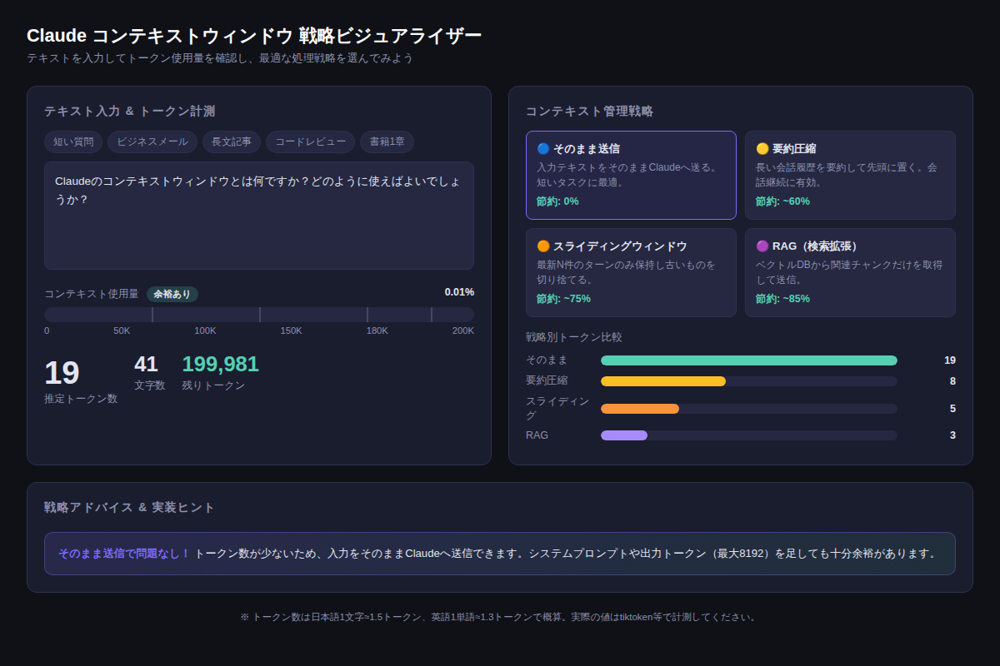

# Claude 200Kコンテキストウィンドウ完全活用ガイド：長文処理・会話最適化・RAGの実装テクニック

「なぜか急に回答の質が落ちた」「長い文章を渡しているのに要点を外す」——そのトラブルの原因、コンテキストウィンドウの使い方にあるかもしれません。Claudeが持つ20万トークンという広大な記憶領域を正しく使い切れば、長文要約も複雑なコード解析も驚くほど精度が上がります。

---

## コンテキストウィンドウとは何か

コンテキストウィンドウとは、**AIモデルが一度に「見える」テキストの上限**のことです。人間で言えば、作業机の広さに相当します。机が広いほど多くの資料を広げて参照できますが、机に乗りきらない書類は見えなくなります。

Claudeの現行モデル（claude-sonnet-4-6）は **200,000トークン（約15万字）** のコンテキストウィンドウを持っています。これは文庫本1冊分強のテキストを一度に処理できる計算です。

```
【トークン数の目安】
日本語 1文字   ≈ 1.5トークン
英語 1単語     ≈ 1.3トークン
コード 1行     ≈ 5〜15トークン

文庫本1冊（約10万字）≈ 約15万トークン
ビジネスメール1通     ≈ 200〜500トークン
Slackの1日分のログ    ≈ 5,000〜20,000トークン
```

---

## なぜコンテキスト管理が重要なのか

コンテキストウィンドウには3つの落とし穴があります。

### 落とし穴1：「ロストインザミドル」現象

研究によると、モデルは**先頭と末尾の情報を最もよく記憶し、中間部分を忘れやすい**という特性があります。200Kトークンをすべて詰め込んでも、中盤の重要な情報が無視されるケースがあります。

### 落とし穴2：コストと速度の問題

入力トークンが多いほどAPIコストと処理時間が増加します。必要な情報だけを渡すことで、コストを最大85%削減できます。

### 落とし穴3：コンテキストオーバーフロー

会話が長くなりすぎると上限を超え、古いやり取りが消えます。設計なしに放置すると、対話の途中でAIが「記憶喪失」を起こします。

---

## コンテキスト管理戦略マップ

使用量に応じて4つの戦略を使い分けましょう。



---

## 戦略①：そのまま送信（0〜80Kトークン）

短いタスクは最もシンプルな方法が最善です。プロンプトの構造だけ整えましょう。

### コピペ用プロンプト例①：長文要約

```
以下の文章を読み、下記の形式で出力してください。

【要約】（200字以内）

【重要ポイント】（箇条書き3〜5点）

【アクション項目】（あれば）

---
{ここに文章を貼り付け}
```

### コピペ用プロンプト例②：文書比較分析

```
以下の2つのドキュメントを比較し、
①共通点、②相違点、③推奨アクションを教えてください。

【ドキュメントA】
{A}

【ドキュメントB】
{B}
```

---

## 戦略②：要約圧縮（80K〜150Kトークン）

会話が長くなってきたら、過去のやり取りを**圧縮して記憶に変換**します。

### RAGのシーケンス図



### コピペ用プロンプト例③：会話要約指示

```
これまでの会話を以下の形式で要約してください。
後続の会話でAIが文脈を維持するために使います。

【決定事項】
- 〜

【未解決の課題】
- 〜

【重要な前提・制約】
- 〜

【次のアクション】
- 〜

（全体で300字以内に収めてください）
```

---

## 戦略③：RAG（大規模ドキュメント処理）

社内マニュアル、書籍、大量のSlackログ——こうした大規模データを扱うときは**RAG（Retrieval Augmented Generation）**が必須です。



[→ デモを操作する](../demos/20260611_context-window-mastery/index.html)

RAGの基本的な流れは以下の通りです。

1. **チャンク分割**：ドキュメントを500〜1000トークンの塊に分割
2. **ベクトル化**：各チャンクをembedding APIで数値ベクトルに変換
3. **類似検索**：ユーザーの質問も同様にベクトル化し、近いチャンクTOP3〜5を取得
4. **コンテキスト挿入**：取得したチャンクのみをClaudeへ渡す

これにより、200万字の書籍があっても、**質問に関連する2,000字だけをClaudeに読ませる**ことができます。

### コピペ用プロンプト例④：RAGシステムプロンプトテンプレート

```
あなたは社内ドキュメントを参照して回答するアシスタントです。

【参照ドキュメント（検索結果TOP3）】
{retrieved_chunk_1}

---
{retrieved_chunk_2}

---
{retrieved_chunk_3}

【回答ルール】
- 参照ドキュメントに記載のない情報は「ドキュメントに記載がありません」と明示すること
- 参照先のセクション名を必ず引用すること
- 推測で回答しないこと
```

---

## 実践：コンテキスト使用量をリアルタイム監視する

プロダクション環境では、APIレスポンスに含まれる`usage`フィールドを常に監視しましょう。

```python
import anthropic

client = anthropic.Anthropic()

response = client.messages.create(
    model="claude-sonnet-4-6",
    max_tokens=2048,
    messages=[{"role": "user", "content": "長文ドキュメントの要約..."}]
)

# トークン使用量を確認
usage = response.usage
print(f"入力: {usage.input_tokens:,} tokens")
print(f"出力: {usage.output_tokens:,} tokens")
print(f"合計: {usage.input_tokens + usage.output_tokens:,} tokens")

# 使用率が80%を超えたら圧縮戦略を発動
MAX_CONTEXT = 200_000
if usage.input_tokens / MAX_CONTEXT > 0.8:
    print("⚠️ コンテキスト使用率80%超 → 圧縮戦略を適用します")
```

---

## まとめ

- **コンテキストウィンドウ**は200Kトークン（約15万字）の作業机。広いが使い方で精度が変わる
- **ロストインザミドル**現象に注意。重要情報は先頭か末尾に置く
- **使用量が80K未満**なら素直に全文投入。それ以上なら圧縮・スライディング・RAGへ移行
- **会話型アプリ**には要約圧縮＋スライディングウィンドウの組み合わせが最も効果的
- **大規模ドキュメント**には必ずRAGを導入し、コスト削減と精度向上を同時に実現する

---

## 次のステップ

明日すぐ試せるアクション：

1. **今日の会話ログ**をClaudeに渡して`usage.input_tokens`を確認する
2. **コピペ用プロンプト例①**（長文要約）を使って手持ちの資料1つを要約させてみる
3. 余裕があれば**Pythonスクリプト**でトークン監視コードを自分のプロジェクトに組み込む

コンテキストウィンドウを「ただ大きな入力フォーム」ではなく「戦略的に管理すべきリソース」として扱い始めると、Claudeの活用レベルが一段階上がります。

---

*この記事で紹介したデモ（[コンテキストウィンドウ戦略ビジュアライザー](../demos/20260611_context-window-mastery/index.html)）はブラウザ上で完全に動作し、外部APIへの接続は一切不要です。ぜひ手元のドキュメントのトークン数を確認してみてください。*
