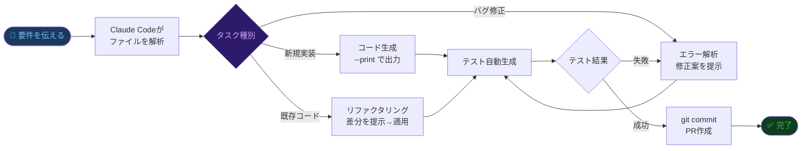
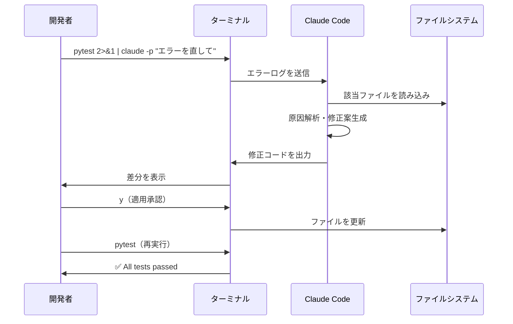
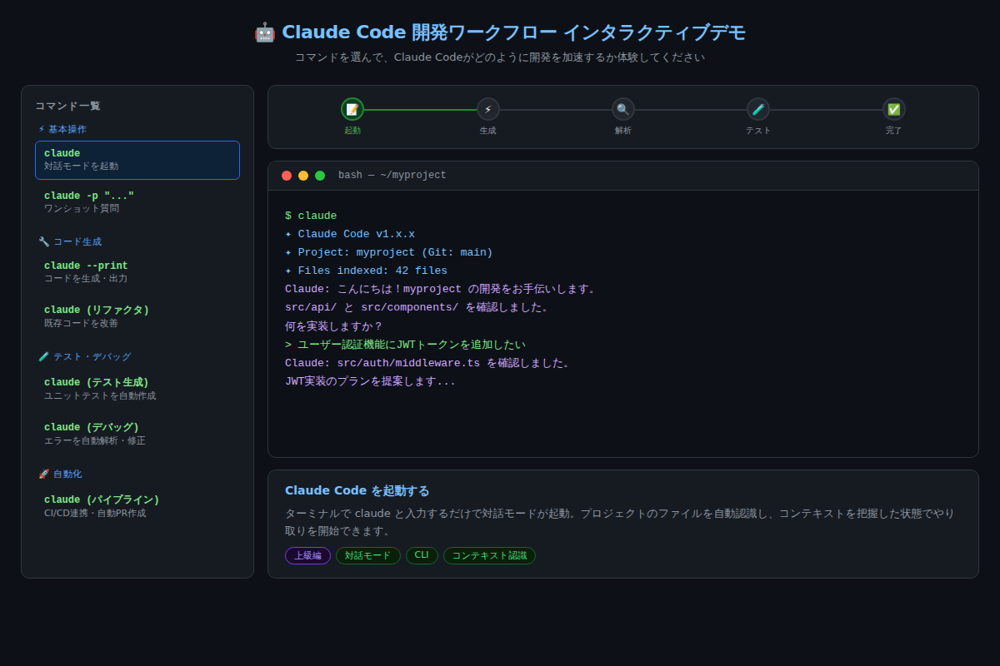

# Claude Codeで開発効率3倍：コード生成・テスト・デバッグを1CLIで完結させる実践ガイド

「AIにコードを書かせてみたけど、結局コピペして微調整するだけで時間がかかる」——そんな経験はないだろうか。Claude Codeはその壁を根本から壊す。ターミナルに住み、プロジェクト全体を把握し、コード生成・テスト・デバッグを文脈ごと理解して実行する。本記事ではClaude Codeを使いこなす5つのパワーテクニックを、実際のコマンドと出力例で解説する。

---

## Claude Codeとは何か——「補助ツール」ではなく「共同開発者」

Claude Codeは、Anthropicが提供するCLIベースのAI開発ツールだ。ChatGPTやClaude.aiのWebインターフェースとの最大の違いは、**プロジェクトのファイルシステムを直接操作できること**にある。

Webのチャット画面でコードをやり取りする場合、毎回コードをコピーして貼り付け、修正後にまた貼り直す——という手間が生じる。Claude Codeはそのオーバーヘッドをゼロにする。ファイルを読み込み、書き換え、テストを走らせ、コミットまで行う。開発フローに**完全に統合されたAI**だ。

```bash
# インストール（npm経由）
npm install -g @anthropic-ai/claude-code

# プロジェクトディレクトリで起動するだけ
cd myproject
claude
```

起動すると、プロジェクト内のファイルを自動でインデックス化し、Gitのブランチ状態まで把握した状態で対話を開始する。

---

## 開発ワークフロー全体像

Claude Codeがどのように開発サイクルに組み込まれるか、まず全体像を確認しよう。



このループが**人間の承認を挟みながら**高速で回る。「実装→テスト→修正→再テスト」の1サイクルが数分で完結する。

---

## テクニック1：対話モードでコンテキストを維持する

最もシンプルな使い方は `claude` コマンドでの対話モード起動だ。

```bash
$ claude

  ✦ Claude Code v1.x.x
  ✦ Project: myapp (Git: feature/auth)
  ✦ Files indexed: 87 files

  Claude: こんにちは！myapp の開発をお手伝いします。
  src/auth/ と tests/auth/ を確認しました。何を実装しますか？
```

**重要なのは「会話の文脈が続く」こと**だ。一度「このプロジェクトはFastAPIとPostgreSQLを使っている」と話せば、以降の指示でわざわざ再説明する必要がない。

```
> ユーザーのパスワードリセット機能を追加したい

Claude: 既存の src/auth/service.py を確認しました。
現在の AuthService クラスに以下を追加します：

1. reset_password_request() - リセットトークンをDBに保存
2. reset_password_confirm() - トークン検証と新パスワード設定
3. メール送信は既存の EmailService を利用します

src/auth/service.py を編集しますか？ [y/N]
```

### コピペ用プロンプト例①

```
現在の認証システム（src/auth/ を確認）に、
JWTトークンのリフレッシュ機能を追加してください。
有効期限は15分（アクセス）と7日（リフレッシュ）で設定してください。
```

---

## テクニック2：ワンショットで既存ツールと組み合わせる

`-p` フラグを使うと、対話を開始せずに結果だけを返す「ワンショットモード」になる。これがパイプラインとの相性が抜群だ。

```bash
# エラー出力をそのままClaudeに渡して修正案を得る
$ pytest 2>&1 | claude -p "このエラーを解析して修正方法を教えて"

# コードの複雑度チェック
$ cat src/api.py | claude -p "この関数の時間計算量を分析して"

# コミットメッセージの自動生成
$ git diff --staged | claude -p "このdiffに対する適切なコミットメッセージを生成して"
```



ポイントは**Claudeを既存のUnixツールチェーンの一部として使う**こと。`grep` や `awk` と同じ感覚でパイプラインに組み込める。

---

## テクニック3：テストを「書く」のではなく「生成させる」

テスト作成はAIが最も力を発揮する領域の一つだ。実装ファイルを渡すだけで、エッジケースを含む包括的なテストスイートを生成する。

```bash
# 実装に対してテストを自動生成
$ claude -p "src/payment.py の全関数に対してpytestテストを生成して" \
  > tests/test_payment.py

# 生成されたテストを実行
$ pytest tests/test_payment.py -v
```

```
PASSED  test_process_payment_success
PASSED  test_process_payment_invalid_card
PASSED  test_process_payment_insufficient_funds
PASSED  test_refund_within_30_days
PASSED  test_refund_after_30_days_raises_error
FAILED  test_concurrent_payment_duplicate  ← Claudeが見つけた潜在バグ！
```

**Claudeが生成したテストが失敗することには価値がある**。実装側に潜在的なバグがあることを示しているからだ。「テストが通ること」が目的ではなく、「バグを炙り出すこと」がテストの本質であり、Claudeはそれを理解している。

### コピペ用プロンプト例②

```
src/[ファイル名].py を読み込んで、以下の観点でpytestテストを生成してください：
- 正常系（ハッピーパス）
- 異常系（バリデーションエラー、例外）
- エッジケース（境界値、空入力、None）
- 並行実行時の競合状態（該当する場合）
テストカバレッジ80%以上を目標にしてください。
```

---

## テクニック4：デバッグを「調査」から「確認」に変える

従来のデバッグは「エラーを読む → 原因を推測 → コードを調べる → 仮説を立てる → 修正する」という多段階のプロセスだった。Claude Codeはこれを短絡する。

```bash
# スタックトレースをパイプするだけ
$ python main.py 2>&1 | claude -p "このエラーの原因と修正方法を教えて"

# Claude Code の対話モードでファイルごと渡す場合
> src/database.py の42行目でKeyError: 'user_id' が出ている。直して。

Claude: src/database.py の42行目を確認しました。

問題: .get() メソッドを使わずに直接キーアクセスしているため、
      キーが存在しない場合に KeyError が発生します。

修正:
-  user_id = session['user_id']
+  user_id = session.get('user_id')
+  if not user_id:
+      raise AuthenticationError("セッションが無効です")

src/database.py を更新しますか？ [y/N]
```

「原因を探す」時間がほぼゼロになる。デバッグの作業が「推測と調査」から「提案の確認と承認」に変わる。

---

## テクニック5：GitHub ActionsでCI/CDに組み込む

最終的なゴールは**人間が何もしなくてもコード品質が保たれる状態**だ。Claude Codeは公式のGitHub Actionsと組み合わせることで、PRトリガーで自動実行できる。

```yaml
# .github/workflows/claude-review.yml
name: Claude Code Review
on: [pull_request]

jobs:
  review:
    runs-on: ubuntu-latest
    steps:
      - uses: actions/checkout@v4
      - uses: anthropics/claude-code-action@v1
        with:
          anthropic_api_key: ${{ secrets.ANTHROPIC_API_KEY }}
          prompt: |
            このPRの差分を確認して：
            1. バグや潜在的な問題をコメントで指摘する
            2. テストが不足している関数にテストを追加する
            3. 型アノテーションが欠けている場所を補完する
```

PRを作成した瞬間に、Claudeがコードをレビューし、テストを追加し、型を補完する。レビュアーが確認するときにはすでにコード品質が一段階引き上げられた状態になっている。



[→ デモを操作する](../demos/20260612_claude-code-dev-guide/index.html)

---

## 実際の開発体験：Before / After

| 作業 | Before（AI無し） | After（Claude Code） |
|------|-----------------|---------------------|
| CRUD API実装 | 2〜3時間 | 15〜30分 |
| ユニットテスト作成 | 1〜2時間 | 5〜10分 |
| デバッグ（原因特定） | 30〜60分 | 2〜5分 |
| コードレビュー対応 | 30〜60分 | 自動化（CI） |
| TypeScript型付け | 1〜2時間 | 10〜20分 |

「3倍」という数字は保守的な見積もりだ。単純な実装タスクでは5〜10倍の速度向上を体感するケースも珍しくない。

---

## まとめ

- **対話モード**でプロジェクトコンテキストを維持したまま連続作業できる
- **`-p` フラグ**でUnixパイプラインにシームレスに組み込める
- **テスト自動生成**はバグ発見まで行う——失敗したテストも価値がある
- **デバッグ**が「推測と調査」から「確認と承認」のプロセスに変わる
- **GitHub Actions連携**でCIレベルの品質保証を自動化できる

Claude Codeは「コードを補完するツール」ではなく「開発フローに統合されたチームメンバー」として機能する。使いこなすほどに、自分が本来集中すべき「設計・判断・創造」に時間を割けるようになる。

---

## 次のステップ：明日すぐ試せるアクション

1. `npm install -g @anthropic-ai/claude-code` でインストール（5分）
2. 既存プロジェクトのディレクトリで `claude` を起動し、「このコードの問題点を教えて」と聞いてみる（10分）
3. `pytest 2>&1 | claude -p "テストが失敗している原因と修正方法を教えて"` を実行する（即時）

まずはこの3ステップだけ。Claude Codeの「プロジェクト全体を把握した上での回答」を体験すれば、従来のAI活用との違いが一目でわかるはずだ。
