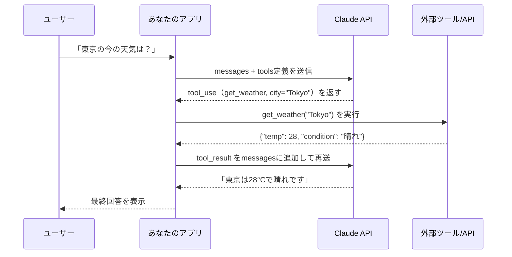
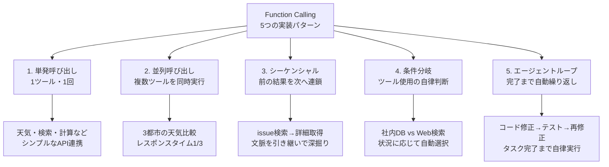
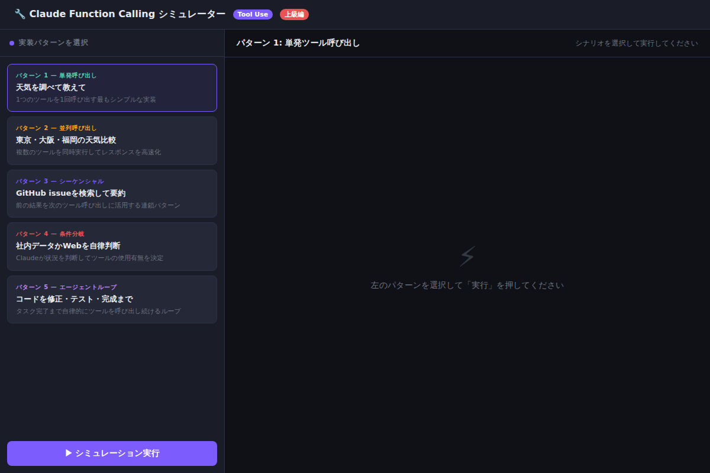

# ClaudeのFunction Callingを完全理解：外部ツール連携を実装する5つの実践パターン

「AIに質問すると答えてくれるが、リアルタイムな情報や社内データは扱えない」——そんな壁を一瞬で突き破るのが**Function Calling（ツール呼び出し）**です。Claudeが自分でAPIを呼び、DBを検索し、コードを実行する。その仕組みと5つの実装パターンを、動かせるデモとともに完全解説します。

---

## Function Callingとは何か

従来のLLMは「テキストを受け取り、テキストを返す」だけでした。Function Calling（Anthropic APIでは**Tool Use**と呼ばれます）は、この制約を根本から変えます。

Claudeは会話の中で「この質問に答えるには外部の情報が必要だ」と判断すると、自律的にツールを呼び出すよう要求します。アプリ側がそのツールを実行して結果を返すと、Claudeはその結果を使って最終的な回答を生成します。



ポイントは「Claudeが直接APIを叩くのではない」という点です。Claudeは**「このツールを呼んでほしい」というリクエストを出すだけ**で、実際の実行はアプリ側が行います。これにより、APIキーなどの機密情報をClaudeに渡す必要がなく、セキュリティが確保されます。

---

## tools定義の基本構造

まずAPIへ渡す`tools`パラメータの書き方を押さえましょう。

```python
import anthropic

client = anthropic.Anthropic()

tools = [
    {
        "name": "get_weather",
        "description": "指定した都市の現在の天気を取得する",
        "input_schema": {
            "type": "object",
            "properties": {
                "city": {
                    "type": "string",
                    "description": "天気を調べる都市名（例: Tokyo, Osaka）"
                },
                "unit": {
                    "type": "string",
                    "enum": ["celsius", "fahrenheit"],
                    "description": "温度の単位"
                }
            },
            "required": ["city"]
        }
    }
]

response = client.messages.create(
    model="claude-opus-4-8",
    max_tokens=1024,
    tools=tools,
    messages=[{"role": "user", "content": "東京の天気を教えてください"}]
)
```

`description`は**Claudeがツールを使うかどうかを判断する唯一の手がかり**です。「何ができるか」「どんな時に使うか」を具体的に書くことが、精度向上の最大のコツです。

---

## 5つの実装パターン



[→ デモを操作する](../demos/20260613_function-calling-patterns/index.html)



---

### パターン 1: 単発ツール呼び出し

最もシンプルな実装です。1つの質問に対して1つのツールを1回呼び出します。

```python
def run_single_tool(user_query: str):
    response = client.messages.create(
        model="claude-opus-4-8",
        max_tokens=1024,
        tools=tools,
        messages=[{"role": "user", "content": user_query}]
    )

    # Claudeがtool_useを要求した場合
    if response.stop_reason == "tool_use":
        tool_use = next(b for b in response.content if b.type == "tool_use")

        # 実際のツールを実行
        tool_result = execute_tool(tool_use.name, tool_use.input)

        # 結果をClaudeへ返して最終回答を生成
        final_response = client.messages.create(
            model="claude-opus-4-8",
            max_tokens=1024,
            tools=tools,
            messages=[
                {"role": "user", "content": user_query},
                {"role": "assistant", "content": response.content},
                {
                    "role": "user",
                    "content": [{
                        "type": "tool_result",
                        "tool_use_id": tool_use.id,
                        "content": str(tool_result)
                    }]
                }
            ]
        )
        return final_response.content[0].text

    return response.content[0].text
```

**コピペ用プロンプト例①（descriptionの書き方）:**

```
ツール名: get_customer_info
description: 「顧客IDから顧客情報（名前・メールアドレス・購入履歴）を取得する。
顧客に関する質問が来た場合や、注文情報が必要な場合に使用する。
顧客IDが分からない場合は使用しない。」
```

良いdescriptionは「**いつ使うか**」「**何が返るか**」「**使わないケース**」の3点を明記します。

---

### パターン 2: 並列ツール呼び出し

Claude 3以降では、1つのレスポンスで複数の`tool_use`ブロックを同時に返すことができます。APIへの往復を減らし、レスポンスタイムを大幅に短縮できます。

```python
def run_parallel_tools(user_query: str):
    response = client.messages.create(
        model="claude-opus-4-8",
        max_tokens=1024,
        tools=tools,
        messages=[{"role": "user", "content": user_query}]
    )

    if response.stop_reason == "tool_use":
        tool_uses = [b for b in response.content if b.type == "tool_use"]

        # 並列実行（asyncio or ThreadPoolExecutor を使用）
        import concurrent.futures
        with concurrent.futures.ThreadPoolExecutor() as executor:
            futures = {
                executor.submit(execute_tool, t.name, t.input): t
                for t in tool_uses
            }
            results = {
                futures[f].id: f.result()
                for f in concurrent.futures.as_completed(futures)
            }

        # 全結果をまとめてClaudeへ
        tool_results = [
            {"type": "tool_result", "tool_use_id": tid, "content": str(res)}
            for tid, res in results.items()
        ]

        final = client.messages.create(
            model="claude-opus-4-8",
            max_tokens=1024,
            tools=tools,
            messages=[
                {"role": "user", "content": user_query},
                {"role": "assistant", "content": response.content},
                {"role": "user", "content": tool_results}
            ]
        )
        return final.content[0].text
```

**使いどころ:** 「A・B・Cを比較してください」のような複数データが必要な質問では、並列化で処理時間を1/N（N=ツール数）に短縮できます。

---

### パターン 3: シーケンシャル呼び出し（連鎖）

前のツール実行結果を次の呼び出しに活用するパターンです。「検索してから詳細取得」「一覧を見てから絞り込む」といった、調査→深掘りの流れで威力を発揮します。

```python
def run_sequential_tools(user_query: str):
    messages = [{"role": "user", "content": user_query}]

    # Claudeが「tool_use不要」を返すまでループ
    while True:
        response = client.messages.create(
            model="claude-opus-4-8",
            max_tokens=1024,
            tools=tools,
            messages=messages
        )

        if response.stop_reason != "tool_use":
            return response.content[0].text  # 最終回答

        # ツール実行と結果の追加
        messages.append({"role": "assistant", "content": response.content})
        tool_results = []
        for block in response.content:
            if block.type == "tool_use":
                result = execute_tool(block.name, block.input)
                tool_results.append({
                    "type": "tool_result",
                    "tool_use_id": block.id,
                    "content": str(result)
                })
        messages.append({"role": "user", "content": tool_results})
```

このパターンは**パターン5（エージェントループ）の基礎**でもあります。

---

### パターン 4: 条件分岐（Claudeの自律判断）

これはコードで実装するのではなく、**Claudeの判断能力をそのまま活用する**パターンです。複数のツールを定義しておくと、Claudeが「どのツールを使うべきか」「そもそもツールが必要か」を自律的に判断します。

**コピペ用プロンプト例②（条件分岐を促すsystem prompt）:**

```
あなたは社内情報アシスタントです。

質問に答える際の優先順位:
1. まず search_internal_db で社内データを確認する
2. 社内データに情報がない場合のみ web_search を使用する
3. どちらも不要な場合（一般常識・概念説明）はツールを使わず回答する

個人情報・機密データは web_search に渡さないこと。
```

system promptでツールの使用方針を明示することで、Claudeの判断精度が大幅に向上します。

---

### パターン 5: エージェントループ（自律実行）

タスクが完了するまでツール呼び出しを繰り返すパターンです。「コードを書いてテストして、エラーがあれば修正する」といった多段階の作業を自律的にこなします。

```python
def agent_loop(task: str, max_iterations: int = 10):
    messages = [{"role": "user", "content": task}]
    iteration = 0

    while iteration < max_iterations:
        response = client.messages.create(
            model="claude-opus-4-8",
            max_tokens=4096,
            tools=tools,
            messages=messages
        )

        if response.stop_reason == "end_turn":
            return response.content[0].text  # タスク完了

        if response.stop_reason == "tool_use":
            messages.append({"role": "assistant", "content": response.content})
            tool_results = []
            for block in response.content:
                if block.type == "tool_use":
                    result = execute_tool(block.name, block.input)
                    tool_results.append({
                        "type": "tool_result",
                        "tool_use_id": block.id,
                        "content": str(result)
                    })
            messages.append({"role": "user", "content": tool_results})
            iteration += 1

    return "最大反復回数に達しました"
```

`max_iterations`は必ず設定してください。無限ループを防ぐ安全弁です。実務では**10〜20回**が目安です。

---

## よくある実装ミスと対策

| ミス | 症状 | 対策 |
|------|------|------|
| descriptionが曖昧 | 的外れなツールを呼ぶ | 「いつ使うか」を具体的に書く |
| tool_resultを返し忘れ | Claudeが固まる | stop_reason=="tool_use"を必ず確認 |
| max_iterationsなし | 無限ループ | 必ず上限を設定する |
| 並列結果の順序を無視 | tool_use_idが不一致 | IDで結果を紐付ける |

---

## まとめ

- **パターン1（単発）**: 最初の実装はここから。1ツール・1回で動作を確認する
- **パターン2（並列）**: 複数データが必要な時はPromise.all/ThreadPoolで同時実行しレスポンスを高速化
- **パターン3（シーケンシャル）**: 前の結果を次に引き継ぐwhileループが基本形
- **パターン4（条件分岐）**: コードではなくdescriptionとsystem promptでClaudeの判断を誘導
- **パターン5（エージェントループ）**: max_iterationsを設けた安全なwhileループで自律タスクを実装

---

## 次のステップ

明日すぐ試せるアクション:

1. **パターン1を動かす**: 天気APIやOpenMeteoなどの無料APIを使い、単発呼び出しを実装してみましょう
2. **descriptionを改善する**: 既存のtoolsのdescriptionに「いつ使うか」「使わないケース」を追加し、精度の変化を観察する
3. **Claude Code試用**: Claude Codeはこのエージェントループを内部で使っています。`claude --help`でどんなツールが定義されているか確認してみましょう

Function Callingをマスターすると、Claudeは「賢い検索エンジン」から「あなたの業務を自律的に遂行するエージェント」へと変貌します。まずはパターン1のコードをコピーして、動かすところから始めてください。
