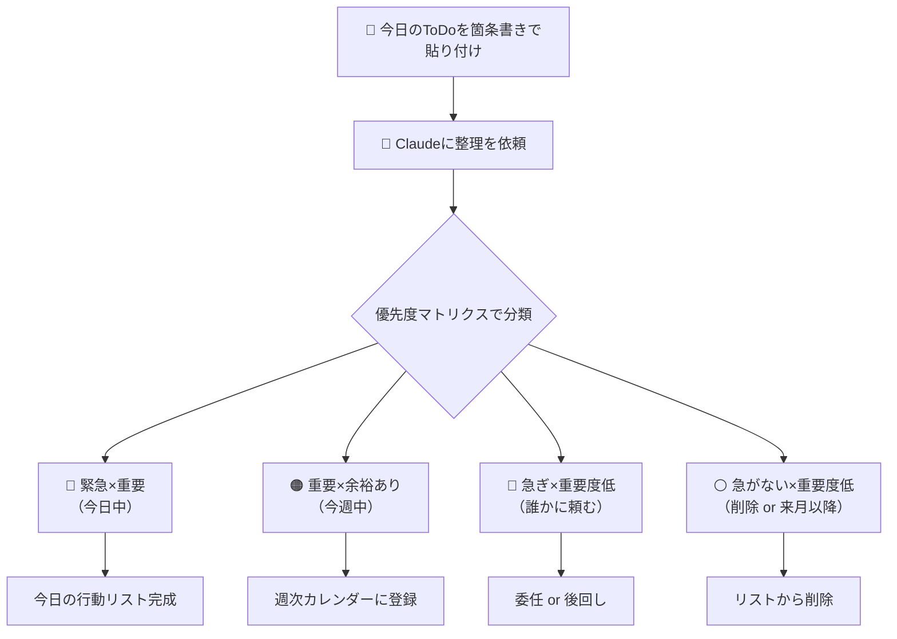
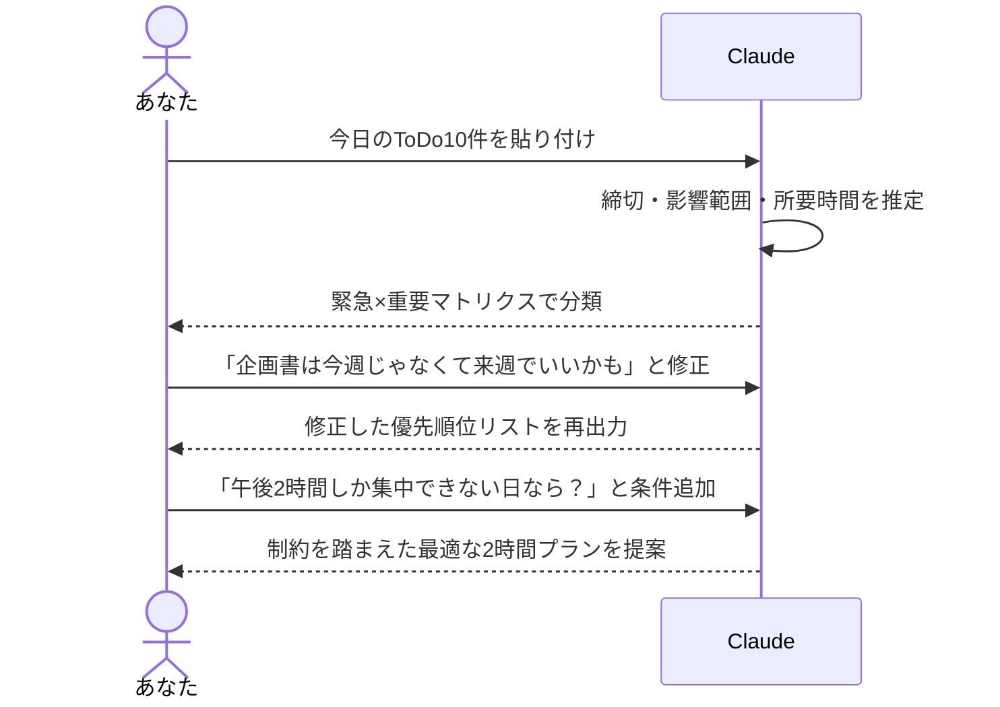
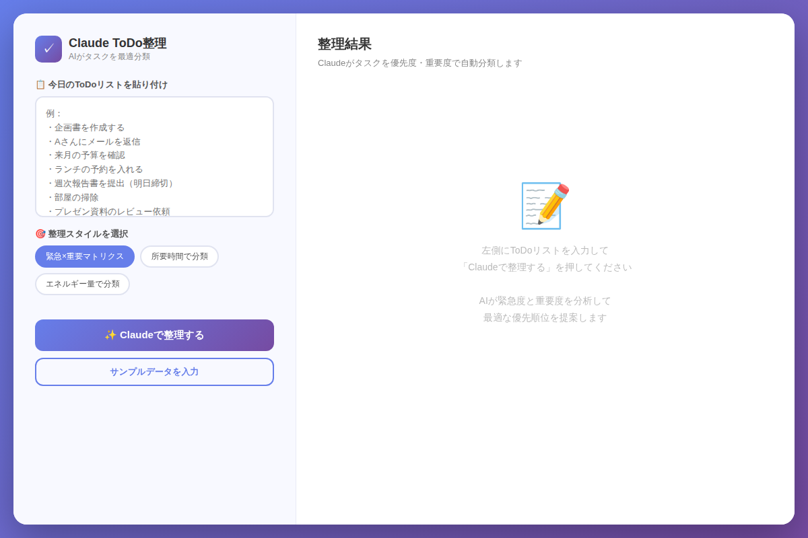

# ToDoが多すぎてパンクしているあなたへ：Claudeで1日のタスク整理を10分で自動化する方法【初級編】

「今日やることが多すぎて、どこから手をつければいいかわからない」——朝イチにこの感覚を覚えたことがある人は、ぜひこの記事を読んでください。Claudeに今日のToDoを丸投げするだけで、優先順位が整理された行動リストが10分で手に入ります。

---

## なぜToDoリストは機能しなくなるのか

タスク管理ツールやノートアプリにToDoを書き溜めている人は多いですが、「書いた瞬間は満足するのに、いざ実行するときに何から始めればいいか迷う」という悩みはよく聞きます。

原因はシンプルです。**タスクを「書く」行為と「整理する」行為を分けていないから**です。

人間の脳は複数のタスクを比較・優先順位付けする処理が得意ではありません。特に10件以上のタスクがあると、脳は「どれも重要に見える」というオーバーロード状態に陥りがちです。

ここでClaudeの出番です。自分の頭を使って悩む代わりに、Claudeという外部処理装置に判断を委ねることで、あなたは「実行」だけに集中できます。

---

## Claudeを使ったToDo整理の全体像

まず、今日試してほしいワークフローの全体像を確認しましょう。



この「緊急度×重要度マトリクス」はアイゼンハワー・マトリクスとも呼ばれる古典的なフレームワークですが、Claudeに自然言語で依頼するだけで自動的にこの分類をしてくれます。

---

## コピペで使えるプロンプト例

### プロンプト1：基本の整理（最初はこれだけでOK）

```
以下の今日のToDoリストを「緊急×重要マトリクス」で整理してください。

【ToDoリスト】
・企画書（来週月曜プレゼン）の骨子を作成
・Aさんへのメール返信（昨日から保留中）
・四半期レポートのデータ集計
・チームランチの店を予約（今日中）
・競合サービスのリサーチ
・デスクの整理整頓

分類後、「今日中にやること」の上位3件を教えてください。
それぞれになぜ今日やるべきかの一言理由も添えてください。
```

**ポイント**：「上位3件」と数を指定するのがコツです。Claudeに決断させることで、自分が悩む時間をゼロにできます。

---

### プロンプト2：週次レビュー用（毎週月曜日に実施）

```
今週のToDoリストを整理して、週次計画を立てるのを手伝ってください。

【今週のToDo一覧】
（ここにリストを貼り付け）

以下の形式で出力してください：

■ 今日（月曜日）に集中すること（3件以内）
■ 火〜木に分散してやること（5件以内）
■ 金曜日にまとめてやること
■ 来週以降に先送りしてよいこと
■ 誰かに依頼できそうなこと

最後に、今週の「勝利条件」を1文で表現してください。
```

これを毎週月曜の朝に実行するだけで、1週間の見通しが劇的に改善します。「今週の勝利条件」をSlackのプロフィールに貼る人もいます。

---

## Claudeとの対話フロー：実際のやりとりイメージ



Claudeのすごさは、**こちらの状況変化に柔軟に応答してくれる点**です。「今日は午後だけ集中できる」「急に会議が入った」といった現実の制約を伝えると、その都度プランを再計算してくれます。

---

## インタラクティブデモで体験しよう

実際にどんな出力になるかは、デモアプリで試してみてください。



[→ デモを操作する](../demos/20260614_claude-todo-organize/index.html)

デモでは：
1. サンプルのToDoリストを入力
2. 「整理スタイル」を選択（緊急×重要 / 所要時間 / エネルギー量）
3. Claudeが各タスクに理由付きで優先順位を割り当て
4. チェックボックスで完了管理

という一連の流れを体験できます。

---

## もう一歩進んだ使い方：毎日の「3-2-1ルーティン」

Claudeを使ったToDo整理に慣れてきたら、次のルーティンを試してください。

**朝の3分（START）**
```
今日やることを以下から3件だけ選んでください。
選んだ理由と、最初に何から始めるべきかも教えてください。

（ToDoリスト貼り付け）
```

**昼の2分（CHECK）**
```
今日の午前中の進捗を踏まえ、午後の優先タスクを2件だけ教えてください。
午前に終わったこと：〇〇
まだ手をつけていないこと：△△
```

**夜の1分（CLOSE）**
```
今日の振り返りをしてください。
完了したこと：〇〇
未完了のこと：△△
明日に繰り越す最重要タスクを1件だけ教えてください。
```

この「3-2-1ルーティン」を1週間続けると、自分のタスク処理パターンや「詰まりやすいポイント」が見えてきます。

---

## よくある失敗パターンと対策

### ❌ タスクが抽象的すぎる

**NG例**：「プロジェクトを進める」
**OK例**：「Aプロジェクトの要件定義書のドラフト（5ページ）を書く」

Claudeはタスクの具体性に応じて判断の精度が変わります。できるだけ「何を・どこまで・いつまでに」を含めてください。

### ❌ 全部「今日中」とつける

Claudeに整理を依頼する前に、自分で「全部今日中」と書いてしまうと、Claudeも分類しにくくなります。締切はわかる範囲で正直に書きましょう。

### ❌ 整理結果を実行に移さない

最大の失敗はここです。Claudeの整理は「実行するため」のものです。整理後はすぐに「今日やること第1位」のタスクに取りかかりましょう。

---

## まとめ

- **Claudeは「タスクの整理役」として最強**：優先順位付けの悩みをゼロにできる
- **「緊急×重要マトリクス」を自然言語で依頼するだけ**：難しい設定は一切不要
- **上位3件に絞ることで実行力が上がる**：Claudeに決断させて自分は動くだけ
- **週次レビューと組み合わせると効果倍増**：毎週月曜の10分が1週間を変える
- **状況変化をそのまま伝えればOK**：「急に会議が入った」にも柔軟対応

---

## 明日すぐ試せるアクション

明日の朝、以下を実行してみてください。

1. 起床後5分以内に、頭に浮かぶToDoをスマホのメモに箇条書き（10件程度）
2. Claudeのアプリにそのメモをそのままペーストしてプロンプト1を送信
3. 返ってきた「今日やること3件」だけを手帳かホワイトボードに書き写す
4. 1件目から迷わず始める

たったこれだけです。Claudeを「考える」ために使うのではなく、「考えることを代わりにやってもらう」ために使う感覚を、ぜひ一度体験してみてください。

---

*次回は中級編：「Claudeに複数ターンの対話でアイデアを深掘りする方法」をお届けします。*
