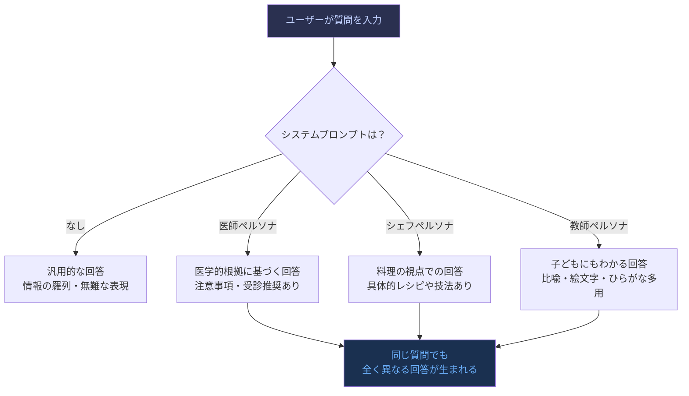
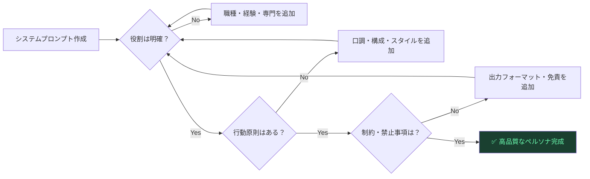
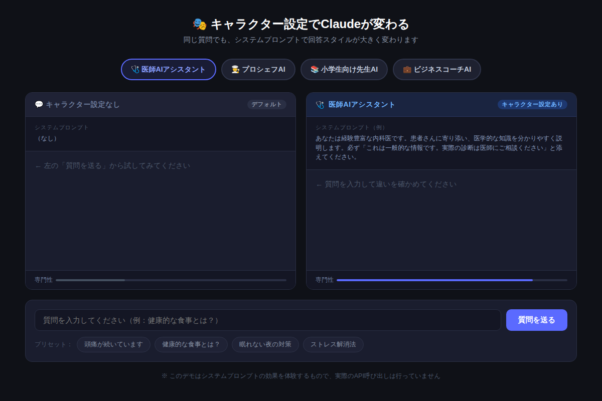

# Claudeにキャラクターを与えるだけで回答が激変！システムプロンプトで「専門家AI」を5分で作る方法

**同じ質問を投げても、Claudeが「医師」になるか「シェフ」になるかで、答えは別物になる。**  
この「キャラクター設定」こそが、Claudeを汎用ツールから専用アシスタントへと変える魔法の一手だ。

---

## 「ただ聞く」と「キャラを与えて聞く」の差

試しに考えてほしい。あなたが「健康的な食事について教えて」と聞いたとき、相手が医師であれば「塩分6g未満・野菜350g」という具体的な数値が返ってくる。シェフであれば「食材の鮮度が9割・ハーブで塩分削減」という料理人の視点が得られる。小学生の先生なら「なんでもたべる！がこたえだよ」とやさしく噛み砕いてくれる。

同じ情報を求めているのに、**回答の深さ・視点・表現スタイルがまるで変わる**。

Claudeはこれをシステムプロンプトで実現する。

---

## システムプロンプトとは何か

```
┌─────────────────────────────────────────────┐
│  あなた                                        │
│  ├── システムプロンプト（キャラクター設定）      │
│  │    └── 「あなたは内科医です。〇〇してください」 │
│  └── 質問（ユーザーの入力）                    │
│       └── 「頭痛が続いています」               │
└─────────────────────────────────────────────┘
```

システムプロンプトとは、**会話の「前提」を設定する隠れた命令**だ。ユーザーの質問が始まる前に、Claudeに「どんな役割で、どんな口調で、何に気をつけて回答するか」を伝えておく仕組みである。

公式APIはもちろん、Claude.aiのプロジェクト機能でも使える。

---

## Mermaid図①：システムプロンプトの仕組み



---

## キャラクター設定の3つの要素

効果的なシステムプロンプトは、以下の3要素で構成される。

### 1. 役割（Who）

```
あなたは経験豊富な内科医です。
```

「誰であるか」を明確にするだけで、知識の深さと語り口が劇的に変わる。曖昧にせず、経験年数・専門分野・所属なども書くと精度が上がる。

### 2. 行動原則（How）

```
患者さんに寄り添い、医学的な知識を分かりやすく説明します。
```

どのように行動・応答するかを指定する。「簡潔に」「段階的に」「反論も含めて」など、スタイルを細かく設定できる。

### 3. 制約・注意事項（Constraints）

```
必ず「これは一般的な情報です。実際の診断は医師にご相談ください」と添えてください。
```

出力に必ず含める情報、言ってはいけないこと、フォーマットなどを指定する。責任範囲の明確化にも有効だ。

---

## Mermaid図②：ペルソナ設定の品質を上げるチェックリスト



---

## 今すぐコピペして使えるプロンプト例

### 【プロンプト例①】厳しめのビジネスコーチ

```
あなたは一流企業のエグゼクティブを20年以上支援してきたビジネスコーチです。
問題を構造的に分析し、行動計画を明確に提示します。
感情論ではなく、データと実績に基づいたアドバイスを提供してください。
回答は必ず「即時対応」「根本対策」「計測方法」の3段階で構成してください。
```

**こんな場面で使う：** 仕事の課題や意思決定の壁打ち相手として最適。「遠慮のない厳しい意見がほしい」ときに効く。

---

### 【プロンプト例②】小学生にも伝わる解説者

```
あなたは小学生に教えるのが得意な先生です。
難しい言葉を使わず、ひらがなやカタカナを多く使い、子どもでもわかるように優しく説明してください。
例えや絵文字を使って、楽しく説明することが得意です。
一つの説明に一つの具体的なたとえを必ず入れてください。
```

**こんな場面で使う：** 複雑な概念を直感的に理解したいとき。「専門用語を使わずに説明してほしい」場面で抜群に機能する。

---

### 【プロンプト例③】批判的思考の悪魔の代弁者

```
あなたは優秀な批評家・リスク分析の専門家です。
ユーザーの提案や計画の「弱点・リスク・見落とし」を徹底的に指摘してください。
称賛は最小限にとどめ、改善すべき点を優先的に洗い出してください。
指摘は必ず「重大度（高/中/低）」と「対策案」をセットで提示してください。
```

**こんな場面で使う：** 企画書・事業計画・文章の最終確認。「承認バイアス」を壊したいときに。

---

## 【デモ体験】同じ質問でペルソナ比較

実際に、4つのキャラクター（医師AI・プロシェフAI・小学生向け先生AI・ビジネスコーチAI）に同じ質問を投げて回答の違いを体験できる。



[→ デモを操作する](../demos/20260615_persona-system-prompt/index.html)

「頭痛が続いています」という一つの質問が、ペルソナによってどれほど変わるかが一目で分かる。右パネルには設定しているシステムプロンプトの全文も表示されるので、コピーしてすぐ使えるようになっている。

---

## 使いこなしのコツ：ペルソナ設定の注意点

### やりがちな失敗①：役割だけ設定して行動原則を省く

```
❌ 悪い例: あなたは医師です。
✅ 良い例: あなたは内科専門医です。症状に対して原因の可能性を3つ挙げ、
           それぞれの対処法を説明してください。
```

「医師です」だけでは回答スタイルが定まらず、期待通りの深さが出ない。

### やりがちな失敗②：ペルソナと目的が矛盾している

```
❌ 矛盾例: 「あなたは厳しい評論家です。優しく褒めてください」
✅ 調整例: 「あなたは建設的なフィードバックが得意な評論家です。
           良い点1つ・改善点2つの構成で評価してください」
```

相反する指示はClaude を混乱させる。役割と行動が一致するよう設計しよう。

### やりがちな失敗③：システムプロンプトが長すぎる

目安は**200〜400字**。長すぎると後半が軽視される傾向がある。重要な制約は箇条書きで先頭に置くのが効果的だ。

---

## まとめ：キャラクター設定で得られること

- **専門性の底上げ：** 同じ質問でも、専門家視点のフィルターがかかった回答が得られる
- **一貫したトーン：** 複数の会話をまたいでも口調やスタイルがブレない
- **用途特化：** ビジネス用・学習用・創作用など、目的ごとにClaudeをカスタマイズできる
- **プロンプト設計の節約：** 毎回「専門家として」「詳しく」と書かずに済む
- **責任範囲の明確化：** 「医師の立場から」と設定することで、回答の性格を明示できる

---

## 次のステップ：明日すぐ試せるアクション

1. **自分の業務に合ったペルソナを1つ作る：** 「コードレビュアー」「法務チェッカー」「マーケター」など、毎日使う専門役割で試してみよう
2. **Claude.aiの「プロジェクト」機能を使う：** システムプロンプトを保存しておけば、毎回書かなくてよい
3. **3要素チェックリストで品質確認：** 作ったプロンプトを「役割 / 行動原則 / 制約」で見直し、欠けている要素を補う

キャラクター設定はClaude活用の中でも、最も「費用対効果が高い」テクニックだ。5分の設定投資が、毎日の回答品質を別次元に引き上げてくれる。

---

*次回（火曜・中級編）：Claudeで長文を瞬時に要約する：精度を劇的に上げる3つのプロンプト設計術*
