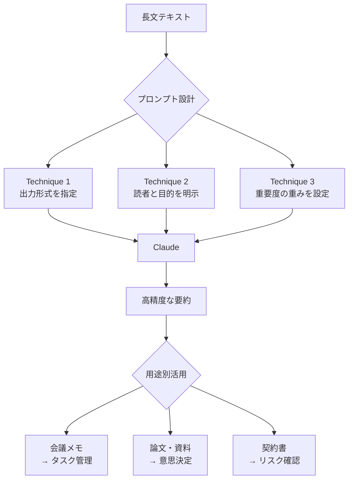
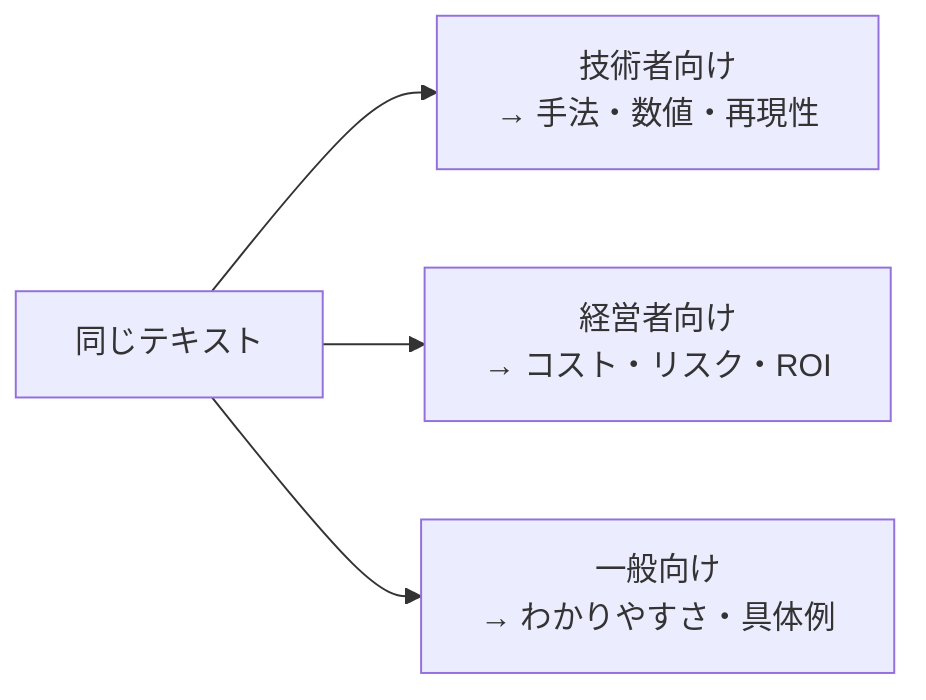
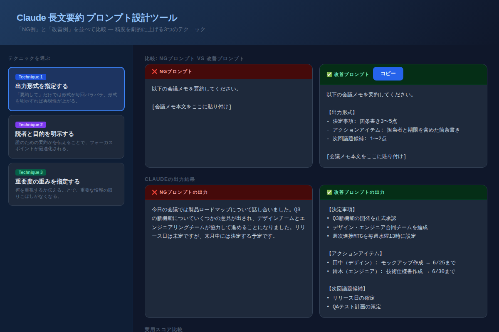

# Claudeで長文を瞬時に要約する：精度を劇的に上げる3つのプロンプト設計術

「要約して」とClaudeに送るたびに、出力がバラバラで使いものにならない——そんな経験はないだろうか。実は**要約の質は、プロンプトの設計で9割決まる**。この記事では、会議メモ・論文・契約書など、どんな長文でも即戦力になる要約プロンプトの3つの核心テクニックを解説する。今日から使えるコピペ用テンプレートつきで、あなたの情報処理速度を劇的に変える。

---

## なぜ「要約して」だけでは使えないのか

Claudeは優秀なAIだが、指示が曖昧だと「解釈の余地が大きすぎる」状態になる。

「要約して」という指示は、実は以下の情報が完全に欠落している：

- **どんな形式で出力すべきか**（箇条書き？段落？見出しつき？）
- **誰が読むのか**（技術者？経営者？一般消費者？）
- **何を特に重視すべきか**（コスト？リスク？タスク？）

この3つが曖昧なまま投げると、Claudeは「なんとなく全体を均等に縮める」という無難な選択をする。結果として、必要な情報が埋もれ、不要な情報が残る「使いにくい要約」ができあがる。

---

## 要約プロセスの全体像



3つのテクニックは独立しているが、組み合わせるほど精度が上がる。まずは1つずつ試して、慣れたら全部まとめて使おう。

---

## Technique 1：出力形式を指定する

### 問題点：形式が毎回バラバラになる

最もよくある失敗がこれだ。プロンプトに形式の指定がないと、同じ文書を何度要約しても出力が変わる。チームで共有したいのに、毎回書き直しが必要になる。

### NG例
```
以下の会議メモを要約してください。

[会議メモ本文]
```

### 改善例（コピペ用）
```
以下の会議メモを要約してください。

【出力形式】
- 決定事項: 箇条書き3〜5点
- アクションアイテム: 担当者と期限を含めた箇条書き
- 次回議題候補: 1〜2点

[会議メモ本文]
```

**ポイント：** セクション名・箇条書き・含める要素数をすべて明示する。「3〜5点」のように範囲を指定すると、Claudeが内容に合わせて適切な粒度で調整してくれる。

---

## Technique 2：読者と目的を明示する

### 問題点：誰向けかによって「重要な情報」が変わる

同じ論文でも、研究者向けならメソッドが重要、経営者向けならビジネスインパクトが重要だ。読者を指定しないと、Claudeは「一般的な読者」に向けた中庸な要約を作る。

### 3ターゲット別の書き方



### 改善例（コピペ用）
```
この論文を要約してください。

【読者】エンジニアではない経営陣（技術知識ゼロ）
【目的】この研究に投資すべきか判断する材料として使用
【文量】200字以内
【注意】専門用語は使わず、ビジネスインパクトを中心に

[論文本文]
```

**ポイント：**「読者」と「目的」を2行で書くだけで、Claudeのフォーカスが劇的に変わる。「文量」の指定も忘れずに——経営者は長文を読まない。

---

## Technique 3：重要度の重みを指定する

### 問題点：重要情報が等価に扱われる

契約書で最も危険なのは、解約条件・自動更新・違約金だ。しかしプロンプトを指定しないと、Claudeはこれらと「一般的な表明保証条項」を同等に扱ってしまう。

### 改善例（コピペ用）
```
この契約書を要約してください。

【最重要（必ず含める）】
① 解約条件と違約金
② 自動更新の有無と停止期限
③ 責任範囲の限定条項

【重要（含めてほしい）】
- 支払いサイト・遅延損害金
- 機密保持の範囲

【省略可】
- 一般的な表明保証条項

[契約書本文]
```

**ポイント：**「最重要 → 重要 → 省略可」の3段階で重みを伝える。Claudeはこの優先順位に従ってスペースを配分してくれる。重要な情報が1行でまとめられ、不要な情報が省略されると、見落とすリスクが格段に下がる。

---

## デモで確認する

3つのテクニックを「NG例 vs 改善例」で並べて確認できるインタラクティブデモを用意した。



[→ デモを操作する](../demos/20260616_summarization-prompt-design/index.html)

各テクニックのボタンを切り替えると、プロンプトの差異と出力結果の変化、そして実用スコアの変化を一目で確認できる。

---

## 3つを組み合わせた最強テンプレート

3テクニックをすべて統合したフルセットがこちらだ。汎用性が高く、どんな文書にも応用できる。

```
以下の文書を要約してください。

【読者】〇〇（例：非技術者の上司）
【目的】〇〇（例：次のステップを決める）

【出力形式】
- 結論（1〜2行）
- 重要ポイント（箇条書き3〜5点）
- アクションアイテム（あれば）

【最重要（必ず含める）】
- 〇〇（例：コスト・期限・リスク）

【省略可】
- 〇〇（例：背景説明・一般論）

[本文をここに貼り付け]
```

---

## まとめ

- **出力形式の指定**で要約の再現性が上がり、チーム共有も楽になる
- **読者と目的の明示**でフォーカスが最適化され、意思決定に直結する要約が生まれる
- **重要度の重みづけ**でリスクの見落としがなくなり、実務の信頼性が上がる
- 3テクニックは組み合わせるほど効果が上がる
- 「要約して」の1行を5行に増やすだけで、Claudeの能力を10倍引き出せる

---

## 次のステップ

**今日すぐできること：**
1. 手元にある会議メモや資料を1つ選ぶ
2. 上記の「最強テンプレート」に貼り付けて、Claudeに送ってみる
3. 出力を見て「どのテクニックが一番効いたか」を確認する

明日の記事では **「Claude Codeで爆速開発：コード生成・デバッグ・リファクタリングを自動化する実践ガイド」** を公開予定。開発ワークフローを丸ごとAIに任せる方法を、実際のコードつきで解説する。
