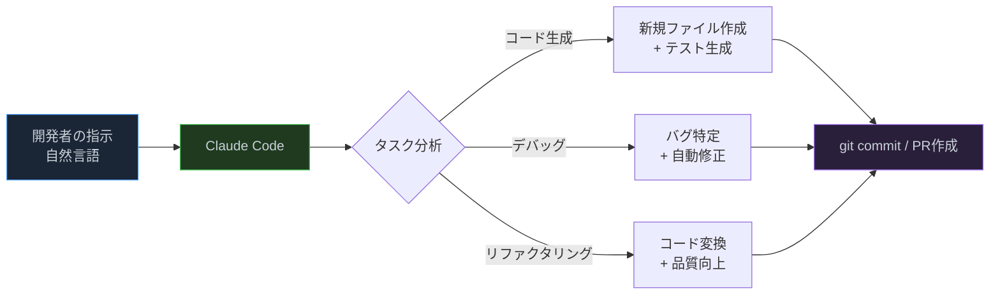
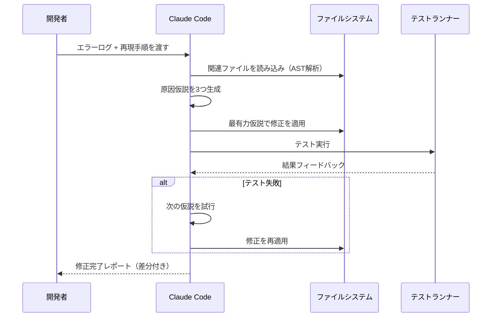
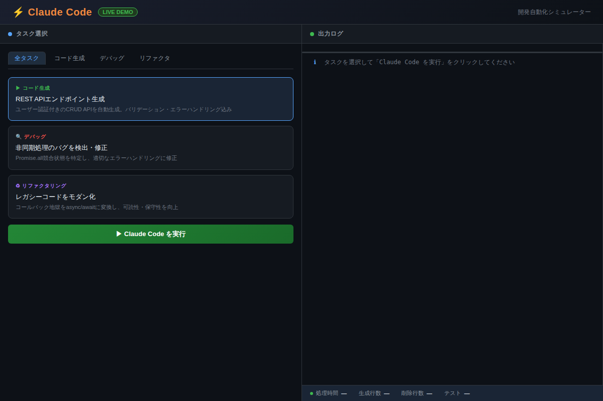

# Claude Codeで爆速開発：コード生成・デバッグ・リファクタリングを自動化する実践ガイド

「コードを書く時間の80%は、書くことではなく**読んで理解すること**に消えている」——ソフトウェア開発の現場でよく言われるこの事実に、Claude Codeは真正面から切り込む。単なる「コード補完」を超え、**要件を伝えれば設計から実装・テストまで一気通貫で自動化できる**開発AIとして、2026年現在エンジニアの働き方を根本から変えつつある。

---

## Claude Codeとは何か：AIペアプログラマーの進化形

Claude Codeは、Anthropicが開発したターミナルベースのAI開発ツールだ。他のコード補完ツールと決定的に異なる点は、**ファイルシステムを直接操作し、コードを読み・書き・実行できる**こと。



従来の開発フローと比較するとその革命性が際立つ。

| 作業 | 従来の方法 | Claude Code |
|------|----------|------------|
| REST API実装 | 2〜4時間（設計・実装・テスト） | 5〜15分 |
| バグ調査 | 30分〜数時間（ログ解析・再現） | 2〜5分 |
| リファクタリング | 半日〜2日（リスク評価込み） | 10〜30分 |
| テストコード作成 | 実装時間の50〜100% | 自動生成 |

---

## Claude Codeの3つのコア機能

### 1. コード生成：仕様→実装を一撃で

最も驚かされるのが、曖昧な自然言語の指示から**動くコードを生成する**能力だ。

**コピペ用プロンプト例①：REST API生成**

```
以下の仕様でREST APIを実装してください：
- フレームワーク：Express + TypeScript
- リソース：User（id, email, name, createdAt）
- エンドポイント：GET/POST/PUT/DELETE
- 認証：JWTミドルウェア
- バリデーション：Zod
- エラーハンドリング：統一フォーマット
- テスト：Vitest + supertest（正常系・異常系各3件）
```

このプロンプトだけで、Claude Codeは以下を自動生成する：

- `src/controllers/userController.ts`（CRUD実装）
- `src/routes/userRoutes.ts`（ルーティング）
- `src/middleware/auth.ts`（JWT検証）
- `src/validators/userValidator.ts`（Zodスキーマ）
- `tests/user.test.ts`（12テストケース）

生成後に`npm test`を実行すると、初回から高いカバレッジを示すことが多い。「完璧でないかも」という恐れを捨て、**まず生成させてからレビューする**サイクルが爆速開発の基本だ。

---

### 2. デバッグ：原因特定から修正まで自動化

「このバグが直らない」という状況でも、Claude Codeはコード全体を俯瞰してパターンを見つける。

**コピペ用プロンプト例②：デバッグ依頼**

```
以下のエラーが発生しています：
エラーメッセージ：[ここにエラーログを貼り付け]
再現手順：[ここに再現手順を記述]
関連ファイル：src/services/dataService.ts

考えられる原因を3つ挙げ、最も可能性の高いものから順に修正してください。
修正後にテストを実行して動作確認もお願いします。
```



特に威力を発揮するのが**非同期処理の競合状態**や**メモリリーク**など、人間の目では追いにくいバグだ。Claude Codeはコード全体の依存グラフを把握した上で原因を特定するため、「どこから見てよいかわからない」系のバグに強い。

---

### 3. リファクタリング：レガシーコードを安全にモダン化

コールバック地獄、巨大なswitch文、テストのない関数群——「触りたくないけど触らなきゃいけない」コードの処理もClaude Codeの得意領域だ。

**コピペ用プロンプト例③：段階的リファクタリング**

```
src/legacy/dataProcessor.js をリファクタリングしてください。

優先順位：
1. コールバック → async/await に変換
2. グローバル変数を排除してモジュール化
3. 型定義（TypeScript）を追加
4. 各関数に単体テストを追加

安全のため、変更前後でテストが通ることを確認しながら段階的に進めてください。
```

「段階的に」という指示が重要だ。一気に変換すると予期しないバグが入り込むリスクがある。Claude Codeは変換→テスト→次の変換というサイクルを自律的に実行し、**各ステップで動作確認をしながら**リファクタリングを完遂する。

---

## 実践：Claude Codeを最大限に活用するためのワークフロー

### CLAUDE.mdでコンテキストを共有する

プロジェクトルートに`CLAUDE.md`ファイルを置くと、Claude Codeが毎回読み込み、プロジェクト固有の知識を活用できる。

```markdown
# プロジェクト概要
Eコマースサイトのバックエンド API（Node.js + TypeScript）

# アーキテクチャ
- フレームワーク: Express
- DB: PostgreSQL（Prisma ORM）
- テスト: Vitest
- リント: ESLint + Prettier

# コーディング規約
- エラーは必ずResult型（neverthrow）で返す
- ログはPinoを使用
- 日本語コメント可

# 禁止事項
- any型の使用禁止
- console.log（Pinoを使うこと）
```

このファイル1つで、Claude Codeはあなたのチームの「暗黙知」を理解した上でコードを生成してくれる。

### デモを実際に試してみる

上記の3タスク（コード生成・デバッグ・リファクタリング）を実際に体験できるインタラクティブデモを用意した。



[→ デモを操作する](../demos/20260617_claude-code-dev-guide/index.html)

タスクを選択して「Claude Code を実行」をクリックすると、実際の処理フローとコード差分がリアルタイムで確認できる。

---

## よくある疑問と回答

**Q: 生成されたコードの品質は信頼できる？**

A: 完璧ではない。特に複雑なビジネスロジックやドメイン固有の制約は、人間のレビューが必須だ。Claude Codeは「90点のコードを10秒で生成する」ツールであり、「100点を保証する」ツールではない。生成→レビュー→修正のサイクルを前提とした使い方が正しい。

**Q: セキュリティ上のリスクは？**

A: Claude Codeはローカル環境で動作し、コードはAnthropicのサーバーで処理される。機密性の高いコードを扱う場合は企業のデータポリシーを確認すること。また、生成されたコードにセキュリティ上の問題（SQLインジェクション、認証バイパス等）が含まれていないか必ずレビューすること。

**Q: どの言語・フレームワークに対応している？**

A: TypeScript/JavaScript、Python、Go、Rust、Java、C++など主要言語に対応。フレームワークも Express、FastAPI、Spring Boot、Rails など幅広く対応している。

---

## まとめ：Claude Codeが変える開発の哲学

- **コードを書く時間ではなく、コードを考える時間を増やす**ことが本質的な価値
- 生成・デバッグ・リファクタリングの3機能を組み合わせることで、**開発サイクル全体を短縮**できる
- `CLAUDE.md`でプロジェクト知識を共有することで、**チーム固有のコーディング規約を維持**したまま自動化できる
- 「AIが書いたコードだから」という言い訳はできない——**レビュー責任は常に開発者にある**
- 最初の壁は「プロンプトを書く習慣」——1週間続ければ自然とプロンプト思考が身につく

---

## 次のステップ：明日すぐ試せるアクション

1. **今日のコードベースで試す**: 直近のバグや技術的負債を1つ選び、上記デバッグプロンプトでClaude Codeに投げてみる
2. **CLAUDE.mdを作る**: プロジェクトの技術スタックと規約を5行でまとめてプロジェクトルートに置く
3. **新機能を丸ごと任せる**: 次に実装する小さな機能（CRUD APIの1エンドポイント等）をClaude Codeに一任し、生成→レビュー→マージのサイクルを体験する

Claude Codeは「仕事を奪うAI」ではなく、「**雑務を引き受けて本質的な思考に集中させてくれるAI**」だ。コードを書く手を止めて、設計と品質判断に集中できる時間が確実に増える。
