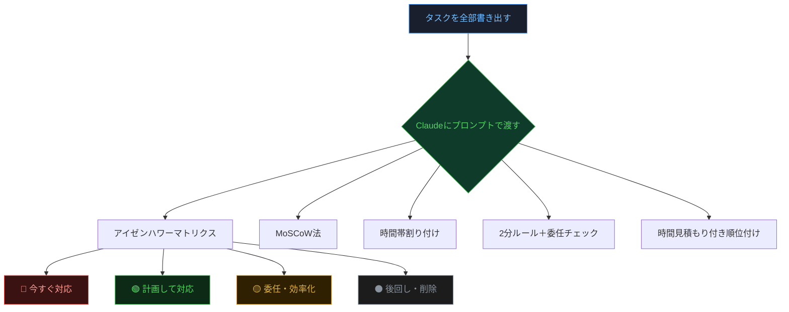
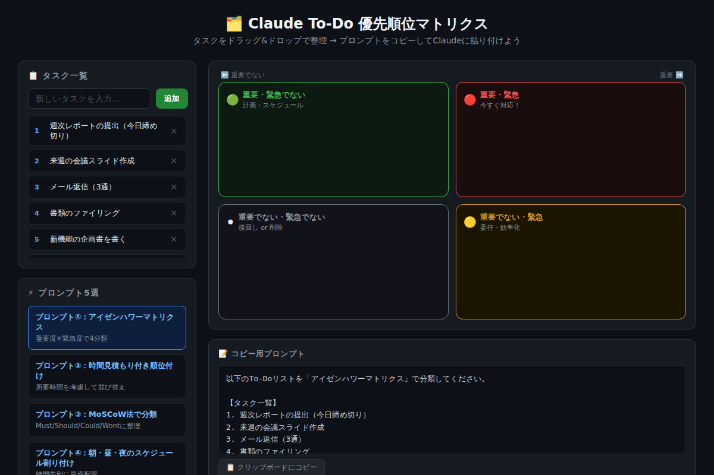
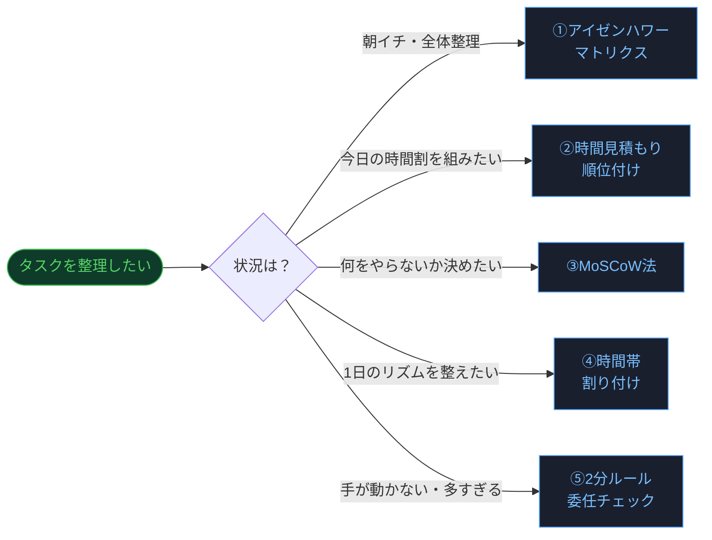

# ClaudeでTo-Doを優先順位付けする：忙しい人のための思考整理プロンプト5選

「やることが多すぎて、何から手をつければいいのかわからない」——そのモヤモヤ、Claudeに丸投げすれば3秒で整理できます。今日から使えるプロンプト5選を厳選しました。

---

## なぜTo-Doの「優先順位付け」が難しいのか

タスク管理で失敗する人のほとんどは、「書き出す」はできても「並び替える」で詰まります。緊急メールと重要な企画書、どちらを先にやるべきか？——これを直感だけで判断しようとするから疲弊するのです。

優先順位付けには「判断基準」が必要です。そして、その判断基準を整理するのが**今日からClaudeに任せられる仕事**です。



---

## 5つのプロンプト：使い分けガイド

### プロンプト①：アイゼンハワーマトリクスで分類する

最も汎用的な優先順位付けフレームワーク。「重要度」と「緊急度」の2軸でタスクを4象限に分類します。

**こんな人に最適：** 初めてタスク管理にClaudeを使う方 / 朝のルーティンに組み込みたい方

```
以下のTo-Doリストを「アイゼンハワーマトリクス」で分類してください。

【タスク一覧】
1. 週次レポートの提出（今日締め切り）
2. 来週の会議スライド作成
3. メール返信（3通）
4. 書類のファイリング
5. 新機能の企画書を書く
6. 健康診断の予約

出力形式：
🔴 重要×緊急（今すぐ対応）：
🟢 重要×緊急でない（計画して対応）：
🟡 重要でない×緊急（委任・効率化）：
⚫ 重要でない×緊急でない（後回し・削除）：

各タスクに分類した理由を1行で添えてください。
```

---

### プロンプト②：時間見積もり付き順位付け

「重要そう」なタスクが5時間かかるなら、今日は着手できないかもしれない。所要時間を現実的に見積もることで、**今日中に終わる計画**が立てられます。

**こんな人に最適：** 1日のスケジュールをしっかり組みたい方 / 残業ゼロを目指している方

```
以下のTo-Doを優先順位順に並べ替え、各タスクの所要時間も推定してください。

【タスク一覧】
1. 週次レポートの提出（今日締め切り）
2. 来週の会議スライド作成
3. メール返信（3通）
4. 新機能の企画書を書く
5. 経費精算（今月末まで）

出力形式（表形式）：
| 優先順位 | タスク名 | 推定時間 | 優先する理由 |

最後に「今日中に必ず終わらせるべき3つ」をまとめてください。
```

---

### プロンプト③：MoSCoW法で"やらないこと"を決める

タスク管理の本質は「何をやるか」より「**何をやらないか**」を決めること。MoSCoW法は、ソフトウェア開発の現場で生まれた優先順位フレームワークで、「Must（必須）」「Should（すべき）」「Could（できれば）」「Won't（今はやらない）」の4層で整理します。

**こんな人に最適：** プロジェクトの優先度を決めたい方 / 「全部重要に見える」と感じている方

```
以下のTo-Doリストを「MoSCoW法」で分類してください。

【タスク一覧】
（タスクをここに貼り付け）

MoSCoW法の定義：
- Must have：必ず今日やる（やらないと致命的）
- Should have：できればやる（重要だが柔軟）
- Could have：余裕があればやる
- Won't have：今回はやらない

各項目を分類し、理由も一言添えてください。
```

---

### プロンプト④：朝・昼・夜のスケジュール割り付け

人間のエネルギーリズムには法則があります。午前中は思考系タスク、午後はコミュニケーション系タスクが向いている。このリズムを無視して「重要なものから」と詰め込むと、必ず夕方にエネルギー切れになります。

**こんな人に最適：** 1日の時間割をClaude任せにしたい方 / 午後から疲れやすいと感じている方

```
以下のTo-Doを、1日のエネルギーリズムを考慮して時間帯に割り付けてください。

【タスク一覧】
（タスクをここに貼り付け）

条件：
- 午前（9-12時）：集中力が高い → 思考系・創造系タスク
- 午後（13-17時）：ミーティング・コミュニケーション向き
- 夕方（17-19時）：ルーティン・事務処理向き

出力形式：
🌅 午前（9-12時）: ...
☀️ 午後（13-17時）: ...
🌇 夕方（17-19時）: ...
📌 明日以降に回すもの: ...
```

---

### プロンプト⑤：2分ルール＋委任チェック

GTD（Getting Things Done）の創始者デビッド・アレンが提唱した「2分ルール」——2分以内に終わるタスクはすぐやれ。これにClaudeの「委任できるか？」判定を組み合わせると、タスクが3種類に綺麗に分かれます。

**こんな人に最適：** タスクが多すぎて手が動かない方 / チームでタスクを振り分けたい方

```
以下のTo-Doリストに「2分ルール」と「委任チェック」を適用してください。

【タスク一覧】
（タスクをここに貼り付け）

判定基準：
1. 2分以内に終わる → 今すぐやる（2分タスク）
2. 自分でなくてもよい → 委任する
3. 締め切りがある → 期限付きタスクとして管理
4. それ以外 → 時間を確保して集中して取り組む

判定結果と「今すぐ着手する順番」を教えてください。
```

---

## インタラクティブデモで試してみよう

下のデモでは、実際にタスクを入力してマトリクスに分類しながら、5つのプロンプトをその場で生成・コピーできます。



[→ デモを操作する](../demos/20260618_todo-priority-prompts/index.html)

---

## 5つのプロンプトの使い分け早見表



---

## まとめ

- **タスク管理の核心**は「何をやらないか」を決める勇気。Claudeがその判断を客観的に支援する
- **アイゼンハワーマトリクス**は最初の一手として最強。朝5分の習慣にするだけで1日が変わる
- **MoSCoW法**は「全部重要に見える病」に効く特効薬。プロジェクト型タスクに特に有効
- **時間帯割り付け**はエネルギーの波と戦わずに乗る方法。「重要＋午前中」の組み合わせが最強
- **5つのプロンプトを使い分ける**ことで、どんな状況のTo-Doリストも整理できる

---

## 次のステップ：明日すぐ試せること

1. **今夜のうちに**：明日やるタスクを箇条書きで10個書き出しておく
2. **明朝5分**：書き出したリストをプロンプト①に貼り付けてClaudeに送る
3. **慣れてきたら**：自分の仕事スタイルに合ったプロンプトを1つ決めて毎朝使う

「やること」を書き出したら、あとはClaudeが整理してくれる。そのシンプルなワークフローが、忙しい毎日のストレスを確実に減らします。

---

*関連記事：[Claudeに「正しく聞く」だけで仕事が変わる：初心者が最初に覚えるべき3つのコツ](./20260518_claude-intro-ask-better.md)*
